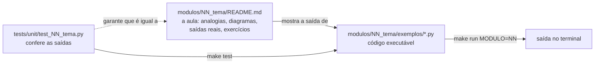

<!-- TOC -->

- [python\_examples](#python_examples)
  - [Início rápido](#início-rápido)
  - [Como funciona](#como-funciona)
  - [Módulos](#módulos)
  - [Comandos do dia a dia](#comandos-do-dia-a-dia)
  - [Documentação](#documentação)
  - [Exemplos antigos](#exemplos-antigos)
  - [Contribuindo](#contribuindo)
  - [Desenvolvedores](#desenvolvedores)
  - [Licença](#licença)

<!-- TOC -->

# python_examples

Uma trilha **para iniciantes** de programação em Python 3, em português do
Brasil: 12 módulos, do primeiro `print()` a testes automatizados e
ambientes virtuais. Cada módulo tem uma explicação com **analogias** e
**diagramas**, **exemplos executáveis** com as saídas reais, os erros mais
comuns (com as mensagens que o Python mostra de verdade), exercícios e
**testes automatizados**. Todo o conteúdo se apoia em **fontes oficiais** -
principalmente o [Tutorial Python](https://docs.python.org/pt-br/3/tutorial/index.html)
em português - citadas em cada página.

Tudo roda no seu computador, sem custo: Linux (Ubuntu), macOS ou Windows
com WSL2. As ferramentas são o [uv](https://docs.astral.sh/uv/) (pacotes e
ambiente virtual), o [mise](https://mise.jdx.dev) (versões do Python e do
uv) e o `make` (atalhos).

## Início rápido

Com o uv, o mise, o git e o make instalados
([`REQUIREMENTS.md`](REQUIREMENTS.md#0-do-zero-ao-primeiro-programa-em-ordem)
explica como, passo a passo):

```bash
git clone https://github.com/aeciopires/python_examples.git
cd python_examples
make check                  # o seu sistema e as ferramentas estão ok?
make setup                  # instala o Python 3.14, o uv e as dependências
make run MODULO=01          # roda os exemplos do módulo 01
make test                   # roda todos os testes
```

Depois, abra o [módulo 01](modulos/01_primeiros_passos/README.md) e siga
a [trilha](docs/TRILHA.md).

## Como funciona



Cada exemplo tem um `main()` que imprime o resultado; o README do módulo
mostra essa saída; e um teste executa o `main()` e compara. Se o código e o
README discordarem, o teste falha. Detalhes em
[`docs/ARQUITETURA.md`](docs/ARQUITETURA.md).

## Módulos

| # | Módulo | Você aprende |
|---|---|---|
| 01 | [Primeiros passos](modulos/01_primeiros_passos/README.md) | interpretador, REPL, `print()`, comentários, indentação |
| 02 | [Variáveis e tipos](modulos/02_variaveis_e_tipos/README.md) | `int`, `float`, `str`, `bool`, `None`, conversões, f-strings |
| 03 | [Controle de fluxo](modulos/03_controle_de_fluxo/README.md) | `if`, `for`, `while`, `break`, `match`, um jogo de adivinhação |
| 04 | [Funções](modulos/04_funcoes/README.md) | `def`, argumentos, escopo, `lambda`, a armadilha do padrão mutável |
| 05 | [Estruturas de dados](modulos/05_estruturas_de_dados/README.md) | listas, tuplas, conjuntos, dicionários, compreensões |
| 06 | [Módulos e pacotes](modulos/06_modulos_e_pacotes/README.md) | `import`, `__name__`, pacotes, biblioteca padrão |
| 07 | [Erros e exceções](modulos/07_erros_e_excecoes/README.md) | ler tracebacks, `try`/`except`, `raise` |
| 08 | [Arquivos](modulos/08_arquivos/README.md) | `open()`, `with`, `pathlib`, JSON, CSV |
| 09 | [Classes e objetos](modulos/09_classes_e_objetos/README.md) | `class`, `self`, herança, `@dataclass` |
| 10 | [Testes](modulos/10_testes/README.md) | pytest, fixtures, `parametrize`, doctest, unittest, cobertura |
| 11 | [Anotações de tipo](modulos/11_anotacoes_de_tipo/README.md) | type hints e o mypy |
| 12 | [Ambientes e dependências](modulos/12_ambientes_e_dependencias/README.md) | ambientes virtuais, uv, `uv.lock`, mise |

## Comandos do dia a dia

`make` (ou `make help`) lista todos os atalhos. Os principais:

| Comando | O que faz |
|---|---|
| `make run MODULO=03` | roda todos os exemplos de um módulo |
| `make run-all` | roda todos os exemplos de todos os módulos |
| `make run-file ARQUIVO=modulos/03_controle_de_fluxo/exemplos/adivinhe.py` | roda um arquivo (com teclado - para o jogo) |
| `make test` / `make test-module MODULO=03` | todos os testes / os de um módulo |
| `make all` | lint, tipos, documentação, doctest, testes com cobertura e todos os exemplos |

Cada atalho é a abreviação de um comando `uv run ...`; a tabela completa
está em [`REQUIREMENTS.md`, seção 5](REQUIREMENTS.md#5-atalhos-do-make).

## Documentação

| Documento | Para quê |
|---|---|
| [`REQUIREMENTS.md`](REQUIREMENTS.md) | sistemas suportados, instalação (Ubuntu, macOS, WSL2), mise, uv e make |
| [`docs/TRILHA.md`](docs/TRILHA.md) | os módulos em fases e como estudar cada um |
| [`docs/ARQUITETURA.md`](docs/ARQUITETURA.md) | como pastas, exemplos, testes e ferramentas se encaixam |
| [`docs/TESTES.md`](docs/TESTES.md) | como os testes deste repositório funcionam |
| [`docs/SOLUCAO-DE-PROBLEMAS.md`](docs/SOLUCAO-DE-PROBLEMAS.md) | sintoma -> causa -> solução |
| [`docs/GLOSSARIO.md`](docs/GLOSSARIO.md) | os termos da trilha |
| [`CONTRIBUTING.md`](CONTRIBUTING.md) | como contribuir |
| [`CHANGELOG.md`](CHANGELOG.md) | o histórico de mudanças |
| [`CLAUDE.md`](CLAUDE.md) | as regras do repositório para quem o mantém (pessoas ou assistentes de IA) |

## Exemplos antigos

A pasta [`learning_python/`](learning_python/README.md) guarda os exemplos
originais deste repositório (em inglês), mantidos por histórico. Eles não
fazem parte da trilha, dos testes nem do lint; versões revisadas e
traduzidas de dois deles estão nos módulos 03 (o jogo de adivinhação de
`guess.py`) e 09 (os peixes de `fish.py`).

## Contribuindo

Correções, explicações mais claras e novos exercícios são bem-vindos - leia
o [`CONTRIBUTING.md`](CONTRIBUTING.md). A regra principal: **não invente
nada**; todo fato vem de uma fonte oficial e toda saída mostrada foi gerada
rodando o código.

## Desenvolvedores

- Aecio dos Santos Pires - [https://linktr.ee/aeciopires](https://linktr.ee/aeciopires)

## Licença

[GPL-3.0](LICENSE) - General Public License v3.0.
