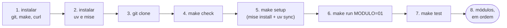

<!-- TOC -->

- [Requisitos](#requisitos)
  - [0. Do zero ao primeiro programa, em ordem](#0-do-zero-ao-primeiro-programa-em-ordem)
  - [1. Sistemas operacionais suportados](#1-sistemas-operacionais-suportados)
  - [2. Hardware recomendado](#2-hardware-recomendado)
  - [3. Software necessário](#3-software-necessário)
    - [3.1 - Instalação no Ubuntu e no WSL2](#31---instalação-no-ubuntu-e-no-wsl2)
    - [3.2 - Instalação no macOS](#32---instalação-no-macos)
    - [3.3 - Gerenciando versões com mise](#33---gerenciando-versões-com-mise)
    - [3.4 - Rodando e lendo o `make check`](#34---rodando-e-lendo-o-make-check)
  - [4. Configurando o projeto (uv)](#4-configurando-o-projeto-uv)
  - [5. Atalhos do `make`](#5-atalhos-do-make)
  - [6. Referências](#6-referências)

<!-- TOC -->

# Requisitos

Este documento lista o software e o hardware necessários para seguir a
trilha de [`docs/TRILHA.md`](docs/TRILHA.md) e explica como preparar a
máquina. Tudo roda localmente, sem custo e sem conta em nenhum serviço.

**Nunca usou Python, uv, mise ou make? Comece pela seção 0.** O resto do
documento é material de consulta.

## 0. Do zero ao primeiro programa, em ordem

Alguns conceitos antes:

- **Python** é a linguagem; o **interpretador** é o programa `python` que
  executa os arquivos `.py` ([módulo 01](modulos/01_primeiros_passos/README.md)).
- **uv** instala os pacotes Python deste projeto em uma pasta privada,
  `.venv/`, e roda os comandos dentro dela (`uv run ...`). Ele também sabe
  baixar o próprio Python ([módulo 12](modulos/12_ambientes_e_dependencias/README.md)).
- **mise** instala e fixa as **versões** das ferramentas (Python e uv)
  descritas em [`mise.toml`](mise.toml), para todo mundo usar as mesmas.
- **make** executa os atalhos do [`Makefile`](Makefile) (`make test`,
  `make run-all`, ...).



1. **Instale o software** da [seção 3](#3-software-necessário)
   ([3.1](#31---instalação-no-ubuntu-e-no-wsl2) Ubuntu/WSL2,
   [3.2](#32---instalação-no-macos)).
2. **Baixe o código**:
   ```bash
   git clone https://github.com/aeciopires/python_examples.git
   cd python_examples
   ```
3. **Verifique a máquina** ([seção 3.4](#34---rodando-e-lendo-o-make-check)):
   ```bash
   make check
   ```
4. **Instale o Python, o uv e as dependências** ([seção 4](#4-configurando-o-projeto-uv)):
   ```bash
   make setup        # o mesmo que: mise install && uv sync
   ```
5. **Rode o primeiro módulo**:
   ```bash
   make run MODULO=01
   # ou, a forma longa:
   uv run python modulos/01_primeiros_passos/exemplos/ola_mundo.py
   ```
6. **Rode os testes** - todos devem passar:
   ```bash
   make test
   ```
7. **Siga os módulos em ordem**, começando por
   [`modulos/01_primeiros_passos/README.md`](modulos/01_primeiros_passos/README.md) -
   veja [`docs/TRILHA.md`](docs/TRILHA.md).

Se algo falhar, rode `make check` de novo, leia a mensagem de erro (de
baixo para cima - [módulo 07](modulos/07_erros_e_excecoes/README.md)) e
consulte [`docs/SOLUCAO-DE-PROBLEMAS.md`](docs/SOLUCAO-DE-PROBLEMAS.md).

## 1. Sistemas operacionais suportados

| Sistema | Arquitetura | Situação |
|---|---|---|
| Ubuntu 22.04 / 24.04 / 26.04 LTS | `amd64` (`x86_64`) | Suportado |
| macOS 13+ | `arm64` (Apple Silicon) e `amd64` (Intel) | Suportado |
| Windows | - | Não suportado diretamente - use o [WSL2](https://learn.microsoft.com/pt-br/windows/wsl/install) (Ubuntu) |

Os exemplos usam só a biblioteca padrão do Python; o uv e o mise publicam
binários para `amd64` e `arm64` em Linux e macOS. O Windows fica de fora
porque o `Makefile` e o [`scripts/check-deps.sh`](scripts/check-deps.sh)
usam o bash; dentro do WSL2 tudo funciona como no Ubuntu.

Outras distribuições Linux provavelmente funcionam, mas não são testadas;
o `make check` avisa (`[AVISO]`) quando detecta uma.

## 2. Hardware recomendado

| Recurso | Necessário | Observação |
|---|---|---|
| Disco livre | cerca de 300 MB | o Python 3.14 instalado pelo mise/uv ocupou 114 MB e o `.venv` deste projeto, 94 MB, em um Ubuntu amd64 |
| Memória e CPU | qualquer computador que rode os sistemas da seção 1 | os exemplos e os testes rodam em poucos segundos |
| Rede | só na instalação | para baixar o uv, o mise, o Python e os pacotes do [PyPI](https://pypi.org) no primeiro `make setup` |

## 3. Software necessário

Rode `make check` ([seção 3.4](#34---rodando-e-lendo-o-make-check)) para ver o que falta.

| Software | Versão | Obrigatório? | Para quê |
|---|---|---|---|
| [uv](https://docs.astral.sh/uv/) | a mais recente (fixada em `mise.toml`) | sim | dependências, ambiente virtual e `uv run` - [seção 4](#4-configurando-o-projeto-uv) |
| Python | 3.14 | sim | fixado em `.python-version`/`mise.toml`; o `mise install` ou o `uv sync` o baixam se faltar |
| [mise](https://mise.jdx.dev) | a mais recente | recomendado | instala o Python e o uv fixados - [seção 3.3](#33---gerenciando-versões-com-mise) |
| GNU make | 3.81+ | sim | os atalhos do `Makefile` |
| git | 2.x | sim | baixar o repositório |
| curl | qualquer | sim | os instaladores do uv e do mise |
| Node.js (`npx`) | qualquer | opcional | só para quem contribui: renderizar os diagramas Mermaid - [`CONTRIBUTING.md`](CONTRIBUTING.md) |

Pacotes de desenvolvimento, instalados pelo `uv sync` a partir do
[`pyproject.toml`](pyproject.toml) e travados no [`uv.lock`](uv.lock):
[pytest](https://docs.pytest.org/en/stable/),
[pytest-cov](https://pytest-cov.readthedocs.io/en/latest/),
[ruff](https://docs.astral.sh/ruff/) e
[mypy](https://mypy.readthedocs.io/en/stable/).

> **Guardrail:** o Python 3.14 está em fase de correções (*bugfix*) até
> 2030-10, segundo o [calendário oficial de versões](https://devguide.python.org/versions/),
> consultado em outubro de 2026, quando o 3.15 ainda era pré-lançamento.
> As versões dos pacotes no `uv.lock` eram as atuais na mesma data. Confira
> o calendário e o [PyPI](https://pypi.org) antes de mudar uma versão.

### 3.1 - Instalação no Ubuntu e no WSL2

No Windows, instale primeiro o WSL2 com Ubuntu: abra o PowerShell como
administrador, rode `wsl --install` e reinicie
([documentação da Microsoft](https://learn.microsoft.com/pt-br/windows/wsl/install)).
Depois, dentro do Ubuntu, siga os passos abaixo.

```bash
# git, make e curl
sudo apt-get update && sudo apt-get install -y git make curl

# uv (instalador oficial - https://docs.astral.sh/uv/getting-started/installation/)
curl -LsSf https://astral.sh/uv/install.sh | sh

# mise (recomendado - seção 3.3; instalador oficial - https://mise.jdx.dev/getting-started.html)
curl https://mise.run | sh
echo 'eval "$(~/.local/bin/mise activate bash)"' >> ~/.bashrc   # Bash; outros shells: seção 3.3
```

Abra um **novo terminal** e, na raiz deste repositório:

```bash
make setup   # mise install (Python 3.14 + uv) e uv sync
```

### 3.2 - Instalação no macOS

O `git` e o `make` vêm nas *Command Line Tools for Xcode*. Se ainda não as
tiver, instale com `xcode-select --install` (o comando que a
[documentação do Homebrew](https://docs.brew.sh/Installation) indica).

```bash
xcode-select --install                               # git e make (pule se já tiver)
curl -LsSf https://astral.sh/uv/install.sh | sh      # uv
curl https://mise.run | sh                           # mise
echo 'eval "$(~/.local/bin/mise activate zsh)"' >> ~/.zshrc   # Zsh (padrão no macOS)
```

Com o [Homebrew](https://brew.sh), `brew install uv` e `brew install mise`
também funcionam; a documentação do mise prefere o instalador `mise.run`.

Abra um **novo terminal** e, na raiz deste repositório:

```bash
make setup
```

### 3.3 - Gerenciando versões com mise

O [mise](https://mise.jdx.dev) instala versões exatas de ferramentas por
projeto e passa a usá-las quando você entra na pasta do projeto. Este
repositório fixa duas em [`mise.toml`](mise.toml):

```toml
[tools]
python = "3.14"
uv = "latest"
```

Ative o mise no seu shell, uma vez por máquina (da
[referência do `mise activate`](https://mise.jdx.dev/cli/activate.html)):

| Shell | Arquivo de inicialização | Linha a adicionar |
|---|---|---|
| Bash | `~/.bashrc` | `eval "$(mise activate bash)"` |
| Zsh | `~/.zshrc` | `eval "$(mise activate zsh)"` |
| Fish | `~/.config/fish/config.fish` | `mise activate fish \| source` |

Se o `mise` ainda não estiver no `PATH`, use o caminho completo, como nos
comandos das seções 3.1 e 3.2 (`~/.local/bin/mise activate ...`).

Depois, neste repositório: `mise trust && mise install`, e confira com
`mise ls --current`, `python --version` e `uv --version`. Sem ativação
(scripts, CI), use `mise exec -- <comando>`.

O mise é recomendado, não obrigatório: o `uv` baixa o Python sozinho a
partir do [`.python-version`](.python-version). Sem o mise, você só perde
a garantia de usar a mesma versão do uv que o restante do time.

### 3.4 - Rodando e lendo o `make check`

```bash
make check
```

executa [`scripts/check-deps.sh`](scripts/check-deps.sh), que verifica o
sistema operacional ([seção 1](#1-sistemas-operacionais-suportados)) e cada
ferramenta da [seção 3](#3-software-necessário), uma por linha:

| Marcador | Significado |
|---|---|
| `[ OK ]` | encontrado e na versão esperada |
| `[AVISO]` | uma ferramenta recomendada ou opcional falta, ou a versão é mais antiga que a fixada |
| `[FALHA]` | uma ferramenta obrigatória falta - corrija antes de continuar |

O script termina com código `0` quando nada obrigatório falhou, e **nunca
instala nada**. Exemplo em um Ubuntu 22.04 com tudo instalado:

```text
== Sistema operacional (REQUIREMENTS.md, seção 1) ==
  [ OK ] Ubuntu 22.04 (x86_64) - suportado

== Software necessário (REQUIREMENTS.md, seção 3) ==
  [ OK ] uv 0.12.19 encontrado
  [ OK ] Python 3.14.7 (3.14 fixado em .python-version/mise.toml)
  [ OK ] git 2.34.1 encontrado
  [ OK ] make 4.3 encontrado
  [ OK ] curl 7.81.0 encontrado
...
```

## 4. Configurando o projeto (uv)

```bash
uv sync                                      # cria o .venv/ com pytest, pytest-cov, ruff e mypy
uv run python --version                      # o Python do .venv (3.14.x)
uv run python modulos/01_primeiros_passos/exemplos/ola_mundo.py
uv run pytest                                # todos os testes
```

O `uv sync` lê o [`pyproject.toml`](pyproject.toml) (o que o projeto
**pede**) e o [`uv.lock`](uv.lock) (as versões **exatas**), cria o
`.venv/` e instala tudo nele; se o Python 3.14 não estiver instalado, o uv o
baixa. Todo comando passa por `uv run`, que garante o ambiente atualizado
antes de rodar. Como isso funciona: [módulo 12](modulos/12_ambientes_e_dependencias/README.md)
e a [documentação do uv](https://docs.astral.sh/uv/concepts/projects/).

## 5. Atalhos do `make`

Os alvos do [`Makefile`](Makefile) são **atalhos** para os comandos
`uv run ...` documentados nos módulos. Aprenda a forma longa primeiro;
`make` (ou `make help`) lista tudo.

| Alvo | O que faz | Forma longa |
|---|---|---|
| `make check` | verifica a máquina | `bash scripts/check-deps.sh` |
| `make setup` | instala ferramentas e dependências | `mise install && uv sync` |
| `make run MODULO=03` | roda todos os exemplos de um módulo | `uv run python modulos/03_.../exemplos/<arquivo>.py`, um por um |
| `make run-all` | roda todos os exemplos de todos os módulos | o mesmo, para todas as pastas |
| `make run-file ARQUIVO=...` | roda um arquivo, com teclado | `uv run python <arquivo>` |
| `make test` | todos os testes | `uv run pytest -q` |
| `make test-module MODULO=03` | os testes de um módulo | `uv run pytest tests/unit/test_03_*.py -v` |
| `make doctest` | os exemplos `>>>` das docstrings | `uv run python -m doctest <arquivo>` |
| `make lint` / `make format` | estilo (ruff) | `uv run ruff check .` / `uv run ruff format .` |
| `make typecheck` | anotações de tipo (mypy) | `uv run mypy ...` |
| `make coverage` | testes com cobertura (mínimo 80%) | `uv run pytest --cov ...` |
| `make docs` | sumários e links da documentação | `uv run python scripts/verificar_docs.py` |
| `make all` | lint, tipos, docs, doctest, cobertura e todos os exemplos | - |
| `make clean` | apaga caches e relatórios | - |

`make run` e `make run-all` rodam os exemplos **sem teclado** (`< /dev/null`):
o jogo do módulo 03 detecta isso e encerra. Para jogar, use `make run-file`.

## 6. Referências

- [Calendário de versões do Python](https://devguide.python.org/versions/)
- [Tutorial Python](https://docs.python.org/pt-br/3/tutorial/index.html)
- [uv - instalação](https://docs.astral.sh/uv/getting-started/installation/)
- [uv - projetos](https://docs.astral.sh/uv/concepts/projects/)
- [mise - Getting started](https://mise.jdx.dev/getting-started.html)
- [mise - `mise activate`](https://mise.jdx.dev/cli/activate.html)
- [WSL - instalação](https://learn.microsoft.com/pt-br/windows/wsl/install)
- [Homebrew - instalação](https://docs.brew.sh/Installation)
- [GNU make - manual](https://www.gnu.org/software/make/manual/make.html)
