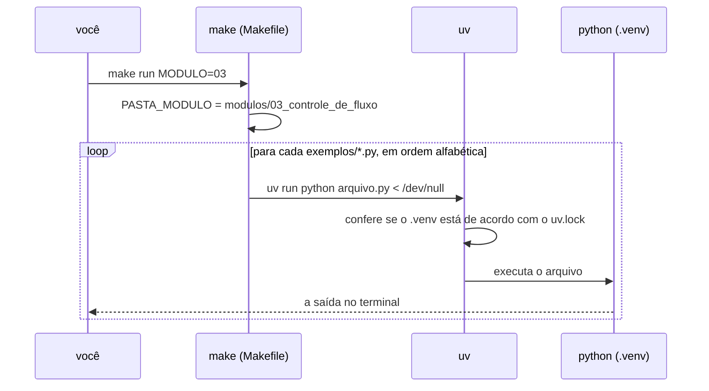
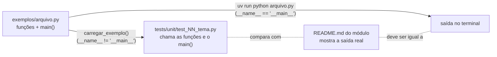
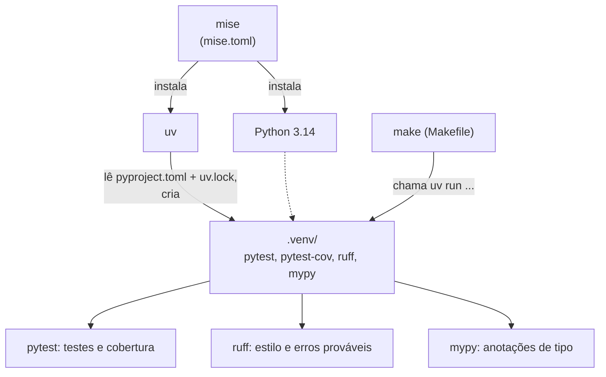

<!-- TOC -->

- [Arquitetura do repositório](#arquitetura-do-repositório)
  - [Estrutura de pastas](#estrutura-de-pastas)
  - [Do comando à saída](#do-comando-à-saída)
  - [O formato de um exemplo](#o-formato-de-um-exemplo)
  - [Como as ferramentas se dividem](#como-as-ferramentas-se-dividem)
  - [Por que as pastas começam com número?](#por-que-as-pastas-começam-com-número)
  - [Referências](#referências)

<!-- TOC -->

# Arquitetura do repositório

Como as pastas, os exemplos, os testes e o `Makefile` se encaixam. Leia
quando quiser entender o repositório como um todo ou antes de contribuir
([`CONTRIBUTING.md`](../CONTRIBUTING.md)).

## Estrutura de pastas

```text
.
├── README.md                # página inicial: o que é, início rápido, módulos
├── REQUIREMENTS.md          # sistemas suportados, instalação, mise, uv, make
├── CONTRIBUTING.md          # como propor uma mudança ou um módulo novo
├── CHANGELOG.md             # histórico de mudanças (Keep a Changelog)
├── CLAUDE.md                # regras para quem mantém o repositório (pessoas ou IA)
├── LICENSE                  # GPL-3.0
├── pyproject.toml           # projeto, dependências de desenvolvimento e configuração das ferramentas
├── uv.lock                  # versões exatas das dependências (gerado pelo uv)
├── .python-version          # 3.14 - lido pelo uv
├── mise.toml                # Python 3.14 e uv - lido pelo mise
├── Makefile                 # atalhos: make run, make test, make all...
├── scripts/
│   ├── check-deps.sh        # make check
│   └── verificar_docs.py    # make docs: sumários e links dos .md
├── docs/                    # trilha, testes, solução de problemas, glossário, esta página
├── modulos/
│   └── NN_tema/
│       ├── README.md        # a aula
│       └── exemplos/*.py    # os exemplos executáveis
├── tests/
│   ├── conftest.py          # fixture saida_de
│   ├── _helpers.py          # carregar_exemplo(), todos_os_exemplos()
│   └── unit/test_NN_tema.py # um arquivo de teste por módulo (+ test_exemplos_executam.py)
└── learning_python/         # exemplos antigos, em inglês, mantidos por histórico
```

## Do comando à saída

O que acontece quando você roda `make run MODULO=03`:



`< /dev/null` faz o programa rodar **sem teclado**: um `input()` recebe
"fim de arquivo" (`EOFError`). Por isso `make run` nunca fica parado
esperando você digitar.

## O formato de um exemplo

Todo arquivo em `modulos/*/exemplos/` segue o mesmo contrato:

1. Uma **docstring** no topo dizendo o que o exemplo mostra e as **fontes
   oficiais** usadas.
2. Funções pequenas, com **anotações de tipo**, que fazem o trabalho e
   podem ser testadas uma a uma.
3. Uma função `main() -> None` que demonstra tudo com `print()`.
4. No fim, `if __name__ == "__main__": main()` - para que os testes possam
   **importar** o arquivo sem executá-lo ([módulo 06](../modulos/06_modulos_e_pacotes/README.md)).
5. Só a **biblioteca padrão** - nenhum exemplo precisa de rede ou de pacote
   instalado.
6. Nenhum arquivo deixado para trás (o módulo 08 usa uma pasta temporária).



## Como as ferramentas se dividem



| Ferramenta | Configuração | Comando |
|---|---|---|
| mise | [`mise.toml`](../mise.toml) | `mise install` |
| uv | [`pyproject.toml`](../pyproject.toml), [`uv.lock`](../uv.lock), [`.python-version`](../.python-version) | `uv sync`, `uv run` |
| pytest / pytest-cov | `[tool.pytest.ini_options]`, `[tool.coverage.*]` no `pyproject.toml` | `make test`, `make coverage` |
| ruff | `[tool.ruff]` no `pyproject.toml` | `make lint`, `make format` |
| mypy | `[tool.mypy]` no `pyproject.toml` | `make typecheck` |

## Por que as pastas começam com número?

`01_primeiros_passos`, `02_variaveis_e_tipos`... deixam a ordem da trilha
visível em qualquer listagem de arquivos. O custo é que esses nomes não
são identificadores Python válidos, então:

- os testes importam os exemplos pelo caminho (`carregar_exemplo()` -
  [`TESTES.md`](TESTES.md#por-que-carregar_exemplo));
- o `make typecheck` roda o mypy em cada pasta de exemplos separadamente;
- o `make doctest` coloca a pasta de cada arquivo no `PYTHONPATH`.

## Referências

- [Tutorial Python - Módulos](https://docs.python.org/pt-br/3/tutorial/modules.html)
- [uv - projetos](https://docs.astral.sh/uv/concepts/projects/)
- [mise - configuração](https://mise.jdx.dev/configuration.html)
- [GNU make - manual](https://www.gnu.org/software/make/manual/make.html)
