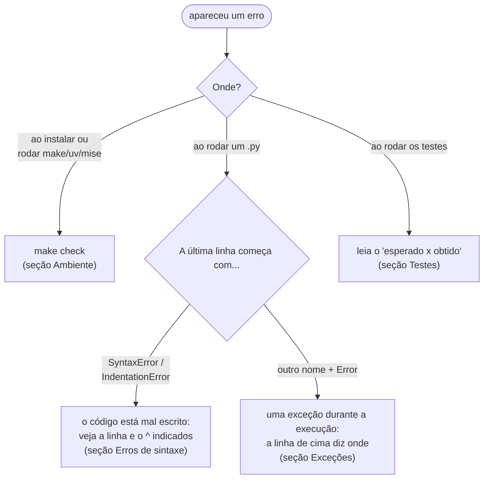

<!-- TOC -->

- [Solução de problemas](#solução-de-problemas)
  - [Primeiro passo: leia o erro de baixo para cima](#primeiro-passo-leia-o-erro-de-baixo-para-cima)
  - [Ambiente: instalação, uv, mise e make](#ambiente-instalação-uv-mise-e-make)
  - [Erros de sintaxe](#erros-de-sintaxe)
  - [Exceções durante a execução](#exceções-durante-a-execução)
  - [O programa não termina](#o-programa-não-termina)
  - [Testes](#testes)
  - [Referências](#referências)

<!-- TOC -->

# Solução de problemas

Sintoma -> causa provável -> solução. As mensagens de erro do Python foram
geradas com o Python 3.14 (outras versões podem ter textos ligeiramente
diferentes); as do terminal dependem do seu sistema.

## Primeiro passo: leia o erro de baixo para cima

O [módulo 07](../modulos/07_erros_e_excecoes/README.md#lendo-um-traceback)
mostra como ler um traceback completo.

## Ambiente: instalação, uv, mise e make

| Sintoma | Causa provável | Solução |
|---|---|---|
| `uv: command not found` (ou `mise`) | o instalador colocou o programa em `~/.local/bin`, que ainda não está no `PATH` deste terminal | abra um **novo terminal**; se persistir, veja a saída do instalador e [`REQUIREMENTS.md`, seção 3](../REQUIREMENTS.md#3-software-necessário) |
| `make: command not found` | `make` não instalado | Ubuntu: `sudo apt-get install -y make`; macOS: `xcode-select --install` |
| o mise avisa que o `mise.toml` não é confiável (*untrusted*) ou pergunta se deve confiar nele | o mise só lê configurações de projeto em que você confiou ([`mise trust`](https://mise.jdx.dev/cli/trust.html)) | `mise trust` na raiz do repositório (o `make setup` já faz isso) |
| `python --version` mostra outra versão (ex.: 3.10) | você está usando o Python do sistema, fora do mise/uv | use `uv run python ...`, ou ative o mise ([`REQUIREMENTS.md`, seção 3.3](../REQUIREMENTS.md#33---gerenciando-versões-com-mise)) |
| `ModuleNotFoundError: No module named 'pytest'` | rodou com o Python do sistema, fora do `.venv` | `uv run pytest` (ou `make test`); se o `.venv` não existir, `uv sync` |
| `make check` mostra `[AVISO]` para a distribuição | Linux que não é Ubuntu | provavelmente funciona; veja [`REQUIREMENTS.md`, seção 1](../REQUIREMENTS.md#1-sistemas-operacionais-suportados) |
| no Windows, `make` ou `bash` não existem | o repositório não roda direto no Windows | use o WSL2 ([`REQUIREMENTS.md`, seção 3.1](../REQUIREMENTS.md#31---instalação-no-ubuntu-e-no-wsl2)) |
| `make run` reclama `Escolha o módulo` | faltou `MODULO=` | `make run MODULO=03` |
| `make run MODULO=3` diz que o módulo não existe | o número precisa ter dois dígitos | `make run MODULO=03` |

## Erros de sintaxe

O Python lê o arquivo inteiro antes de executar; com um erro de sintaxe,
**nenhuma linha roda**.

| Mensagem | Causa | Módulo |
|---|---|---|
| `IndentationError: unexpected indent` | linha recuada sem motivo | [01](../modulos/01_primeiros_passos/README.md#erros-comuns) |
| `IndentationError: expected an indented block after 'if' statement on line N` | corpo do bloco sem recuo | [01](../modulos/01_primeiros_passos/README.md#erros-comuns) |
| `SyntaxError: unterminated string literal` | aspas não fechadas | [01](../modulos/01_primeiros_passos/README.md#erros-comuns) |
| `SyntaxError: '(' was never closed` | parêntese não fechado | [01](../modulos/01_primeiros_passos/README.md#erros-comuns) |
| `SyntaxError: invalid syntax. Maybe you meant '==' or ':=' instead of '='?` | `=` em uma comparação | [03](../modulos/03_controle_de_fluxo/README.md#erros-comuns) |

## Exceções durante a execução

| Mensagem (última linha) | Causa provável | Módulo |
|---|---|---|
| `NameError: name 'X' is not defined` | nome digitado errado (maiúsculas contam) ou usado antes de ser criado | [01](../modulos/01_primeiros_passos/README.md#erros-comuns) |
| `TypeError: can only concatenate str (not "int") to str` | somou texto com número | [02](../modulos/02_variaveis_e_tipos/README.md#erros-comuns) |
| `ValueError: invalid literal for int() with base 10: ...` | `int()` em um texto que não é número | [02](../modulos/02_variaveis_e_tipos/README.md#erros-comuns) |
| `TypeError: f() missing 1 required positional argument: ...` | faltou um argumento na chamada | [04](../modulos/04_funcoes/README.md#erros-comuns) |
| `UnboundLocalError: cannot access local variable ...` | atribuiu a uma global dentro de uma função | [04](../modulos/04_funcoes/README.md#erros-comuns) |
| `IndexError: list index out of range` | índice maior que a lista | [05](../modulos/05_estruturas_de_dados/README.md#erros-comuns) |
| `KeyError: 'chave'` | chave inexistente no dicionário | [05](../modulos/05_estruturas_de_dados/README.md#erros-comuns) |
| `ModuleNotFoundError: No module named ...` | nome errado, pacote não instalado ou fora do `.venv` | [06](../modulos/06_modulos_e_pacotes/README.md#erros-comuns), [12](../modulos/12_ambientes_e_dependencias/README.md#erros-comuns) |
| `AttributeError: module 'random' has no attribute ...` | um arquivo seu com o nome de um módulo da biblioteca padrão | [06](../modulos/06_modulos_e_pacotes/README.md#erros-comuns) |
| `ZeroDivisionError: division by zero` | divisão por zero | [07](../modulos/07_erros_e_excecoes/README.md#lendo-um-traceback) |
| `FileNotFoundError: [Errno 2] No such file or directory` | caminho errado, ou relativo à pasta errada | [08](../modulos/08_arquivos/README.md#erros-comuns) |
| `TypeError: X.m() takes 0 positional arguments but 1 was given` | método sem `self` | [09](../modulos/09_classes_e_objetos/README.md#erros-comuns) |

A lista completa de exceções embutidas está na
[documentação oficial](https://docs.python.org/pt-br/3/library/exceptions.html).

## O programa não termina

| Sintoma | Causa provável | Solução |
|---|---|---|
| o terminal fica parado, sem mensagem | um `input()` esperando você digitar | digite a resposta e Enter |
| o terminal imprime sem parar | um `while` cuja condição nunca fica falsa | Ctrl-C interrompe; garanta que o laço altere a condição |

## Testes

| Sintoma | Causa provável | Solução |
|---|---|---|
| `AssertionError` com `-` e `+` | o resultado (`+`) é diferente do esperado (`-`) | descubra qual dos dois está errado: o código ou o teste |
| `assert 0.30000000000000004 == 0.3` falha | comparação exata de floats | `pytest.approx` ([módulo 10](../modulos/10_testes/README.md)) |
| `test_exemplos_executam` falhou para um exemplo | o exemplo terminou com erro, não imprimiu nada ou deixou arquivos na pasta | rode o exemplo com `uv run python ...` e leia o erro |
| `make coverage` termina com `FAIL Required test coverage of 80% not reached. Total coverage: ...` | código novo sem teste | escreva os testes ([`TESTES.md`](TESTES.md)); `SKIP_COVERAGE_CHECK=1` só durante o trabalho |
| `make docs` aponta "sumário desatualizado" | um título mudou | `make docs-fix` |
| `make docs` aponta "link quebrado" | arquivo renomeado ou título mudou | corrija o link |

## Referências

- [Tutorial Python - Erros e exceções](https://docs.python.org/pt-br/3/tutorial/errors.html)
- [Exceções embutidas](https://docs.python.org/pt-br/3/library/exceptions.html)
- [uv - instalação](https://docs.astral.sh/uv/getting-started/installation/)
- [mise - Troubleshooting](https://mise.jdx.dev/troubleshooting.html)
