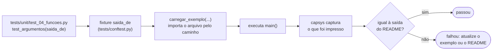

<!-- TOC -->

- [Testes](#testes)
  - [Por que este repositório tem testes?](#por-que-este-repositório-tem-testes)
  - [Rodando os testes](#rodando-os-testes)
  - [Onde ficam os testes](#onde-ficam-os-testes)
    - [Por que `carregar_exemplo()`?](#por-que-carregar_exemplo)
  - [Como um teste roda](#como-um-teste-roda)
  - [Lendo um teste](#lendo-um-teste)
  - [Escrevendo um teste para um novo exemplo](#escrevendo-um-teste-para-um-novo-exemplo)
  - [Cobertura](#cobertura)
  - [O que os testes não verificam](#o-que-os-testes-não-verificam)
  - [Referências](#referências)

<!-- TOC -->

# Testes

Como os testes em [`tests/`](../tests/) funcionam e como escrever um. Para
aprender a testar do zero, comece pelo
[módulo 10](../modulos/10_testes/README.md); este documento descreve a
organização dos testes **deste repositório**.

## Por que este repositório tem testes?

Uma trilha para iniciantes que mostra saídas erradas ensina errado. Cada
README mostra a saída de cada exemplo; os testes executam os mesmos
exemplos e **comparam** com essas saídas. Se alguém alterar um exemplo (ou
uma nova versão do Python mudar uma mensagem de erro), um teste falha e
avisa que o README precisa ser atualizado.

## Rodando os testes

```bash
uv run pytest                                          # todos (menos de 1 segundo)
uv run pytest tests/unit/test_04_funcoes.py -v         # um módulo, um teste por linha
uv run pytest -k armadilha -v                          # testes cujo nome contém "armadilha"
make test                                              # o mesmo que: uv run pytest -q
make test-module MODULO=04                             # um módulo
make doctest                                           # os exemplos >>> das docstrings
make coverage                                          # com relatório de cobertura
```

Nenhum teste precisa de rede, teclado ou permissões especiais.

## Onde ficam os testes

| Arquivo | Testa |
|---|---|
| `tests/unit/test_NN_tema.py` | um por módulo: a saída de cada `main()` e as funções do módulo |
| `tests/unit/test_exemplos_executam.py` | **todo** exemplo roda do começo ao fim em um processo separado, como em `make run-all` |
| `tests/unit/test_10_testes.py` e `test_10_testes_unittest.py` | o conteúdo do módulo 10 (pytest e unittest, comentados) |
| `tests/unit/test_verificar_docs.py` | o [`scripts/verificar_docs.py`](../scripts/verificar_docs.py) |
| `tests/conftest.py` | a fixture `saida_de` |
| `tests/_helpers.py` | `carregar_exemplo()`, `todos_os_exemplos()` |

### Por que `carregar_exemplo()`?

As pastas dos módulos começam com um número (`04_funcoes`), que não é um
identificador Python válido: `from modulos.04_funcoes...` é um erro de
sintaxe. [`carregar_exemplo("04_funcoes", "argumentos")`](../tests/_helpers.py)
importa o arquivo pelo caminho, com `importlib`
([importando um arquivo-fonte diretamente](https://docs.python.org/pt-br/3/library/importlib.html#importing-a-source-file-directly)),
e devolve o módulo.

## Como um teste roda



## Lendo um teste

De [`tests/unit/test_04_funcoes.py`](../tests/unit/test_04_funcoes.py):

```python
def test_escopo(saida_de: Callable[[str, str], str]) -> None:
    assert saida_de(M, "escopo").splitlines() == ["global", "local", "global", "1 2", "15"]
```

- `saida_de` é uma **fixture**: o pytest a encontra em `tests/conftest.py`
  e a entrega ao teste pelo nome do parâmetro.
- `saida_de(M, "escopo")` executa o `main()` de
  `modulos/04_funcoes/exemplos/escopo.py` e devolve tudo o que foi impresso.
- `.splitlines()` transforma o texto em uma lista de linhas - quando a
  comparação falha, o pytest mostra exatamente qual linha mudou.

## Escrevendo um teste para um novo exemplo

1. Rode o exemplo e copie a saída real para o README do módulo.
2. No `tests/unit/test_NN_tema.py` do módulo, adicione um teste que compara
   `saida_de(M, "arquivo")` com essa saída.
3. Teste as funções do exemplo diretamente, inclusive **limites** e
   **erros** (`pytest.raises`) - veja o [módulo 10](../modulos/10_testes/README.md).
4. **Quebre o exemplo de propósito** e confira que um teste falha. Um teste
   que não falha não protege nada.
5. `make test-module MODULO=NN`, depois `make all`.

O teste `test_exemplos_executam.py` encontra o arquivo novo sozinho: ele
percorre `modulos/*/exemplos/*.py`.

## Cobertura

```bash
make coverage                          # relatório; falha abaixo de 80%
make coverage SKIP_COVERAGE_CHECK=1    # só o relatório (trabalho em andamento)
```

`make coverage` roda `uv run pytest tests --cov --cov-report=term-missing --cov-report=html`.
A seção `[tool.coverage.*]` do [`pyproject.toml`](../pyproject.toml) define
o que é medido (`modulos` e `scripts`), liga a **cobertura de ramos** (um
`if` só conta como coberto quando os dois caminhos rodaram) e o mínimo de
80%. Abra `htmlcov/index.html` para ver linha a linha: verde rodou,
vermelho nunca rodou, amarelo é um `if` que só foi por um caminho.

A regra: **nunca abaixo de 80%, e o código novo coberto** (hoje o
repositório está perto de 100%). A única exclusão é o bloco
`if __name__ == "__main__":`, que só roda quando o arquivo é executado
diretamente - e esse caminho é coberto por `test_exemplos_executam.py`, em
outro processo.

## O que os testes não verificam

- Que o **texto** dos READMEs está correto além das saídas - isso é
  revisão humana, com as fontes oficiais citadas em cada README.
- Que os diagramas Mermaid renderizam - veja
  [`CONTRIBUTING.md`](../CONTRIBUTING.md#diagramas).
- O jogo do módulo 03 com uma pessoa de verdade digitando.

## Referências

- [pytest - documentação](https://docs.pytest.org/en/stable/)
- [pytest - fixtures e conftest.py](https://docs.pytest.org/en/stable/reference/fixtures.html#conftest-py-sharing-fixtures-across-multiple-files)
- [pytest - capsys](https://docs.pytest.org/en/stable/how-to/capture-stdout-stderr.html)
- [pytest-cov](https://pytest-cov.readthedocs.io/en/latest/)
- [coverage.py - cobertura de ramos](https://coverage.readthedocs.io/en/latest/branch.html)
- [`importlib`](https://docs.python.org/pt-br/3/library/importlib.html)
