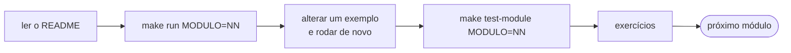
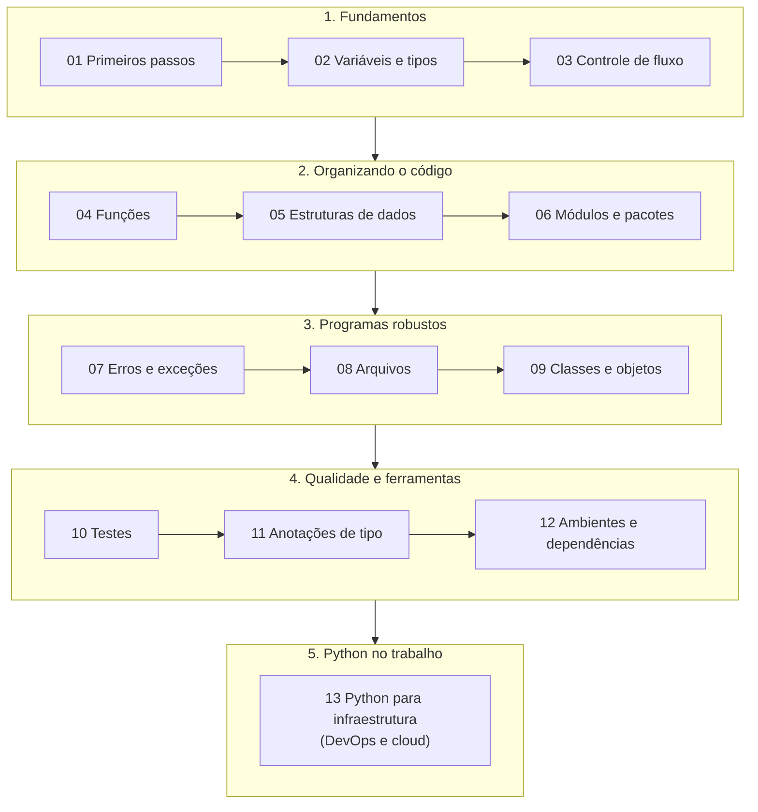

<!-- TOC -->

- [Trilha de aprendizado](#trilha-de-aprendizado)
  - [Como usar esta trilha](#como-usar-esta-trilha)
  - [As fases](#as-fases)
    - [Fase 1 - Fundamentos](#fase-1---fundamentos)
    - [Fase 2 - Organizando o código](#fase-2---organizando-o-código)
    - [Fase 3 - Programas robustos](#fase-3---programas-robustos)
    - [Fase 4 - Qualidade e ferramentas](#fase-4---qualidade-e-ferramentas)
    - [Fase 5 - Python no trabalho](#fase-5---python-no-trabalho)
  - [Depois da trilha](#depois-da-trilha)
  - [Guias transversais](#guias-transversais)

<!-- TOC -->

# Trilha de aprendizado

13 módulos, do primeiro `print()` a testes automatizados, ambientes
virtuais e Python aplicado a infraestrutura (DevOps e cloud). Cada módulo é uma pasta em [`modulos/`](../modulos/) com um README
(explicação, analogias, diagramas, saídas reais, erros comuns e
exercícios), exemplos executáveis em `exemplos/` e testes em
[`tests/unit/`](../tests/unit/). Prepare a máquina antes com
[`REQUIREMENTS.md`, seção 0](../REQUIREMENTS.md#0-do-zero-ao-primeiro-programa-em-ordem).

A ordem e o conteúdo seguem de perto o
[Tutorial Python oficial](https://docs.python.org/pt-br/3/tutorial/index.html),
que é a principal fonte desta trilha.

## Como usar esta trilha

- **Siga a ordem na primeira vez.** Cada módulo usa o que os anteriores
  ensinaram; os READMEs avisam quando algo só será explicado mais adiante.
- **Para cada módulo**:
  1. leia a Visão geral, a Analogia e os Conceitos;
  2. rode os exemplos (`make run MODULO=NN`) e compare com as saídas do README;
  3. **altere** os exemplos e rode de novo - é assim que se aprende;
  4. rode os testes do módulo (`make test-module MODULO=NN`);
  5. leia os Erros comuns e faça os Exercícios.
- **Errou? Ótimo.** Leia a mensagem de baixo para cima
  ([módulo 07](../modulos/07_erros_e_excecoes/README.md)) e consulte
  [`SOLUCAO-DE-PROBLEMAS.md`](SOLUCAO-DE-PROBLEMAS.md).
- Termos novos estão no [`GLOSSARIO.md`](GLOSSARIO.md).

## As fases

### Fase 1 - Fundamentos

| Módulo | Você aprende | Exemplos |
|---|---|---|
| [01 - Primeiros passos](../modulos/01_primeiros_passos/README.md) | interpretador, REPL, `print()`, comentários, indentação | 3 |
| [02 - Variáveis e tipos](../modulos/02_variaveis_e_tipos/README.md) | `int`, `float`, `str`, `bool`, `None`, conversões, f-strings | 4 |
| [03 - Controle de fluxo](../modulos/03_controle_de_fluxo/README.md) | `if`/`elif`/`else`, `for`, `while`, `break`, `match`, um jogo | 4 |

### Fase 2 - Organizando o código

| Módulo | Você aprende | Exemplos |
|---|---|---|
| [04 - Funções](../modulos/04_funcoes/README.md) | `def`, `return`, argumentos, `*args`/`**kwargs`, escopo, `lambda` | 4 |
| [05 - Estruturas de dados](../modulos/05_estruturas_de_dados/README.md) | listas, tuplas, conjuntos, dicionários, compreensões | 5 |
| [06 - Módulos e pacotes](../modulos/06_modulos_e_pacotes/README.md) | `import`, `__name__`, pacotes, biblioteca padrão | 4 |

### Fase 3 - Programas robustos

| Módulo | Você aprende | Exemplos |
|---|---|---|
| [07 - Erros e exceções](../modulos/07_erros_e_excecoes/README.md) | tracebacks, `try`/`except`/`else`/`finally`, `raise`, exceções próprias | 2 |
| [08 - Arquivos](../modulos/08_arquivos/README.md) | `open()`, `with`, `pathlib`, JSON, CSV | 2 |
| [09 - Classes e objetos](../modulos/09_classes_e_objetos/README.md) | `class`, `self`, herança, polimorfismo, `@dataclass` | 3 |

### Fase 4 - Qualidade e ferramentas

| Módulo | Você aprende | Exemplos |
|---|---|---|
| [10 - Testes](../modulos/10_testes/README.md) | pytest, `parametrize`, fixtures, doctest, unittest, cobertura | 1 + os testes |
| [11 - Anotações de tipo](../modulos/11_anotacoes_de_tipo/README.md) | type hints, `str \| None`, mypy | 1 |
| [12 - Ambientes e dependências](../modulos/12_ambientes_e_dependencias/README.md) | ambientes virtuais, uv, `uv.lock`, mise | 1 |

### Fase 5 - Python no trabalho

Aplica tudo o que veio antes a uma área profissional. Este módulo é para
quem trabalha (ou quer trabalhar) com infraestrutura - *DevOps engineer*,
SRE, *cloud architect* - e continua usando só a biblioteca padrão.

| Módulo | Você aprende | Exemplos |
|---|---|---|
| [13 - Python para infraestrutura](../modulos/13_python_para_infraestrutura/README.md) | `subprocess`, `shlex`, variáveis de ambiente, `tomllib`, `argparse`, `logging`, `re`, `ipaddress`, backoff, `hashlib` | 6 |

## Depois da trilha

O próximo passo natural é o restante do
[Tutorial Python oficial](https://docs.python.org/pt-br/3/tutorial/index.html)
(iteradores, geradores, a biblioteca padrão em detalhes) e a
[referência da biblioteca padrão](https://docs.python.org/pt-br/3/library/index.html).
Os exemplos antigos em [`learning_python/`](../learning_python/README.md)
(em inglês) também podem ser lidos como prática - compare `guess.py` e `fish.py`
com as versões revisadas dos módulos 03 e 09.

## Guias transversais

| Documento | Conteúdo |
|---|---|
| [`ARQUITETURA.md`](ARQUITETURA.md) | como as pastas, os testes e o `Makefile` se encaixam |
| [`TESTES.md`](TESTES.md) | como os testes deste repositório funcionam e como escrever um |
| [`SOLUCAO-DE-PROBLEMAS.md`](SOLUCAO-DE-PROBLEMAS.md) | sintoma -> causa -> solução |
| [`GLOSSARIO.md`](GLOSSARIO.md) | os termos usados na trilha |
