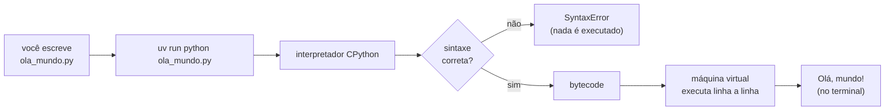
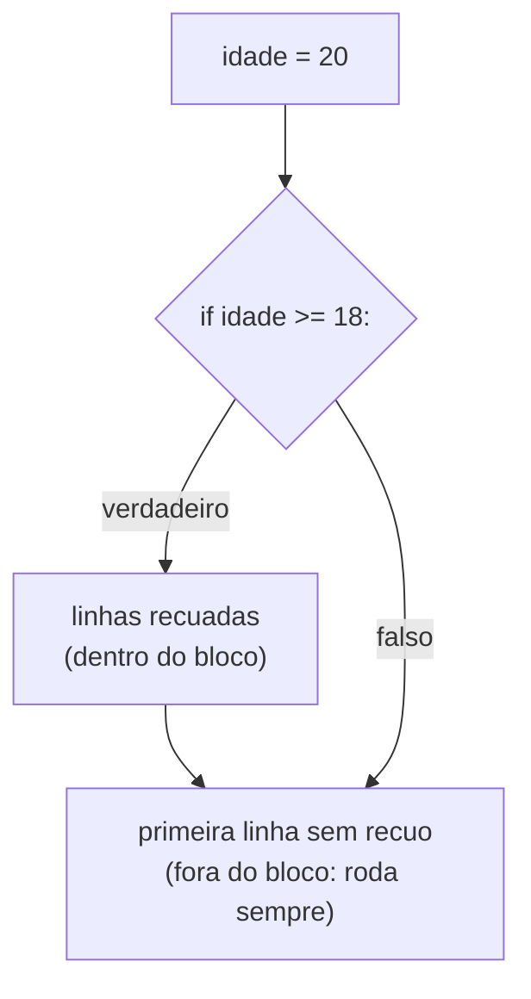

<!-- TOC -->

- [Módulo 01 - Primeiros passos](#módulo-01---primeiros-passos)
  - [Visão geral](#visão-geral)
  - [O que você vai aprender](#o-que-você-vai-aprender)
  - [Analogia: o intérprete de idiomas](#analogia-o-intérprete-de-idiomas)
  - [Conceitos](#conceitos)
    - [O caminho do código até a tela](#o-caminho-do-código-até-a-tela)
    - [O modo interativo (REPL)](#o-modo-interativo-repl)
    - [`print()` e comentários](#print-e-comentários)
    - [Indentação define os blocos](#indentação-define-os-blocos)
    - [O que são `def main()` e `if __name__ == "__main__":`?](#o-que-são-def-main-e-if-__name__--__main__)
  - [Exemplos](#exemplos)
    - [`ola_mundo.py`](#ola_mundopy)
    - [`print_e_comentarios.py`](#print_e_comentariospy)
    - [`indentacao.py`](#indentacaopy)
  - [O Zen do Python](#o-zen-do-python)
  - [Testes](#testes)
  - [Erros comuns](#erros-comuns)
  - [Exercícios](#exercícios)
  - [Referências](#referências)

<!-- TOC -->

# Módulo 01 - Primeiros passos

## Visão geral

"Python é uma linguagem fácil de aprender e poderosa", diz a abertura do
[tutorial oficial](https://docs.python.org/pt-br/3/tutorial/index.html).
É uma linguagem **interpretada**: segundo o capítulo
[Abrindo o apetite](https://docs.python.org/pt-br/3/tutorial/appetite.html),
"não há necessidade de compilação e ligação" antes de rodar. O nome, diz o
mesmo capítulo, vem do programa da BBC *Monty Python's Flying Circus* - e
"não tem nada a ver com répteis".

Neste módulo você roda o seu primeiro programa, usa o Python como
calculadora, escreve comentários e entende por que os **espaços no começo
da linha** importam.

**Antes de começar:** prepare a máquina com
[`REQUIREMENTS.md`, seção 0](../../REQUIREMENTS.md#0-do-zero-ao-primeiro-programa-em-ordem).

## O que você vai aprender

- O que é o interpretador Python e o que acontece quando você roda um arquivo `.py`.
- Usar o modo interativo (REPL, o prompt `>>>`).
- Mostrar textos e resultados com `print()` (e os parâmetros `sep=` e `end=`).
- Escrever comentários com `#`.
- Por que a **indentação** (recuo) define os blocos de código.

## Analogia: o intérprete de idiomas

Imagine que você fala português e o computador só entende "linguagem de
máquina". O **interpretador Python** é como um intérprete de idiomas: você
escreve instruções em um texto legível (o arquivo `.py`) e ele as traduz e
executa para você, na ordem, de cima para baixo.

A analogia tem um detalhe a mais: antes de executar, o CPython (o
interpretador oficial) traduz o arquivo inteiro para uma forma
intermediária chamada **bytecode**, que uma "máquina virtual" executa - é
como o intérprete ler o discurso inteiro antes, fazer anotações, e só
então falar. Se houver um erro de *sintaxe* (de gramática), ele avisa antes
de executar qualquer linha. Fonte: o verbete
[bytecode do glossário](https://docs.python.org/pt-br/3/glossary.html#term-bytecode).

## Conceitos

### O caminho do código até a tela



### O modo interativo (REPL)

Rodar `python` sem nenhum arquivo abre o **modo interativo**: você digita
uma linha, o Python executa e mostra o resultado. O prompt `>>>` indica que
ele espera um comando; `...` indica a continuação de um bloco. Para sair,
digite `quit()` ou o caractere de fim de arquivo (Ctrl-D no Linux/macOS).
Fonte: [Utilizando o interpretador Python](https://docs.python.org/pt-br/3/tutorial/interpreter.html).

```bash
uv run python
```

```text
>>> 2 + 2
4
>>> "Py" + "thon"
'Python'
>>> quit()
```

No REPL você não precisa de `print()` para ver o valor de uma expressão; em
um arquivo `.py`, precisa.

### `print()` e comentários

[`print()`](https://docs.python.org/pt-br/3/library/functions.html#print)
mostra valores no terminal. Com vários valores, ele os separa com um espaço
(`sep=" "`) e termina com uma quebra de linha (`end="\n"`) - ambos podem ser
trocados. Tudo depois de `#` é um **comentário**: um bilhete para quem lê o
código, ignorado pelo Python.

### Indentação define os blocos

Em vez de chaves `{ }`, o Python usa o **recuo** para saber quais linhas
pertencem a um bloco (o corpo de um `if`, de uma função, ...). Uma linha
terminada em `:` abre um bloco; as linhas seguintes, recuadas, fazem parte
dele. O guia de estilo oficial ([PEP 8](https://peps.python.org/pep-0008/#indentation))
recomenda **4 espaços** por nível.



### O que são `def main()` e `if __name__ == "__main__":`?

Todos os exemplos desta trilha seguem o mesmo formato:

```python
def main() -> None:
    print("Olá, mundo!")


if __name__ == "__main__":
    main()
```

Por enquanto, leia isso como "o programa começa em `main()`". O `def` é
explicado no [módulo 04](../04_funcoes/README.md), o `-> None` no
[módulo 11](../11_anotacoes_de_tipo/README.md) e o `if __name__ ...` no
[módulo 06](../06_modulos_e_pacotes/README.md). Esse formato permite que os
testes importem o arquivo sem executá-lo.

## Exemplos

Rode a partir da raiz do repositório. Para rodar todos de uma vez:
`make run MODULO=01`.

### `ola_mundo.py`

```bash
uv run python modulos/01_primeiros_passos/exemplos/ola_mundo.py
```

```text
Olá, mundo!
```

### `print_e_comentarios.py`

```bash
uv run python modulos/01_primeiros_passos/exemplos/print_e_comentarios.py
```

```text
Python é divertido
2026-10-03
Sem pular linha... continuou na mesma linha.
14
20
```

`2 + 3 * 4` dá `14` porque a multiplicação acontece antes da soma (a mesma
precedência da matemática); com parênteses, `(2 + 3) * 4` dá `20`.

### `indentacao.py`

```bash
uv run python modulos/01_primeiros_passos/exemplos/indentacao.py
```

```text
Esta linha está DENTRO do if (recuada 4 espaços).
Esta também: só rodam se a condição for verdadeira.
Esta linha está FORA do if: roda sempre.
```

Troque `idade = 20` por `idade = 10` e rode de novo: só a última linha
aparece.

## O Zen do Python

Os princípios que guiam o design da linguagem estão na
[PEP 20](https://peps.python.org/pep-0020/) e escondidos no próprio Python:

```bash
uv run python -c "import this"
```

```text
The Zen of Python, by Tim Peters

Beautiful is better than ugly.
Explicit is better than implicit.
Simple is better than complex.
...
Readability counts.
...
```

## Testes

[`tests/unit/test_01_primeiros_passos.py`](../../tests/unit/test_01_primeiros_passos.py)
executa o `main()` de cada exemplo e compara o que foi impresso com as
saídas mostradas acima.

```bash
uv run pytest tests/unit/test_01_primeiros_passos.py -v
make test-module MODULO=01        # o mesmo, pelo atalho
```

Como esses testes funcionam é assunto do [módulo 10](../10_testes/README.md).

## Erros comuns

As mensagens abaixo foram geradas pelo Python 3.14 ao executar cada trecho.
Leia a **última linha** primeiro: ela diz o tipo e o motivo do erro.

| Você escreveu | O Python responde | Como corrigir |
|---|---|---|
| uma linha recuada sem motivo | `IndentationError: unexpected indent` | remova os espaços do começo da linha |
| `if True:` e, na linha de baixo, `print("b")` sem recuo | `IndentationError: expected an indented block after 'if' statement on line 1` | recue o corpo do `if` com 4 espaços |
| `Print("oi")` | `NameError: name 'Print' is not defined. Did you mean: 'print'?` | o Python diferencia maiúsculas de minúsculas: `print` |
| `print("oi)` | `SyntaxError: unterminated string literal (detected at line 1)` | feche as aspas: `"oi"` |
| `print("oi"` | `SyntaxError: '(' was never closed` | feche o parêntese |

Misturar tabs e espaços na mesma indentação também causa erro; configure o
editor para inserir 4 espaços ao apertar Tab.

## Exercícios

1. Escreva `meu_nome.py`, que mostra o seu nome e a sua cidade em uma
   única linha, separados por `" - "` (use `sep=`).
2. Use o REPL para calcular quantos minutos há em uma semana.
3. Em `indentacao.py`, remova o recuo de uma das linhas de dentro do `if`
   e veja o que muda (e se dá erro).

## Referências

- [Tutorial Python - Abrindo o apetite](https://docs.python.org/pt-br/3/tutorial/appetite.html)
- [Tutorial Python - Utilizando o interpretador Python](https://docs.python.org/pt-br/3/tutorial/interpreter.html)
- [Tutorial Python - Uma introdução informal ao Python](https://docs.python.org/pt-br/3/tutorial/introduction.html)
- [Funções embutidas - `print()`](https://docs.python.org/pt-br/3/library/functions.html#print)
- [Glossário - bytecode](https://docs.python.org/pt-br/3/glossary.html#term-bytecode)
- [PEP 8 - Guia de estilo para código Python](https://peps.python.org/pep-0008/)
- [PEP 20 - O Zen do Python](https://peps.python.org/pep-0020/)
