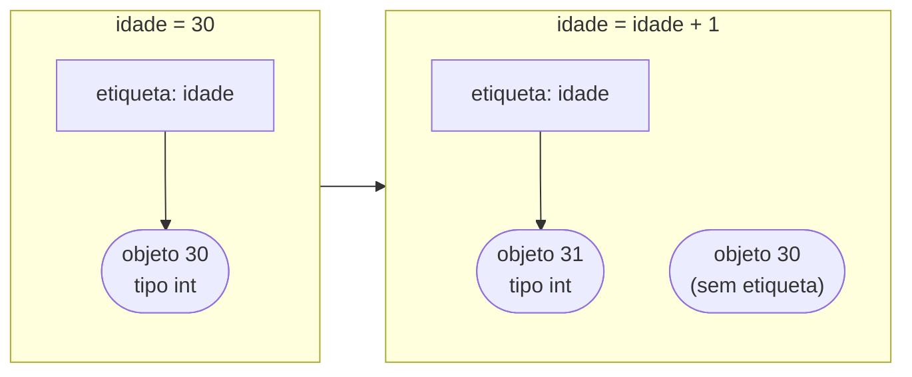

<!-- TOC -->

- [Módulo 02 - Variáveis e tipos](#módulo-02---variáveis-e-tipos)
  - [Visão geral](#visão-geral)
  - [O que você vai aprender](#o-que-você-vai-aprender)
  - [Analogia: variáveis são etiquetas, não caixas](#analogia-variáveis-são-etiquetas-não-caixas)
  - [Conceitos](#conceitos)
    - [Os tipos básicos](#os-tipos-básicos)
    - [Operações com números](#operações-com-números)
    - [Por que `0.1 + 0.2` dá `0.30000000000000004`?](#por-que-01--02-dá-030000000000000004)
    - [Textos (`str`)](#textos-str)
    - [O que é "verdadeiro" para o Python](#o-que-é-verdadeiro-para-o-python)
  - [Exemplos](#exemplos)
    - [`variaveis.py`](#variaveispy)
    - [`numeros.py`](#numerospy)
    - [`textos.py`](#textospy)
    - [`conversoes.py`](#conversoespy)
  - [Testes](#testes)
  - [Erros comuns](#erros-comuns)
  - [Exercícios](#exercícios)
  - [Referências](#referências)

<!-- TOC -->

# Módulo 02 - Variáveis e tipos

## Visão geral

Programas guardam e transformam **dados**: nomes, idades, preços, respostas
de sim/não. Neste módulo você aprende a dar nomes a esses dados
(**variáveis**) e conhece os tipos básicos do Python: números inteiros
(`int`), números com casas decimais (`float`), textos (`str`), valores
lógicos (`bool`) e o "nenhum valor" (`None`).

**Pré-requisito:** [módulo 01](../01_primeiros_passos/README.md).

## O que você vai aprender

- Criar e reatribuir variáveis com `=`.
- Usar `type()` para descobrir o tipo de um valor.
- As operações com números: `/`, `//`, `%`, `**` - e por que `0.1 + 0.2` não é `0.3`.
- Trabalhar com textos: f-strings, índices, fatias e métodos como `upper()` e `split()`.
- Converter entre tipos com `int()`, `float()`, `str()` e `bool()`.
- O que é "verdadeiro" e "falso" para o Python, e o que é `None`.

## Analogia: variáveis são etiquetas, não caixas

É comum imaginar uma variável como uma "caixa" que guarda um valor. Em
Python, a imagem mais fiel é a de uma **etiqueta presa a um objeto**:
`idade = 30` cria o objeto `30` e cola nele a etiqueta `idade`. Quando você
faz `idade = idade + 1`, o Python cria o objeto `31` e **move a etiqueta**
para ele.

Essa diferença parece pequena agora, mas explica uma surpresa do
[módulo 05](../05_estruturas_de_dados/README.md): duas etiquetas podem estar
presas ao **mesmo** objeto. O tutorial oficial descreve isso como nomes que
fazem referência a objetos
([Uma palavra sobre nomes e objetos](https://docs.python.org/pt-br/3/tutorial/classes.html#a-word-about-names-and-objects)).



## Conceitos

### Os tipos básicos

| Tipo | Exemplo | Para quê | Documentação |
|---|---|---|---|
| `int` | `42`, `-7`, `2**100` | números inteiros, de qualquer tamanho | [Tipos numéricos](https://docs.python.org/pt-br/3/library/stdtypes.html#numeric-types-int-float-complex) |
| `float` | `3.14`, `1.65`, `7 / 2` | números com casas decimais (use **ponto**, não vírgula) | [Tipos numéricos](https://docs.python.org/pt-br/3/library/stdtypes.html#numeric-types-int-float-complex) |
| `str` | `"Ana"`, `'café'` | textos (aspas simples ou duplas) | [Texto](https://docs.python.org/pt-br/3/library/stdtypes.html#text-sequence-type-str) |
| `bool` | `True`, `False` | verdadeiro/falso | [Valor verdade](https://docs.python.org/pt-br/3/library/stdtypes.html#truth-value-testing) |
| `NoneType` | `None` | "nenhum valor" | [Constantes](https://docs.python.org/pt-br/3/library/constants.html#None) |

### Operações com números

| Operação | Resultado | Observação |
|---|---|---|
| `7 / 2` | `3.5` | divisão: o resultado é sempre `float` |
| `7 // 2` | `3` | divisão inteira: arredonda **para baixo** |
| `-7 // 2` | `-4` | "para baixo" é em direção a menos infinito, não a zero |
| `7 % 2` | `1` | resto da divisão |
| `2 ** 10` | `1024` | potência |

### Por que `0.1 + 0.2` dá `0.30000000000000004`?

O computador guarda `float` em **binário**, e frações como 0,1 não têm
representação exata em binário - do mesmo jeito que 1/3 não tem
representação exata em decimal (0,3333...). O resultado é uma aproximação
muito próxima, mas não idêntica. Não é um bug do Python; o tutorial
oficial dedica um capítulo a isso:
[Aritmética de ponto flutuante: problemas e limitações](https://docs.python.org/pt-br/3/tutorial/floatingpoint.html).
Na prática: arredonde ao **mostrar** (`round()` ou `f"{valor:.2f}"`) e, ao
comparar floats em testes, use `pytest.approx` ([módulo 10](../10_testes/README.md)).

### Textos (`str`)

Um texto é uma **sequência** de caracteres, numerada a partir de **0**.
Índices negativos contam do fim.

```text
 P   y   t   h   o   n
 0   1   2   3   4   5     <- índice a partir do início
-6  -5  -4  -3  -2  -1     <- índice a partir do fim
```

- `texto[0]` é o primeiro caractere; `texto[-1]`, o último.
- `texto[0:2]` é uma **fatia**: do índice 0 até o 2, **sem incluir o 2** (`"Py"`).
- Textos são **imutáveis**: métodos como `replace()` e `upper()` devolvem um
  **texto novo**; o original não muda.
- **f-strings** (`f"Olá, {nome}!"`) inserem valores dentro do texto, e
  aceitam formatação: `f"{3.14159:.2f}"` dá `3.14`
  ([f-strings no tutorial](https://docs.python.org/pt-br/3/tutorial/inputoutput.html#formatted-string-literals)).

### O que é "verdadeiro" para o Python

Qualquer valor pode ser testado em um `if`. São **falsos**: `False`, `None`,
zero (`0`, `0.0`) e coleções vazias (`""`, `[]`, `{}`). Todo o resto é
**verdadeiro** - inclusive o texto `"0"`, que não é vazio. Fonte:
[Teste do valor verdade](https://docs.python.org/pt-br/3/library/stdtypes.html#truth-value-testing).

## Exemplos

Para rodar todos: `make run MODULO=02`.

### `variaveis.py`

```bash
uv run python modulos/02_variaveis_e_tipos/exemplos/variaveis.py
```

```text
Ana 30 1.65 True
Ano que vem: 31
x = 20 e y = 10
<class 'str'> <class 'int'> <class 'float'> <class 'bool'>
```

### `numeros.py`

```bash
uv run python modulos/02_variaveis_e_tipos/exemplos/numeros.py
```

```text
3.5
3
1
-4
1024
1267650600228229401496703205376
0.30000000000000004
0.3
7.5
```

### `textos.py`

```bash
uv run python modulos/02_variaveis_e_tipos/exemplos/textos.py
```

```text
6
P n
Py thon
PYTHON python
True
Python 3.14 é a versão usada nesta trilha.
Pi com 2 casas: 3.14
['banana', 'maçã', 'uva']
banana | maçã | uva
banana,maçã,kiwi
Olá, Ada Lovelace!
```

A função `saudacao()` tem um exemplo `>>>` na docstring - um **doctest**,
que `make doctest` executa ([módulo 10](../10_testes/README.md)).

### `conversoes.py`

```bash
uv run python modulos/02_variaveis_e_tipos/exemplos/conversoes.py
```

```text
43
7.0
100
3
False False False False
True True True
True
```

Repare: `int(3.99)` dá `3` - a conversão **corta** as casas decimais, não
arredonda. E `input()` (que lê o teclado) sempre devolve um `str`: para
fazer contas com o que a pessoa digitou, converta com `int()` ou `float()`.

## Testes

[`tests/unit/test_02_variaveis_e_tipos.py`](../../tests/unit/test_02_variaveis_e_tipos.py)
confere as saídas acima e testa `media()` e `saudacao()` diretamente -
inclusive com `pytest.approx` para o caso `0.1 + 0.2`.

```bash
make test-module MODULO=02
```

## Erros comuns

| Você escreveu | O Python responde | Como corrigir |
|---|---|---|
| `"42" + 1` | `TypeError: can only concatenate str (not "int") to str` | converta antes: `int("42") + 1` ou `"42" + str(1)` |
| `int("abc")` | `ValueError: invalid literal for int() with base 10: 'abc'` | só converta textos que representam números (tratar o erro: [módulo 07](../07_erros_e_excecoes/README.md)) |
| `altura = 1,65` | não dá erro, mas cria uma **tupla** `(1, 65)` | use ponto: `1.65` |
| `if resultado == None:` | funciona, mas não é o recomendado | compare com `None` usando `is`: `if resultado is None:` ([PEP 8](https://peps.python.org/pep-0008/#programming-recommendations)) |

## Exercícios

1. Peça uma temperatura em Celsius com `input()`, converta para `float` e
   mostre em Fahrenheit (`F = C * 9 / 5 + 32`) com uma casa decimal.
2. Dado `nome = "  maria da silva  "`, produza `"Maria Da Silva"` e depois
   `"MDS"` (as iniciais - dica: `split()` e índices).
3. Descubra, no REPL, o que `bool(" ")` (um espaço) devolve, e explique por quê.

## Referências

- [Tutorial Python - Uma introdução informal ao Python](https://docs.python.org/pt-br/3/tutorial/introduction.html)
- [Tutorial Python - Entrada e saída (f-strings)](https://docs.python.org/pt-br/3/tutorial/inputoutput.html#formatted-string-literals)
- [Tutorial Python - Aritmética de ponto flutuante](https://docs.python.org/pt-br/3/tutorial/floatingpoint.html)
- [Tipos embutidos](https://docs.python.org/pt-br/3/library/stdtypes.html)
- [Métodos de string](https://docs.python.org/pt-br/3/library/stdtypes.html#string-methods)
- [Funções embutidas](https://docs.python.org/pt-br/3/library/functions.html)
- [Uma palavra sobre nomes e objetos](https://docs.python.org/pt-br/3/tutorial/classes.html#a-word-about-names-and-objects)
