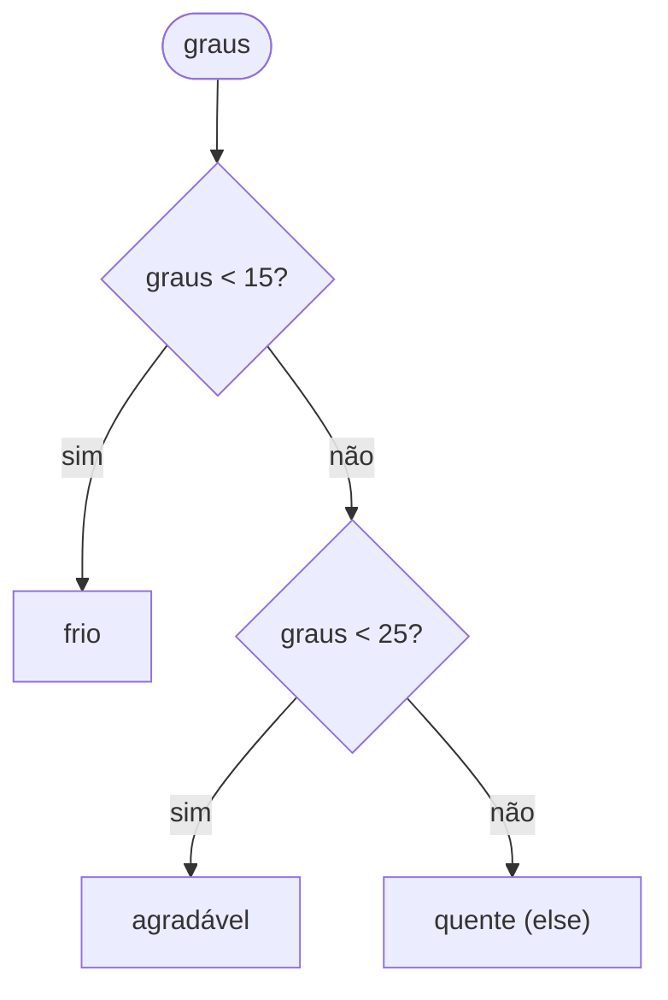
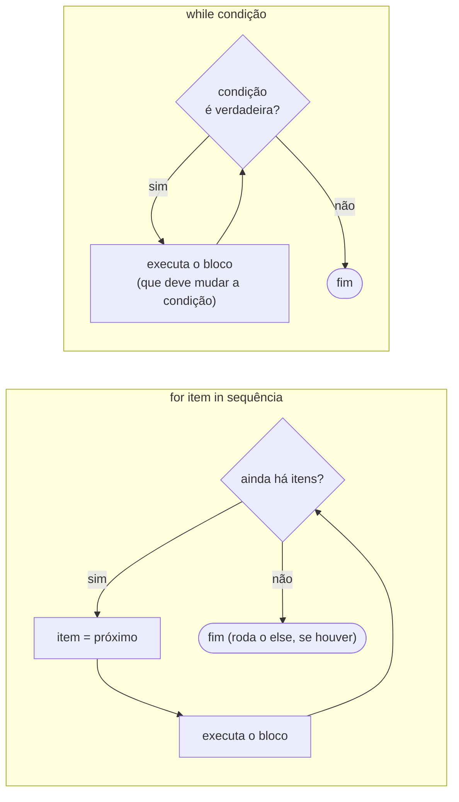

<!-- TOC -->

- [Módulo 03 - Controle de fluxo](#módulo-03---controle-de-fluxo)
  - [Visão geral](#visão-geral)
  - [O que você vai aprender](#o-que-você-vai-aprender)
  - [Analogias](#analogias)
  - [Conceitos](#conceitos)
    - [Decisões: `if` / `elif` / `else`](#decisões-if--elif--else)
    - [Repetições: `for` e `while`](#repetições-for-e-while)
    - [Vários casos: `match` / `case`](#vários-casos-match--case)
  - [Exemplos](#exemplos)
    - [`condicionais.py`](#condicionaispy)
    - [`lacos.py`](#lacospy)
    - [`match_case.py`](#match_casepy)
    - [`adivinhe.py` - o jogo](#adivinhepy---o-jogo)
  - [Testes](#testes)
  - [Erros comuns](#erros-comuns)
  - [Exercícios](#exercícios)
  - [Referências](#referências)

<!-- TOC -->

# Módulo 03 - Controle de fluxo

## Visão geral

Até aqui, os programas rodavam todas as linhas, de cima para baixo. Agora
eles vão **decidir** (`if`, `match`) e **repetir** (`for`, `while`). No fim
do módulo, um jogo de adivinhação junta tudo isso com a leitura do teclado
(`input()`).

**Pré-requisito:** [módulo 02](../02_variaveis_e_tipos/README.md).

## O que você vai aprender

- Tomar decisões com `if` / `elif` / `else`.
- Combinar condições com `and`, `or`, `not` e comparações encadeadas (`18 <= idade < 65`).
- Repetir com `for` (sobre listas e `range()`) e com `while`.
- Interromper laços com `break` e pular voltas com `continue`.
- O `else` de um laço (raro, mas útil).
- Escolher entre vários casos com `match` / `case` (Python 3.10+).

## Analogias

- **`if` / `elif` / `else` é uma bifurcação na estrada**: você segue o
  **primeiro** caminho cuja placa se aplica a você e ignora os outros.
- **`for` é uma fila de pessoas sendo atendidas**: cada item da sequência é
  "chamado" uma vez, na ordem, até a fila acabar.
- **`while` é "enquanto estiver com fome, coma mais um pedaço"**: repete
  enquanto a condição for verdadeira - se nada mudar a condição, nunca para
  (um **laço infinito**; interrompa com Ctrl-C).
- **`match` é a triagem dos Correios**: cada pacote vai para a primeira
  caixa cujo formato (padrão) combina com ele; `case _` é a caixa
  "outros".

## Conceitos

### Decisões: `if` / `elif` / `else`



`elif` só é testado se as condições anteriores forem falsas - por isso
`classificar_temperatura(10)` devolve `"frio"`, mesmo que `10 < 25` também
seja verdade. Fonte: [Comandos if](https://docs.python.org/pt-br/3/tutorial/controlflow.html#if-statements).

### Repetições: `for` e `while`



- O `for` do Python percorre os itens de **qualquer sequência** (lista,
  texto, `range()`...), na ordem
  ([Comandos for](https://docs.python.org/pt-br/3/tutorial/controlflow.html#for-statements)).
- [`range(inicio, fim)`](https://docs.python.org/pt-br/3/tutorial/controlflow.html#the-range-function)
  gera números de `inicio` até `fim - 1`: o fim **não entra**. `range(5)` é 0, 1, 2, 3, 4.
- [`enumerate()`](https://docs.python.org/pt-br/3/library/functions.html#enumerate)
  entrega a posição junto com o item.
- `break` sai do laço; `continue` pula para a próxima volta
  ([break e continue](https://docs.python.org/pt-br/3/tutorial/controlflow.html#break-and-continue-statements)).
- O `else` de um laço roda quando ele termina **sem** `break` - útil em
  buscas: "procurei em tudo e não achei"
  ([cláusulas else em laços](https://docs.python.org/pt-br/3/tutorial/controlflow.html#else-clauses-on-loops)).

### Vários casos: `match` / `case`

Disponível desde o Python 3.10, o `match` compara um valor com **padrões**,
de cima para baixo, e executa o primeiro que combinar. Um padrão pode ser
um valor literal (`case 404:`), várias alternativas (`case 401 | 403:`), a
**forma** de uma tupla com variáveis (`case (0, y):` captura `y`) ou o
curinga `_`. Fontes: [Comandos match](https://docs.python.org/pt-br/3/tutorial/controlflow.html#match-statements)
e o tutorial da [PEP 636](https://peps.python.org/pep-0636/).

## Exemplos

Para rodar todos: `make run MODULO=03` (o jogo roda sem teclado e encerra;
para jogar, veja `adivinhe.py` abaixo).

### `condicionais.py`

```bash
uv run python modulos/03_controle_de_fluxo/exemplos/condicionais.py
```

```text
10°C: frio
20°C: agradável
30°C: quente
É adulto? False
17 é par? False
Entre 18 e 64? False
Pode entrar? False
Tem algum? True
Sem documento? True
```

### `lacos.py`

```bash
uv run python modulos/03_controle_de_fluxo/exemplos/lacos.py
```

```text
Fruta: maçã
Fruta: banana
Fruta: uva
1 vermelho
2 verde
Soma de 1 a 100: 5050
Contagem: [5, 4, 3, 2, 1]
Ímpar: 1
Ímpar: 3
Ímpar: 5
Ímpar: 7
2 é um número primo
3 é um número primo
4 é igual a 2 * 2
5 é um número primo
6 é igual a 2 * 3
7 é um número primo
8 é igual a 2 * 4
9 é igual a 3 * 3
```

As últimas linhas reproduzem o exemplo de `for ... else` do tutorial
oficial: o `else` só imprime "é um número primo" quando o `for` interno não
encontrou nenhum divisor (não executou `break`).

### `match_case.py`

```bash
uv run python modulos/03_controle_de_fluxo/exemplos/match_case.py
```

```text
200 -> OK
403 -> Acesso negado
404 -> Não encontrado
418 -> Outro status
(0, 0) -> Na origem
(0, 5) -> No eixo Y, em y=5
(3, 0) -> No eixo X, em x=3
(2, 7) -> Em x=2, y=7
```

### `adivinhe.py` - o jogo

O computador sorteia um número de 1 a 25
([`random.randint`](https://docs.python.org/pt-br/3/library/random.html#random.randint))
e você tem 5 tentativas. Rode em um terminal, para poder digitar:

```bash
make run-file ARQUIVO=modulos/03_controle_de_fluxo/exemplos/adivinhe.py
# ou: uv run python modulos/03_controle_de_fluxo/exemplos/adivinhe.py
```

Uma partida em que o número secreto era 13:

```text
Tentativa 1/5 - seu palpite (1 a 25): 1
Muito baixo.
Tentativa 2/5 - seu palpite (1 a 25): 25
Muito alto.
Tentativa 3/5 - seu palpite (1 a 25): 13
Acertou em 3 tentativa(s)!
```

A função `jogar()` recebe a função que lê o palpite como parâmetro
(`ler=input`). Isso parece estranho agora, mas é o que permite **testar o
jogo sem teclado**: o teste passa uma função que devolve palpites
pré-definidos (veja a seção Testes). Funções como valores são assunto do
[módulo 04](../04_funcoes/README.md).

## Testes

[`tests/unit/test_03_controle_de_fluxo.py`](../../tests/unit/test_03_controle_de_fluxo.py):

- testa `classificar_temperatura()` **nos limites** (14.9, 15, 24.9, 25) com `@pytest.mark.parametrize`;
- confere `soma_ate()`, `contagem_regressiva()` e `eh_primo()`;
- joga o jogo com um "teclado de mentira" (`ler=lambda _pergunta: next(palpites)`);
- simula a falta de teclado trocando `input()` com `monkeypatch`.

```bash
make test-module MODULO=03
```

## Erros comuns

| Você escreveu | O Python responde | Como corrigir |
|---|---|---|
| `if x = 5:` | `SyntaxError: invalid syntax. Maybe you meant '==' or ':=' instead of '='?` | `=` atribui, `==` compara: `if x == 5:` |
| `while` sem mudar a condição | nada - o programa nunca termina | interrompa com Ctrl-C e garanta que o bloco altere a condição |
| `range(1, 10)` esperando incluir o 10 | o laço para no 9 | o fim não entra: `range(1, 11)` |
| esquecer o `:` no fim do `if`/`for`/`while` | `SyntaxError` | toda linha que abre um bloco termina em `:` |

## Exercícios

1. Escreva `fizzbuzz.py`: para os números de 1 a 30, mostre `Fizz` se for
   múltiplo de 3, `Buzz` se for de 5, `FizzBuzz` se for dos dois, e o
   próprio número nos outros casos.
2. Melhore o jogo: se a pessoa digitar algo que não é número, `int()` lança
   `ValueError`. Depois do [módulo 07](../07_erros_e_excecoes/README.md),
   trate esse erro e peça o palpite de novo.
3. Reescreva `descrever_status_http()` com `if`/`elif` e compare a
   legibilidade com a versão `match`.

## Referências

- [Tutorial Python - Mais ferramentas de controle de fluxo](https://docs.python.org/pt-br/3/tutorial/controlflow.html)
- [Operações booleanas: and, or, not](https://docs.python.org/pt-br/3/library/stdtypes.html#boolean-operations-and-or-not)
- [Comparações](https://docs.python.org/pt-br/3/library/stdtypes.html#comparisons)
- [Referência da linguagem - comandos compostos](https://docs.python.org/pt-br/3/reference/compound_stmts.html)
- [PEP 636 - Structural Pattern Matching: Tutorial](https://peps.python.org/pep-0636/)
- [`input()`](https://docs.python.org/pt-br/3/library/functions.html#input) e
  [`random`](https://docs.python.org/pt-br/3/library/random.html)
