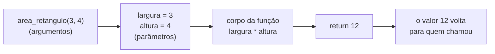
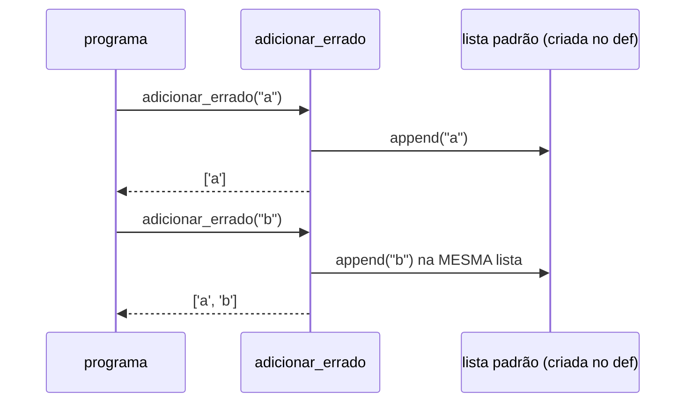
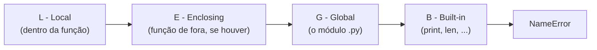

<!-- TOC -->

- [Módulo 04 - Funções](#módulo-04---funções)
  - [Visão geral](#visão-geral)
  - [O que você vai aprender](#o-que-você-vai-aprender)
  - [Analogia: a receita e o liquidificador](#analogia-a-receita-e-o-liquidificador)
  - [Conceitos](#conceitos)
    - [Anatomia de uma função](#anatomia-de-uma-função)
    - [Formas de passar argumentos](#formas-de-passar-argumentos)
    - [A armadilha do valor padrão mutável](#a-armadilha-do-valor-padrão-mutável)
    - [Escopo: a regra LEGB](#escopo-a-regra-legb)
    - [Funções são valores](#funções-são-valores)
  - [Exemplos](#exemplos)
    - [`funcoes_basicas.py`](#funcoes_basicaspy)
    - [`argumentos.py`](#argumentospy)
    - [`escopo.py`](#escopopy)
    - [`funcoes_como_valores.py`](#funcoes_como_valorespy)
  - [Testes](#testes)
  - [Erros comuns](#erros-comuns)
  - [Exercícios](#exercícios)
  - [Referências](#referências)

<!-- TOC -->

# Módulo 04 - Funções

## Visão geral

Uma **função** é um bloco de código com nome, que recebe dados de entrada
(**parâmetros**), faz um trabalho e devolve um resultado (`return`). Ela
evita repetir código, dá nome a uma ideia ("calcular a área") e torna o
programa testável pedaço por pedaço.

**Pré-requisito:** [módulo 03](../03_controle_de_fluxo/README.md).

## O que você vai aprender

- Definir funções com `def`, `return` e docstrings.
- Valores padrão, argumentos posicionais e nomeados.
- Receber quantidades variáveis de argumentos com `*args` e `**kwargs`.
- A armadilha do valor padrão mutável (e como evitá-la).
- Escopo: onde um nome existe (local, global, a regra LEGB).
- Funções como valores: passar funções para outras funções, `lambda`, `sorted(key=...)`, `map` e `filter`.

## Analogia: a receita e o liquidificador

- **Uma função é uma receita**: `def` escreve a receita (nada é cozinhado
  ainda); **chamar** a função, `area_retangulo(3, 4)`, é cozinhar. Os
  **parâmetros** são a lista de ingredientes da receita; os **argumentos**
  são os ingredientes de verdade que você entrega naquela vez.
- **`return` é o prato pronto** que sai da cozinha. Uma função sem
  `return` entrega `None` - a cozinha trabalhou, mas não saiu prato.
- **Escopo é a cozinha fechada**: o que a receita cria lá dentro (variáveis
  locais) não aparece na sala. Mas, se faltar um ingrediente na cozinha, o
  cozinheiro procura na despensa da casa (o escopo global).

## Conceitos

### Anatomia de uma função



```python
def area_retangulo(largura: float, altura: float) -> float:
    """Devolve a área de um retângulo."""  # docstring: aparece em help()
    return largura * altura
```

As anotações `: float` e `-> float` documentam os tipos esperados - são
opcionais e o Python não as verifica ao rodar ([módulo 11](../11_anotacoes_de_tipo/README.md)).
Fonte: [Definindo funções](https://docs.python.org/pt-br/3/tutorial/controlflow.html#defining-functions).

### Formas de passar argumentos

| Forma | Exemplo | Regra |
|---|---|---|
| posicional | `descrever_pet("Mimi", "gato")` | pela **ordem** dos parâmetros |
| nomeado (keyword) | `descrever_pet("Mimi", idade=3)` | pelo **nome**; a ordem não importa, mas vêm depois dos posicionais |
| valor padrão | `def saudar(nome, saudacao="Olá")` | o parâmetro pode ser omitido |
| `*args` | `somar(1, 2, 3)` | junta posicionais extras em uma **tupla** |
| `**kwargs` | `ficha(nome="Ana", cidade="Recife")` | junta nomeados extras em um **dicionário** |

Fontes: [Argumentos nomeados](https://docs.python.org/pt-br/3/tutorial/controlflow.html#keyword-arguments)
e [Listas de argumentos arbitrárias](https://docs.python.org/pt-br/3/tutorial/controlflow.html#arbitrary-argument-lists).

### A armadilha do valor padrão mutável

O tutorial oficial traz um "aviso importante": **o valor padrão é
avaliado uma única vez**, quando a função é definida
([Valores padrão de argumentos](https://docs.python.org/pt-br/3/tutorial/controlflow.html#default-argument-values)).
Se o padrão é uma lista, **a mesma lista** é reaproveitada a cada chamada:



A solução é usar `None` como padrão e criar a lista dentro da função
(`adicionar_certo` em [`argumentos.py`](exemplos/argumentos.py)). O linter
deste repositório (ruff, regra B006) aponta esse erro automaticamente - no
exemplo ele está desligado de propósito com `# noqa: B006`.

### Escopo: a regra LEGB

Quando você usa um nome, o Python o procura nesta ordem e para no primeiro
que encontrar:



- Atribuir a um nome dentro de uma função cria uma variável **local**, que
  esconde ("sombreia") a global de mesmo nome.
- Para **alterar** uma global dentro de uma função, declare `global nome` -
  mas prefira receber valores por parâmetro e devolvê-los com `return`.

Fonte: [Escopos e espaços de nomes](https://docs.python.org/pt-br/3/tutorial/classes.html#python-scopes-and-namespaces).
A sigla LEGB é um mnemônico; a documentação descreve a mesma ordem de busca
sem usar a sigla.

### Funções são valores

Em Python, uma função é um objeto como outro qualquer: pode ser guardada em
uma variável, passada como argumento e devolvida por outra função. Uma
[`lambda`](https://docs.python.org/pt-br/3/tutorial/controlflow.html#lambda-expressions)
é uma função pequena e sem nome, de uma expressão só. O uso mais comum para
iniciantes é o `key=` de [`sorted()`](https://docs.python.org/pt-br/3/howto/sorting.html#key-functions):
uma função que diz **por qual critério** ordenar.

## Exemplos

Para rodar todos: `make run MODULO=04`.

### `funcoes_basicas.py`

```bash
uv run python modulos/04_funcoes/exemplos/funcoes_basicas.py
```

```text
12
Olá, Ana!
Bom dia, Ana!
1 9
Aviso: disco quase cheio
avisar() devolveu: None
```

### `argumentos.py`

```bash
uv run python modulos/04_funcoes/exemplos/argumentos.py
```

```text
Rex é um(a) cachorro de 1 ano(s)
Mimi é um(a) gato de 1 ano(s)
Mimi é um(a) gato de 3 ano(s)
6.0 10.5 0.0
nome: Ana; cidade: Recife
['a', 'b'] ['a', 'b']
['a'] ['b']
```

Na penúltima linha, as duas chamadas de `adicionar_errado` devolveram **a
mesma lista** - por isso o `print` mostra `['a', 'b']` duas vezes.

### `escopo.py`

```bash
uv run python modulos/04_funcoes/exemplos/escopo.py
```

```text
global
local
global
1 2
15
```

### `funcoes_como_valores.py`

```bash
uv run python modulos/04_funcoes/exemplos/funcoes_como_valores.py
```

```text
20
25
['Carlos', 'Duda', 'ana', 'bia']
['ana', 'bia', 'Carlos', 'Duda']
['bia', 'ana', 'Duda', 'Carlos']
[2, 4, 6, 8, 10, 12]
[2, 4, 6]
```

Na ordenação padrão de textos, maiúsculas vêm antes das minúsculas
(`'Carlos'` antes de `'ana'`); `key=str.lower` compara tudo em minúsculas.
`sorted()` é **estável**: com `key=len`, `'bia'` e `'ana'` (mesmo tamanho)
mantêm a ordem original ([HOWTO de ordenação](https://docs.python.org/pt-br/3/howto/sorting.html#sort-stability-and-complex-sorts)).

## Testes

[`tests/unit/test_04_funcoes.py`](../../tests/unit/test_04_funcoes.py) confere
as saídas e prova a armadilha do valor padrão: a segunda chamada de
`adicionar_errado("y")` devolve `['x', 'y']`.

```bash
make test-module MODULO=04
```

## Erros comuns

| Você escreveu | O Python responde | Como corrigir |
|---|---|---|
| `saudar()` sem o argumento obrigatório | `TypeError: saudar() missing 1 required positional argument: 'nome'` | passe todos os parâmetros sem valor padrão |
| `contador += 1` dentro de uma função, com `contador` global | `UnboundLocalError: cannot access local variable 'contador' where it is not associated with a value` | receba e devolva o valor, ou declare `global contador` |
| `print` em vez de `return` | a função "mostra" o valor, mas devolve `None` | use `return` para entregar o resultado a quem chamou |
| `def f(lista=[])` | sem erro - mas a lista é compartilhada entre chamadas | use `None` como padrão |

## Exercícios

1. Escreva `celsius_para_fahrenheit(c: float) -> float` e use-a em um `for`
   para montar uma tabela de 0 a 100 °C, de 10 em 10.
2. Escreva `maior(*numeros)` que devolve o maior número **sem** usar `max()`.
3. Ordene `[("Ana", 31), ("Bia", 25), ("Caio", 40)]` pela idade com
   `sorted(..., key=lambda pessoa: pessoa[1])`.

## Referências

- [Tutorial Python - Definindo funções](https://docs.python.org/pt-br/3/tutorial/controlflow.html#defining-functions)
- [Tutorial Python - Mais sobre definição de funções](https://docs.python.org/pt-br/3/tutorial/controlflow.html#more-on-defining-functions)
- [Tutorial Python - Escopos e espaços de nomes](https://docs.python.org/pt-br/3/tutorial/classes.html#python-scopes-and-namespaces)
- [Referência - o comando global](https://docs.python.org/pt-br/3/reference/simple_stmts.html#the-global-statement)
- [HOWTO - Ordenação](https://docs.python.org/pt-br/3/howto/sorting.html)
- [PEP 257 - Convenções de docstrings](https://peps.python.org/pep-0257/)
- [Regra B006 do ruff (mutable-argument-default)](https://docs.astral.sh/ruff/rules/mutable-argument-default/)
