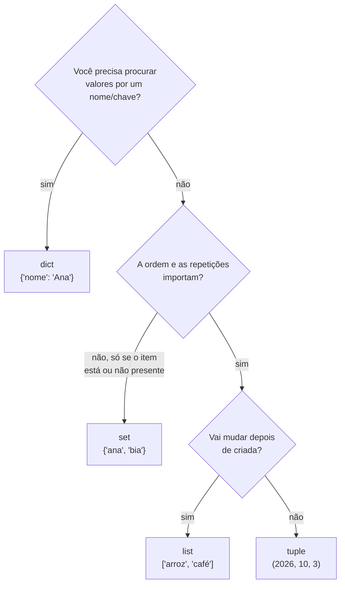
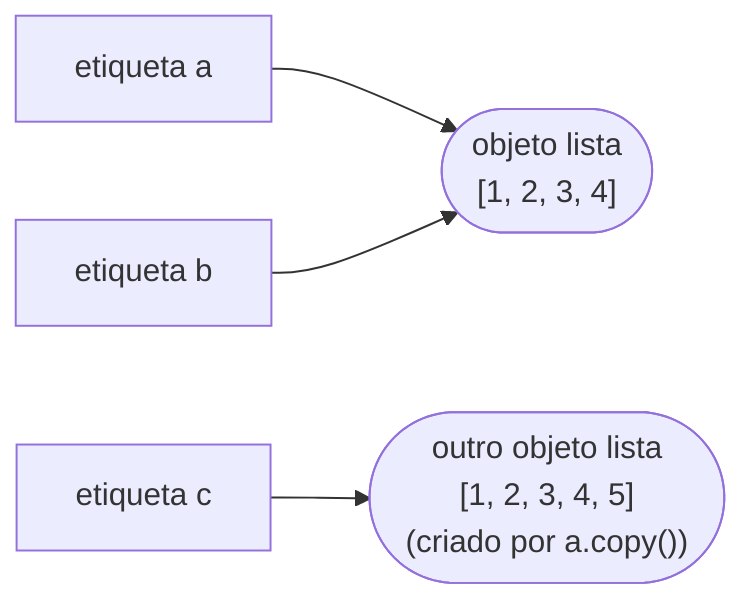

<!-- TOC -->

- [Módulo 05 - Estruturas de dados](#módulo-05---estruturas-de-dados)
  - [Visão geral](#visão-geral)
  - [O que você vai aprender](#o-que-você-vai-aprender)
  - [Analogias](#analogias)
  - [Conceitos](#conceitos)
    - [Escolhendo a estrutura](#escolhendo-a-estrutura)
    - [Etiquetas na mesma lista: `b = a` não copia](#etiquetas-na-mesma-lista-b--a-não-copia)
    - [Dicionários: chave -> valor](#dicionários-chave---valor)
    - [Compreensões](#compreensões)
  - [Exemplos](#exemplos)
    - [`listas.py`](#listaspy)
    - [`tuplas.py`](#tuplaspy)
    - [`conjuntos.py`](#conjuntospy)
    - [`dicionarios.py`](#dicionariospy)
    - [`compreensoes.py`](#compreensoespy)
  - [Testes](#testes)
  - [Erros comuns](#erros-comuns)
  - [Exercícios](#exercícios)
  - [Referências](#referências)

<!-- TOC -->

# Módulo 05 - Estruturas de dados

## Visão geral

Programas raramente lidam com um valor só: são listas de compras, cadastros
de pessoas, conjuntos de tags. O Python já vem com quatro estruturas para
**agrupar** valores - listas, tuplas, conjuntos e dicionários - e com as
**compreensões**, uma forma curta de criá-las.

**Pré-requisito:** [módulo 04](../04_funcoes/README.md).

## O que você vai aprender

- Listas: criar, acessar, alterar, ordenar e fatiar.
- Por que `b = a` **não copia** uma lista.
- Tuplas: sequências imutáveis e desempacotamento.
- Conjuntos: itens únicos e operações de união, interseção e diferença.
- Dicionários: pares chave -> valor, `get()` e como percorrê-los.
- Compreensões de lista, de conjunto e de dicionário.

## Analogias

| Estrutura | Analogia | Ordenada? | Pode mudar? | Repete itens? |
|---|---|---|---|---|
| `list` `[1, 2]` | uma **lista de compras** em papel: você risca, acrescenta e reordena | sim | sim | sim |
| `tuple` `(1, 2)` | as **coordenadas de um endereço** impressas em um documento: não se mexe | sim | **não** | sim |
| `set` `{1, 2}` | um **saco de figurinhas sem repetidas**: só importa se tem ou não tem | **não** | sim | **não** |
| `dict` `{"a": 1}` | uma **agenda telefônica**: você procura pelo nome (chave) e acha o número (valor) | ordem de inserção | sim | chaves únicas |

Desde o Python 3.7, um `dict` mantém a ordem em que as chaves foram
inseridas ([documentação de `dict`](https://docs.python.org/pt-br/3/library/stdtypes.html#mapping-types-dict)).

## Conceitos

### Escolhendo a estrutura



### Etiquetas na mesma lista: `b = a` não copia

Lembra das etiquetas do [módulo 02](../02_variaveis_e_tipos/README.md)?
`b = a` cola **mais uma etiqueta** no **mesmo** objeto lista. Alterar a
lista por `b` altera "também" `a`, porque só existe uma lista. Para ter
duas listas independentes, copie: `a.copy()` ou `list(a)`. Tutorial:
[As atribuições não copiam dados](https://docs.python.org/pt-br/3/tutorial/classes.html#python-scopes-and-namespaces);
cópias rasas e profundas: [módulo `copy`](https://docs.python.org/pt-br/3/library/copy.html).



Isso só "aparece" com objetos **mutáveis** (listas, dicionários, sets). Com
`int`, `str` e `tuple`, que são imutáveis, toda "alteração" cria um objeto
novo.

### Dicionários: chave -> valor

- `pessoa["nome"]` acessa; se a chave não existir, dá `KeyError`.
- `pessoa.get("email", "padrão")` devolve o padrão em vez do erro.
- `for chave, valor in pessoa.items():` percorre os pares.
- As chaves precisam ser de um tipo imutável (textos, números, ou tuplas
  que só contenham imutáveis) - listas não podem ser chaves; os valores
  podem ser qualquer coisa.

Fonte: [Dicionários](https://docs.python.org/pt-br/3/tutorial/datastructures.html#dictionaries).

### Compreensões

Uma compreensão é um `for` com `append` escrito em uma linha:

```python
quadrados = []
for x in range(5):
    quadrados.append(x**2)

quadrados = [x**2 for x in range(5)]  # o mesmo, em uma linha
pares = [n for n in numeros if n % 2 == 0]  # com filtro
tamanhos = {p: len(p) for p in palavras}  # de dicionário
```

Use quando ficar **mais legível** que o laço; se a linha ficar comprida ou
precisar de vários `if`, volte ao `for`. Fonte:
[Compreensões de lista](https://docs.python.org/pt-br/3/tutorial/datastructures.html#list-comprehensions).

## Exemplos

Para rodar todos: `make run MODULO=05`.

### `listas.py`

```bash
uv run python modulos/05_estruturas_de_dados/exemplos/listas.py
```

```text
arroz café
['pão', 'arroz', 'feijão', 'café', 'leite']
leite ['pão', 'arroz', 'café']
3 True
[5, 7, 8, 10]
[7, 10, 5, 8]
[10, 8, 7, 5]
[8, 7]
[1, 2, 3, 4]
[1, 2, 3, 4] [1, 2, 3, 4, 5]
```

Repare na diferença entre `sorted(notas)` (devolve uma **nova** lista; a
original fica igual) e `notas.sort()` (ordena a **própria** lista e devolve
`None`).

### `tuplas.py`

```bash
uv run python modulos/05_estruturas_de_dados/exemplos/tuplas.py
```

```text
3 4
<class 'tuple'> <class 'int'>
03/10/2026
Erro: 'tuple' object does not support item assignment
```

### `conjuntos.py`

```bash
uv run python modulos/05_estruturas_de_dados/exemplos/conjuntos.py
```

```text
['kiwi', 'maçã', 'uva']
['ana', 'bia', 'caio', 'duda']
['bia']
['ana', 'caio']
True
```

O exemplo usa `sorted()` antes de imprimir porque um set **não tem ordem
definida**: imprimi-lo direto pode mostrar os itens em outra ordem.

### `dicionarios.py`

```bash
uv run python modulos/05_estruturas_de_dados/exemplos/dicionarios.py
```

```text
Ana
{'nome': 'Ana', 'idade': 31, 'cidade': 'Recife'}
sem e-mail
nome = Ana
idade = 31
['nome', 'idade'] ['Ana', 31]
{'o': 2, 'rato': 2, 'roeu': 1, 'a': 1, 'roupa': 1}
```

### `compreensoes.py`

```bash
uv run python modulos/05_estruturas_de_dados/exemplos/compreensoes.py
```

```text
[0, 1, 4, 9, 16]
[0, 1, 4, 9, 16]
[2, 4, 6]
{'sol': 3, 'lua': 3, 'estrela': 7}
[3, 7]
```

## Testes

[`tests/unit/test_05_estruturas_de_dados.py`](../../tests/unit/test_05_estruturas_de_dados.py)
confere as saídas e testa `contar_palavras()` com maiúsculas misturadas e
com um texto vazio (um caso-limite que costuma esconder bugs).

```bash
make test-module MODULO=05
```

## Erros comuns

| Você escreveu | O Python responde | Como corrigir |
|---|---|---|
| `frutas[1]` em uma lista com 1 item | `IndexError: list index out of range` | os índices vão de `0` a `len(lista) - 1` |
| `pessoa["idade"]` sem essa chave | `KeyError: 'idade'` | use `pessoa.get("idade")` ou teste `"idade" in pessoa` |
| `lista = lista.sort()` | sem erro, mas `lista` vira `None` | `lista.sort()` sozinho, ou `lista = sorted(lista)` |
| `vazio = {}` esperando um set | cria um **dict** vazio | set vazio é `set()` |
| `b = a` e depois alterar `b` | `a` muda junto | copie: `b = a.copy()` |

## Exercícios

1. Dada uma lista de notas, use uma compreensão para criar a lista só das
   notas maiores ou iguais a 7, e outra com todas arredondadas para inteiro.
2. Escreva `inverter(d: dict[str, str]) -> dict[str, str]` que troca chaves
   por valores (`{"a": "1"}` vira `{"1": "a"}`).
3. Duas turmas: `{"ana", "bia", "caio"}` e `{"bia", "duda"}`. Quem está em
   **exatamente uma** das turmas? (Procure o operador `^` na
   [documentação de set](https://docs.python.org/pt-br/3/library/stdtypes.html#set-types-set-frozenset).)

## Referências

- [Tutorial Python - Estruturas de dados](https://docs.python.org/pt-br/3/tutorial/datastructures.html)
- [Tutorial Python - Listas](https://docs.python.org/pt-br/3/tutorial/introduction.html#lists)
- [Tipos sequência - list, tuple, range](https://docs.python.org/pt-br/3/library/stdtypes.html#sequence-types-list-tuple-range)
- [Tipos conjuntos - set, frozenset](https://docs.python.org/pt-br/3/library/stdtypes.html#set-types-set-frozenset)
- [Tipo mapeamento - dict](https://docs.python.org/pt-br/3/library/stdtypes.html#mapping-types-dict)
- [Módulo `copy`](https://docs.python.org/pt-br/3/library/copy.html)
