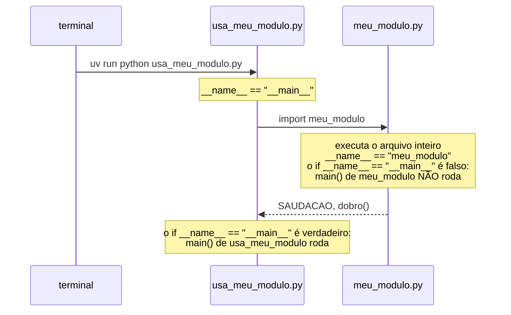

<!-- TOC -->

- [Módulo 06 - Módulos e pacotes](#módulo-06---módulos-e-pacotes)
  - [Visão geral](#visão-geral)
  - [O que você vai aprender](#o-que-você-vai-aprender)
  - [Analogia: a caixa de ferramentas](#analogia-a-caixa-de-ferramentas)
  - [Conceitos](#conceitos)
    - [Importar executa o arquivo uma vez](#importar-executa-o-arquivo-uma-vez)
    - [Onde o Python procura os módulos](#onde-o-python-procura-os-módulos)
    - [Pacotes](#pacotes)
    - [`__pycache__`: arquivos "compilados"](#__pycache__-arquivos-compilados)
  - [Exemplos](#exemplos)
    - [`meu_modulo.py` executado diretamente](#meu_modulopy-executado-diretamente)
    - [`usa_meu_modulo.py`](#usa_meu_modulopy)
    - [`usa_pacote.py`](#usa_pacotepy)
    - [`biblioteca_padrao.py`](#biblioteca_padraopy)
  - [Testes](#testes)
  - [Erros comuns](#erros-comuns)
  - [Exercícios](#exercícios)
  - [Referências](#referências)

<!-- TOC -->

# Módulo 06 - Módulos e pacotes

## Visão geral

Quando um programa cresce, ele é dividido em vários arquivos. Em Python,
**todo arquivo `.py` é um módulo** que outro arquivo pode importar, e uma
**pasta de módulos** com um `__init__.py` é um **pacote**. Além dos seus,
você pode importar os módulos da **biblioteca padrão**, que já vêm com o
Python - matemática, datas, estatística, arquivos, JSON e muito mais.

**Pré-requisito:** [módulo 05](../05_estruturas_de_dados/README.md).

## O que você vai aprender

- As formas de importar: `import x`, `import x as y`, `from x import nome`.
- O que é `__name__` e por que todo exemplo termina com `if __name__ == "__main__":`.
- Onde o Python procura os módulos (`sys.path`).
- Criar um pacote (pasta com `__init__.py`).
- Usar módulos da biblioteca padrão: `math`, `statistics`, `collections`, `datetime`.
- O que é a pasta `__pycache__`.

## Analogia: a caixa de ferramentas

- Um **módulo** é uma **caixa de ferramentas** etiquetada: `math` tem as
  ferramentas de matemática. `import math` traz a caixa inteira para a sua
  bancada (use `math.sqrt`); `from math import sqrt` tira só a chave de
  fenda da caixa (use `sqrt`).
- Um **pacote** é um **armário** com várias caixas: `geometria` é o
  armário, `geometria.formas` é uma caixa dentro dele.
- A **biblioteca padrão** é a oficina que já vem montada quando você
  instala o Python - "baterias inclusas", como diz o
  [tutorial](https://docs.python.org/pt-br/3/tutorial/stdlib.html).
- **`__name__` é o crachá do arquivo**: quando você executa o arquivo
  diretamente, o crachá diz `"__main__"` ("eu sou o programa principal");
  quando ele é importado, diz o próprio nome (`"meu_modulo"`).

## Conceitos

### Importar executa o arquivo uma vez

Na primeira vez que um módulo é importado, o Python **executa o arquivo
inteiro** de cima para baixo (criando as funções, classes e variáveis) e
guarda o resultado; os próximos `import` do mesmo módulo reaproveitam o que
foi guardado. Por isso, código "solto" no módulo (fora de funções) roda no
momento da importação - e é exatamente isso que o `if __name__ == "__main__":`
evita. Fonte: [Mais sobre módulos](https://docs.python.org/pt-br/3/tutorial/modules.html#more-on-modules)
e [Executando módulos como scripts](https://docs.python.org/pt-br/3/tutorial/modules.html#executing-modules-as-scripts).



### Onde o Python procura os módulos

Ao executar `import meu_modulo`, o Python procura, em ordem, nas pastas de
[`sys.path`](https://docs.python.org/pt-br/3/tutorial/modules.html#the-module-search-path):
primeiro **a pasta do script que você executou**, depois as pastas
configuradas na variável `PYTHONPATH` (se houver) e, por fim, as pastas da
instalação (biblioteca padrão e pacotes instalados, como os do `.venv`).
É por isso que `usa_meu_modulo.py` encontra `meu_modulo.py`: os dois estão na
mesma pasta.

Consequência importante: **não dê ao seu arquivo o nome de um módulo da
biblioteca padrão.** Um arquivo `random.py` na pasta do seu script é
encontrado **antes** do `random` de verdade (veja Erros comuns).

### Pacotes

```text
exemplos/
├── usa_pacote.py           # from geometria.formas import area_quadrado
└── geometria/              # o pacote
    ├── __init__.py         # marca a pasta como pacote (pode ser vazio)
    └── formas.py           # o módulo geometria.formas
```

Fonte: [Pacotes](https://docs.python.org/pt-br/3/tutorial/modules.html#packages).

### `__pycache__`: arquivos "compilados"

Depois de rodar os exemplos, aparecem pastas `__pycache__/` com arquivos
`.pyc`. Para acelerar o carregamento, o Python guarda ali a versão já
traduzida para bytecode ([módulo 01](../01_primeiros_passos/README.md)) de
cada módulo **importado**, e a refaz se o `.py` mudar. Pode apagá-las sem
medo (`make clean`); o `.gitignore` já as ignora. Fonte:
[Arquivos Python "compilados"](https://docs.python.org/pt-br/3/tutorial/modules.html#compiled-python-files).

## Exemplos

Para rodar todos: `make run MODULO=06`. Compare as saídas de `meu_modulo.py`
e `usa_meu_modulo.py`.

### `meu_modulo.py` executado diretamente

```bash
uv run python modulos/06_modulos_e_pacotes/exemplos/meu_modulo.py
```

```text
meu_modulo executado diretamente: __name__ = '__main__'
42
```

### `usa_meu_modulo.py`

```bash
uv run python modulos/06_modulos_e_pacotes/exemplos/usa_meu_modulo.py
```

```text
Olá do meu_modulo!
10 14
__name__ do módulo importado: 'meu_modulo'
__name__ deste script: '__main__'
```

O `main()` de `meu_modulo.py` **não** rodou: ao ser importado, o crachá dele
dizia `'meu_modulo'`.

### `usa_pacote.py`

```bash
uv run python modulos/06_modulos_e_pacotes/exemplos/usa_pacote.py
```

```text
Área do círculo de raio 2: 12.57
Área do quadrado de lado 3: 9
```

### `biblioteca_padrao.py`

```bash
uv run python modulos/06_modulos_e_pacotes/exemplos/biblioteca_padrao.py
```

```text
4.0 2 3
3.14159
7.75 7.75
[('a', 5), ('b', 2)]
358
2026-10-03
```

| Módulo | Usado para | Documentação |
|---|---|---|
| `math` | raiz quadrada, arredondamentos, π | [math](https://docs.python.org/pt-br/3/library/math.html) |
| `statistics` | média, mediana | [statistics](https://docs.python.org/pt-br/3/library/statistics.html) |
| `collections.Counter` | contar ocorrências | [Counter](https://docs.python.org/pt-br/3/library/collections.html#collections.Counter) |
| `datetime.date` | datas e diferença entre datas | [datetime](https://docs.python.org/pt-br/3/library/datetime.html) |

A lista completa está no [índice da biblioteca padrão](https://docs.python.org/pt-br/3/library/index.html).

## Testes

[`tests/unit/test_06_modulos_e_pacotes.py`](../../tests/unit/test_06_modulos_e_pacotes.py)
confere as saídas, prova que `main()` de `meu_modulo` não roda ao ser
importado e testa `dias_entre()` atravessando fevereiro de um ano comum e
de um bissexto.

```bash
make test-module MODULO=06
```

## Erros comuns

| Situação | O Python responde | Como corrigir |
|---|---|---|
| `import requestz` (nome errado ou pacote não instalado) | `ModuleNotFoundError: No module named 'requestz'` | confira o nome; pacotes de terceiros são instalados com `uv add` ([módulo 12](../12_ambientes_e_dependencias/README.md)) |
| um arquivo seu chamado `random.py` na pasta do script | `AttributeError: module 'random' has no attribute 'randint' (consider renaming '.../random.py' since it has the same name as the standard library module named 'random' ...)` | renomeie o seu arquivo (e apague o `__pycache__` dele) |
| código solto no módulo (fora de funções) | ele roda toda vez que o módulo é importado | coloque-o em `main()` e chame dentro de `if __name__ == "__main__":` |

A mensagem do `random.py` é real, gerada pelo Python 3.14; a dica no fim
dela existe desde o Python 3.13
([O que há de novo no 3.13](https://docs.python.org/pt-br/3/whatsnew/3.13.html#improved-error-messages)).

## Exercícios

1. Crie `conversores.py` com `celsius_para_fahrenheit()` e um `main()`;
   depois crie `tabela.py`, na mesma pasta, que importa a função e mostra
   uma tabela. Confira que o `main()` de `conversores.py` não roda.
2. Use `random.choice()` para sortear um item de uma lista e
   `datetime.date.today()` para mostrar a data de hoje.
3. Rode `uv run python -c "import sys; print(sys.path)"` e identifique a
   pasta do `.venv` na lista.

## Referências

- [Tutorial Python - Módulos](https://docs.python.org/pt-br/3/tutorial/modules.html)
- [Tutorial Python - Um breve passeio pela biblioteca padrão](https://docs.python.org/pt-br/3/tutorial/stdlib.html)
- [A biblioteca padrão do Python](https://docs.python.org/pt-br/3/library/index.html)
- [`__main__` - ambiente de código de nível superior](https://docs.python.org/pt-br/3/library/__main__.html)
- [`sys.path`](https://docs.python.org/pt-br/3/library/sys.html#sys.path)
