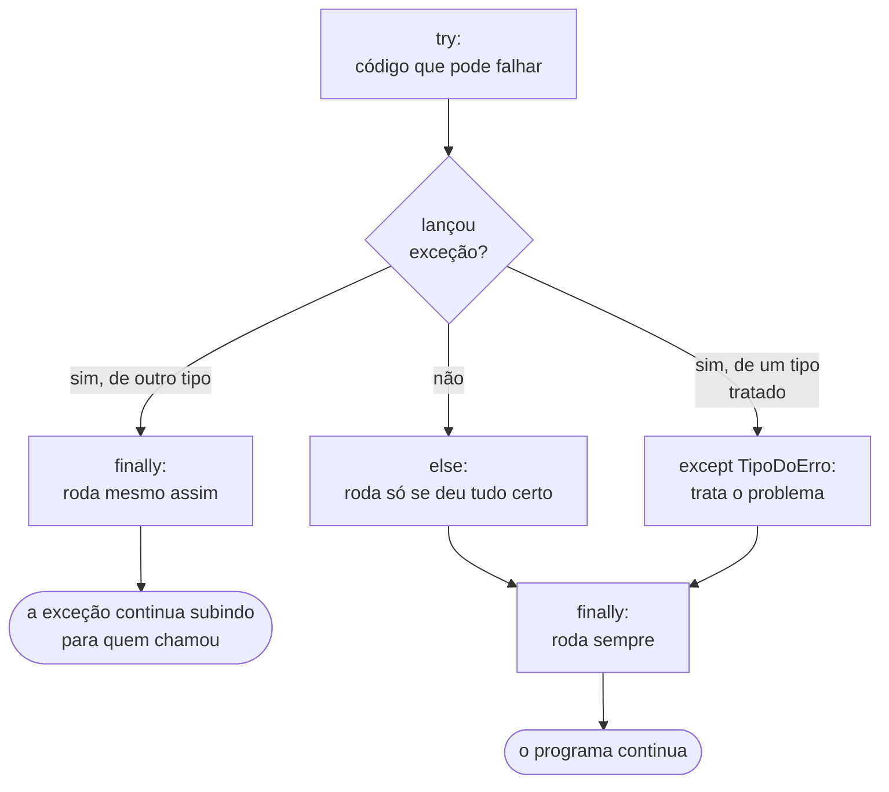

<!-- TOC -->

- [Módulo 07 - Erros e exceções](#módulo-07---erros-e-exceções)
  - [Visão geral](#visão-geral)
  - [O que você vai aprender](#o-que-você-vai-aprender)
  - [Analogia: o alarme de incêndio](#analogia-o-alarme-de-incêndio)
  - [Conceitos](#conceitos)
    - [Lendo um traceback](#lendo-um-traceback)
    - [O fluxo do `try`](#o-fluxo-do-try)
    - [Exceções comuns](#exceções-comuns)
    - [Lançando e criando exceções](#lançando-e-criando-exceções)
  - [Exemplos](#exemplos)
    - [`tratando_excecoes.py`](#tratando_excecoespy)
    - [`lancando_excecoes.py`](#lancando_excecoespy)
  - [Testes](#testes)
  - [Erros comuns](#erros-comuns)
  - [Exercícios](#exercícios)
  - [Referências](#referências)

<!-- TOC -->

# Módulo 07 - Erros e exceções

## Visão geral

Você já viu várias mensagens de erro nos módulos anteriores. O tutorial
oficial separa dois tipos: **erros de sintaxe** (o código está "mal
escrito" e nem começa a rodar) e **exceções** (o código está bem escrito,
mas algo deu errado durante a execução - uma divisão por zero, um arquivo
que não existe). Neste módulo você aprende a **ler** um erro, a **tratar**
exceções para o programa não quebrar e a **lançar** as suas.

**Pré-requisito:** [módulo 06](../06_modulos_e_pacotes/README.md).

## O que você vai aprender

- Ler um *traceback* de baixo para cima.
- Tratar exceções com `try` / `except` / `else` / `finally`.
- Capturar mais de um tipo de exceção e acessar a mensagem (`as erro`).
- Lançar exceções com `raise`.
- Criar as suas próprias exceções.

## Analogia: o alarme de incêndio

- Uma **exceção** é um **alarme que dispara**: o fluxo normal para na hora
  e o alarme "sobe" pelo prédio - da função atual para quem a chamou, e
  assim por diante.
- Um **`try` / `except`** é a **brigada de incêndio de um andar**: se o
  alarme é do tipo que ela sabe tratar, ela resolve e o prédio continua
  funcionando. Se ninguém tratar, o alarme chega ao térreo e **o programa
  termina** mostrando o traceback.
- O **`finally`** é o **"apague as luzes ao sair"**: acontece com ou sem
  alarme.
- O **`raise`** é **você apertando o botão do alarme** de propósito, porque
  encontrou algo errado que não deve ser ignorado.

O Zen do Python ([PEP 20](https://peps.python.org/pep-0020/)) resume:
"Erros nunca devem passar silenciosamente, a menos que explicitamente
silenciados" (*Errors should never pass silently. Unless explicitly silenced.*).

## Conceitos

### Lendo um traceback

Este programa chama `relatorio()`, que chama `media([])`, que divide por zero:

```python
def media(numeros):
    return sum(numeros) / len(numeros)


def relatorio():
    print(media([]))


relatorio()
```

```text
Traceback (most recent call last):
  File "traceback_demo.py", line 9, in <module>
    relatorio()
    ~~~~~~~~~^^
  File "traceback_demo.py", line 6, in relatorio
    print(media([]))
          ~~~~~^^^^
  File "traceback_demo.py", line 2, in media
    return sum(numeros) / len(numeros)
           ~~~~~~~~~~~~~^~~~~~~~~~~~~~
ZeroDivisionError: division by zero
```

**Leia de baixo para cima**: a última linha diz **o que** aconteceu
(`ZeroDivisionError: division by zero`); a linha logo acima diz **onde**
(linha 2, dentro de `media`); as de cima mostram **o caminho** até ali
("most recent call last" = a chamada mais recente fica por último). Os
`~~~^^^` apontam a parte exata da linha que falhou.

### O fluxo do `try`



Fontes: [Tratamento de exceções](https://docs.python.org/pt-br/3/tutorial/errors.html#handling-exceptions)
e [Definindo ações de limpeza](https://docs.python.org/pt-br/3/tutorial/errors.html#defining-clean-up-actions).

Boas práticas:

- **Capture o tipo específico** (`except ValueError:`), não "tudo". Um
  `except:` sem tipo captura até o Ctrl-C; a
  [PEP 8](https://peps.python.org/pep-0008/#programming-recommendations)
  recomenda mencionar exceções específicas sempre que possível.
- Deixe **dentro do `try` só a linha que pode falhar**; o que depende do
  sucesso vai no `else`.
- Para arquivos, prefira `with` ([módulo 08](../08_arquivos/README.md)),
  que fecha o arquivo sozinho - um "finally pronto".

### Exceções comuns

Todas as exceções embutidas estão em
[Exceções embutidas](https://docs.python.org/pt-br/3/library/exceptions.html).

| Exceção | Quando acontece | Visto no módulo |
|---|---|---|
| `SyntaxError` / `IndentationError` | o código está mal escrito (antes de rodar) | 01, 03 |
| `NameError` | um nome que não existe | 01 |
| `TypeError` | operação com o tipo errado (`"42" + 1`) | 02, 04 |
| `ValueError` | tipo certo, valor inválido (`int("abc")`) | 02 |
| `ZeroDivisionError` | divisão por zero | 07 |
| `IndexError` / `KeyError` | índice ou chave inexistente | 05 |
| `ModuleNotFoundError` | módulo não encontrado | 06 |
| `FileNotFoundError` | arquivo inexistente | 08 |
| `AttributeError` | atributo ou método inexistente (`x = 5` e depois `x.append(1)`) | 06, 09 |

### Lançando e criando exceções

`raise ValueError("mensagem")` interrompe a função e entrega o problema a
quem a chamou. Para erros do seu domínio, crie uma classe que herda de
`Exception` - por convenção, com nome terminado em `Error`
([Exceções definidas pelo usuário](https://docs.python.org/pt-br/3/tutorial/errors.html#user-defined-exceptions)).
Herança é assunto do [módulo 09](../09_classes_e_objetos/README.md); por
enquanto, copie o formato de `SaldoInsuficienteError` em
[`lancando_excecoes.py`](exemplos/lancando_excecoes.py).

## Exemplos

Para rodar todos: `make run MODULO=07`.

### `tratando_excecoes.py`

```bash
uv run python modulos/07_erros_e_excecoes/exemplos/tratando_excecoes.py
```

```text
42 None
[finally] dividir(10, 2) terminou
10 / 2 = 5.0
[finally] dividir(1, 0) terminou
não dá para dividir por zero
'5' -> 2.0
'abc' -> ValueError: invalid literal for int() with base 10: 'abc'
None -> TypeError: int() argument must be a string, a bytes-like object or a real number, not 'NoneType'
'0' -> ZeroDivisionError: division by zero
```

Repare na ordem: a linha `[finally]` aparece **antes** do resultado, porque
o `finally` roda quando a função termina - antes de o `print` de fora
receber o valor devolvido.

### `lancando_excecoes.py`

```bash
uv run python modulos/07_erros_e_excecoes/exemplos/lancando_excecoes.py
```

```text
70
ValueError: o valor do saque deve ser positivo, recebi -5
SaldoInsuficienteError: saldo 100.00 é menor que o saque 500.00
```

## Testes

[`tests/unit/test_07_erros_e_excecoes.py`](../../tests/unit/test_07_erros_e_excecoes.py)
usa `pytest.raises` para verificar que `sacar()` lança **a exceção certa,
com a mensagem certa** - testar o caminho de erro é tão importante quanto
testar o caminho feliz.

```bash
make test-module MODULO=07
```

## Erros comuns

| Situação | Problema | Como corrigir |
|---|---|---|
| `except:` ou `except Exception: pass` | esconde bugs - o programa segue errado em silêncio | capture o tipo específico e trate (ou registre) o erro |
| `try` envolvendo 30 linhas | não se sabe qual linha falhou | deixe no `try` só o que pode falhar |
| `raise Exception("erro")` | quem chama não consegue tratar só esse caso | use um tipo específico (`ValueError`) ou crie o seu |
| ler só a primeira linha do traceback | a causa está no fim | leia de baixo para cima |

## Exercícios

1. Escreva `ler_idade(texto: str) -> int` que lança `ValueError` se o texto
   não for um número **ou** se a idade for negativa. Teste os três casos.
2. Volte ao jogo do [módulo 03](../03_controle_de_fluxo/README.md) e faça
   ele pedir o palpite de novo quando a pessoa digitar algo que não é número.
3. Crie `EstoqueInsuficienteError` e uma função `retirar(estoque, quantidade)`
   que a lança.

## Referências

- [Tutorial Python - Erros e exceções](https://docs.python.org/pt-br/3/tutorial/errors.html)
- [Exceções embutidas](https://docs.python.org/pt-br/3/library/exceptions.html)
- [Referência - o comando try](https://docs.python.org/pt-br/3/reference/compound_stmts.html#the-try-statement)
- [PEP 8 - Recomendações de programação](https://peps.python.org/pep-0008/#programming-recommendations)
- [PEP 20 - O Zen do Python](https://peps.python.org/pep-0020/)
