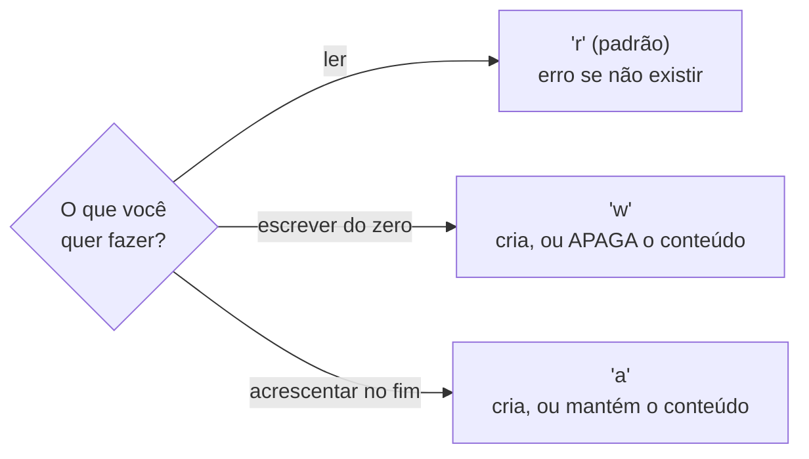
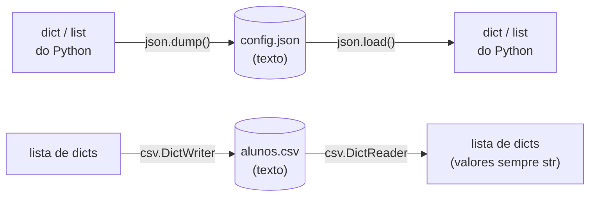

<!-- TOC -->

- [Módulo 08 - Arquivos](#módulo-08---arquivos)
  - [Visão geral](#visão-geral)
  - [O que você vai aprender](#o-que-você-vai-aprender)
  - [Analogia: o caderno da biblioteca](#analogia-o-caderno-da-biblioteca)
  - [Conceitos](#conceitos)
    - [Modos de abertura](#modos-de-abertura)
    - [Sempre `with` e sempre `encoding="utf-8"`](#sempre-with-e-sempre-encodingutf-8)
    - [Caminhos com `pathlib`](#caminhos-com-pathlib)
    - [JSON e CSV](#json-e-csv)
  - [Exemplos](#exemplos)
    - [`arquivos_texto.py`](#arquivos_textopy)
    - [`json_e_csv.py`](#json_e_csvpy)
  - [Testes](#testes)
  - [Erros comuns](#erros-comuns)
  - [Exercícios](#exercícios)
  - [Referências](#referências)

<!-- TOC -->

# Módulo 08 - Arquivos

## Visão geral

Tudo o que um programa guarda em variáveis some quando ele termina. Para
**guardar dados entre execuções**, ele escreve em arquivos. Neste módulo
você lê e escreve arquivos de texto, usa `pathlib` para lidar com
caminhos, e salva dados estruturados em **JSON** e **CSV** - dois formatos
que quase todo sistema entende.

**Pré-requisito:** [módulo 07](../07_erros_e_excecoes/README.md).

## O que você vai aprender

- Abrir arquivos com `open()` e os modos `"r"`, `"w"` e `"a"`.
- Por que usar `with` e sempre informar `encoding="utf-8"`.
- Montar caminhos com `pathlib.Path` (funciona em Linux, macOS e Windows).
- Salvar e carregar JSON com o módulo `json`.
- Escrever e ler CSV com `csv.DictWriter` e `csv.DictReader`.

## Analogia: o caderno da biblioteca

- **`open()` é pegar um caderno emprestado no balcão**; **fechar** o
  arquivo é devolvê-lo. Esquecer de devolver deixa o caderno "preso" (e o
  que você escreveu pode não ter sido salvo ainda).
- **`with open(...) as arquivo:` é o empréstimo com devolução automática**:
  ao sair do bloco, o caderno volta ao balcão, mesmo que algo dê errado no
  meio.
- Os **modos** são o que você vai fazer com o caderno: `"r"` só ler; `"w"`
  **arrancar todas as folhas** e escrever do zero; `"a"` escrever **no fim**,
  sem apagar nada.
- **`encoding`** é o idioma em que o caderno foi escrito: se você ler um
  caderno UTF-8 achando que é outro idioma, "ação" vira "ação".

## Conceitos

### Modos de abertura



Fonte: [`open()`](https://docs.python.org/pt-br/3/library/functions.html#open)
e [Leitura e escrita de arquivos](https://docs.python.org/pt-br/3/tutorial/inputoutput.html#reading-and-writing-files).

### Sempre `with` e sempre `encoding="utf-8"`

```python
with open(caminho, "w", encoding="utf-8") as arquivo:
    arquivo.write("ação\n")
# aqui o arquivo já está fechado
```

- O tutorial recomenda `with` porque o arquivo é fechado corretamente ao
  fim do bloco, mesmo se uma exceção for lançada.
- Sem `encoding=`, "o padrão irá depender da plataforma", diz o tutorial,
  que recomenda `encoding="utf-8"` ("o padrão mais moderno"). Informar o
  encoding evita que o mesmo arquivo seja lido de um jeito em uma máquina e
  de outro em outra. Para JSON, a nota do tutorial é direta: arquivos JSON
  devem ser codificados em UTF-8.

### Caminhos com `pathlib`

[`pathlib.Path`](https://docs.python.org/pt-br/3/library/pathlib.html)
representa um caminho de arquivo como um objeto. O operador `/` junta
partes (`pasta / "tarefas.txt"`) usando o separador certo para cada
sistema, e o objeto tem métodos prontos: `exists()`, `read_text()`,
`write_text()`, `iterdir()`, `.name`, `.suffix`...

### JSON e CSV

| Formato | Parece com | Bom para | Módulo |
|---|---|---|---|
| JSON | dicionários e listas do Python | configurações, dados aninhados, APIs web | [`json`](https://docs.python.org/pt-br/3/library/json.html) |
| CSV | uma planilha: linhas e colunas separadas por vírgula | tabelas, exportar para planilhas | [`csv`](https://docs.python.org/pt-br/3/library/csv.html) |



Detalhes vindos da documentação:

- `json.dump(..., ensure_ascii=False)` mantém `ç` e `ã` legíveis no
  arquivo; sem isso, eles viram sequências como `ç`.
- A documentação do `csv` pede que o arquivo seja aberto com
  **`newline=""`**, para que o próprio módulo controle as quebras de linha.
- No CSV, **tudo vira texto**: converta ao ler (`float(aluno["nota"])`).

## Exemplos

Os exemplos escrevem em uma **pasta temporária**
([`tempfile.TemporaryDirectory`](https://docs.python.org/pt-br/3/library/tempfile.html#tempfile.TemporaryDirectory)),
apagada no fim, para não deixar arquivos no repositório. Para rodar todos:
`make run MODULO=08`.

### `arquivos_texto.py`

```bash
uv run python modulos/08_arquivos/exemplos/arquivos_texto.py
```

```text
['estudar Python', 'beber água', 'dormir cedo']
Acentos funcionam: ação, café, pão.
True nota.txt .txt
['nota.txt', 'tarefas.txt']
A pasta temporária ainda existe? False
```

### `json_e_csv.py`

```bash
uv run python modulos/08_arquivos/exemplos/json_e_csv.py
```

```text
{
  "tema": "escuro",
  "fonte": 14,
  "idiomas": [
    "pt-BR",
    "en-US"
  ]
}
True
nome,nota
Ana,9.5
João,7.0
Ana 9.5
João 7.0
```

## Testes

[`tests/unit/test_08_arquivos.py`](../../tests/unit/test_08_arquivos.py) usa
a fixture [`tmp_path`](https://docs.pytest.org/en/stable/how-to/tmp_path.html)
do pytest - uma pasta temporária nova para cada teste - para provar que
`"w"` apaga e `"a"` acrescenta, e que JSON e CSV fazem "ida e volta" sem
perder nada (inclusive um nome com vírgula dentro, `"Zé, o Bom"`, que o
`csv` protege com aspas).

```bash
make test-module MODULO=08
```

## Erros comuns

| Situação | O que acontece | Como corrigir |
|---|---|---|
| abrir para leitura um arquivo que não existe | `FileNotFoundError: [Errno 2] No such file or directory: 'nao_existe.txt'` | confira o caminho, ou teste antes com `Path(...).exists()` |
| caminho relativo (`"dados.txt"`) | é relativo à pasta **de onde você rodou** o comando, não à pasta do script | monte o caminho a partir de `Path(__file__).parent` |
| abrir com `"w"` querendo acrescentar | o conteúdo anterior some | use `"a"` |
| sem `encoding="utf-8"` | acentos corrompidos em outro sistema | sempre informe o encoding |
| `json.dump` de um set (ou outro tipo que o JSON não tem) | `TypeError: Object of type set is not JSON serializable` | converta antes para tipos que o JSON suporta |

## Exercícios

1. Escreva um "diário": cada execução pede uma frase com `input()` e a
   acrescenta, com a data de hoje, em `diario.txt`.
2. Leia um CSV de produtos (`nome,preco,quantidade`) e mostre o valor total
   do estoque.
3. Salve uma lista de tarefas em JSON, carregue-a de volta, marque uma como
   concluída e salve de novo.

## Referências

- [Tutorial Python - Leitura e escrita de arquivos](https://docs.python.org/pt-br/3/tutorial/inputoutput.html#reading-and-writing-files)
- [Tutorial Python - Salvando dados estruturados com json](https://docs.python.org/pt-br/3/tutorial/inputoutput.html#saving-structured-data-with-json)
- [`open()`](https://docs.python.org/pt-br/3/library/functions.html#open)
- [`pathlib`](https://docs.python.org/pt-br/3/library/pathlib.html)
- [`json`](https://docs.python.org/pt-br/3/library/json.html)
- [`csv`](https://docs.python.org/pt-br/3/library/csv.html)
- [`tempfile`](https://docs.python.org/pt-br/3/library/tempfile.html)
