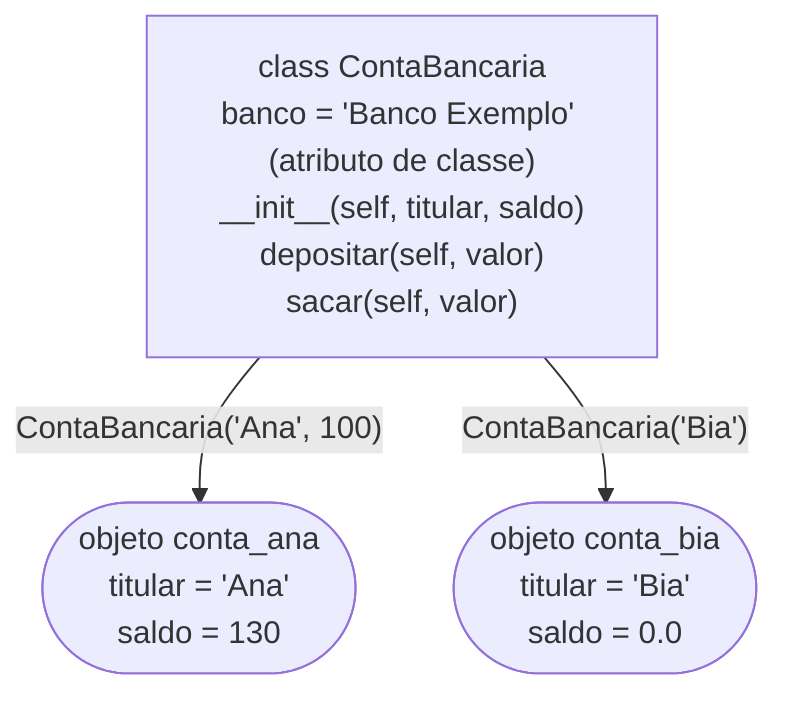
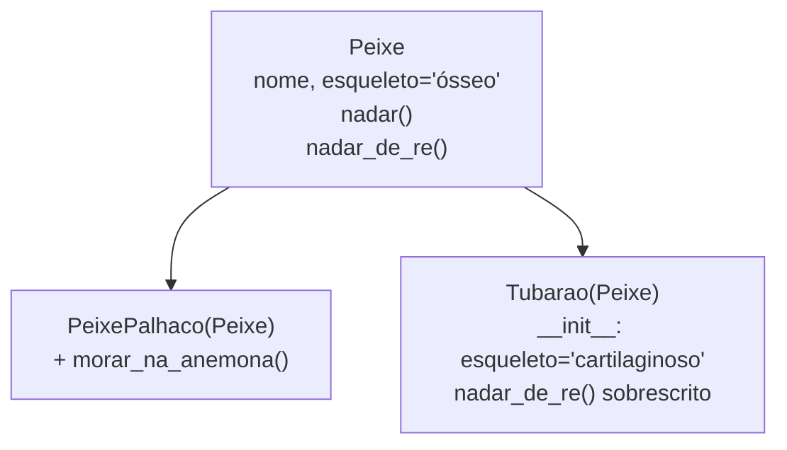

<!-- TOC -->

- [Módulo 09 - Classes e objetos](#módulo-09---classes-e-objetos)
  - [Visão geral](#visão-geral)
  - [O que você vai aprender](#o-que-você-vai-aprender)
  - [Analogia: a planta da casa](#analogia-a-planta-da-casa)
  - [Conceitos](#conceitos)
    - [Classe, objetos e `self`](#classe-objetos-e-self)
    - [Atributos de classe e de instância](#atributos-de-classe-e-de-instância)
    - [`__str__` e `__repr__`](#__str__-e-__repr__)
    - [Herança e polimorfismo](#herança-e-polimorfismo)
    - [`@dataclass`](#dataclass)
  - [Exemplos](#exemplos)
    - [`classes.py`](#classespy)
    - [`heranca.py`](#herancapy)
    - [`dataclasses_exemplo.py`](#dataclasses_exemplopy)
  - [Testes](#testes)
  - [Erros comuns](#erros-comuns)
  - [Exercícios](#exercícios)
  - [Referências](#referências)

<!-- TOC -->

# Módulo 09 - Classes e objetos

## Visão geral

Até aqui, dados (variáveis) e comportamentos (funções) andavam separados.
Uma **classe** junta os dois: ela descreve um tipo de coisa - uma conta
bancária, um peixe, um produto - com os **dados** que cada uma tem
(atributos) e **o que ela sabe fazer** (métodos). Cada coisa criada a partir
da classe é um **objeto** (ou **instância**). Você já usou muitos: todo
`str`, `list` e `dict` é um objeto, e `"ana".upper()` é a chamada de um
método.

**Pré-requisito:** [módulo 08](../08_arquivos/README.md).

## O que você vai aprender

- Definir uma classe com `class`, `__init__` e `self`.
- A diferença entre atributos de classe e de instância.
- `__str__` e `__repr__`: como um objeto aparece no `print` e no REPL.
- Herança, `super()` e sobrescrita de métodos.
- Polimorfismo: o mesmo código funcionando com objetos diferentes.
- `@dataclass`: classes de dados com menos código.

## Analogia: a planta da casa

- Uma **classe** é a **planta de uma casa**: ela diz quantos quartos a
  casa tem e onde fica a porta, mas você não mora na planta.
- Um **objeto** é **uma casa construída** a partir da planta. Com a mesma
  planta, você constrói várias casas; cada uma tem os seus moradores e a
  sua cor de parede (os atributos de instância).
- **`self`** é **"esta casa aqui"**: quando um método diz `self.saldo`, é o
  saldo *desta* conta, não de outra.
- **`__init__`** é a **entrega das chaves**: roda uma vez, quando a casa é
  construída, e arruma tudo para o primeiro uso.
- **Herança** é uma **planta derivada**: a "casa com piscina" reaproveita
  a planta original e só acrescenta (ou muda) o que for diferente.

## Conceitos

### Classe, objetos e `self`



Quando você escreve `conta_ana.depositar(50)`, o Python chama
`ContaBancaria.depositar(conta_ana, 50)`: o objeto antes do ponto vira o
primeiro argumento, `self`. Por isso todo método recebe `self` primeiro.
Fonte: [Uma primeira olhada nas classes](https://docs.python.org/pt-br/3/tutorial/classes.html#a-first-look-at-classes).

### Atributos de classe e de instância

- **De instância** (`self.saldo = ...` dentro do `__init__`): cada objeto tem
  o seu.
- **De classe** (`banco = "..."` direto no corpo da classe): um só,
  compartilhado por todos os objetos.

O tutorial alerta: um atributo de classe **mutável** (como uma lista) é
compartilhado entre todos os objetos - o mesmo problema do valor padrão
mutável do [módulo 04](../04_funcoes/README.md)
([Variáveis de classe e instância](https://docs.python.org/pt-br/3/tutorial/classes.html#class-and-instance-variables)).

### `__str__` e `__repr__`

| Método | Quem usa | Para quem | Exemplo |
|---|---|---|---|
| `__str__` | `print()`, `str()`, f-strings | pessoas | `Conta de Ana: R$ 130.00` |
| `__repr__` | o REPL, listas, depuração | quem programa | `ContaBancaria('Ana', 130)` |

Fonte: [`object.__str__`](https://docs.python.org/pt-br/3/reference/datamodel.html#object.__str__)
e [`object.__repr__`](https://docs.python.org/pt-br/3/reference/datamodel.html#object.__repr__).

### Herança e polimorfismo



- `class Tubarao(Peixe):` faz `Tubarao` **herdar** tudo de `Peixe`.
- Um método com o mesmo nome na classe filha **sobrescreve** o da mãe.
- [`super().__init__(...)`](https://docs.python.org/pt-br/3/library/functions.html#super)
  chama o `__init__` da classe mãe, para não repetir código.
- **Polimorfismo**: o laço `for peixe in (nemo, bruce): peixe.nadar_de_re()`
  não precisa saber o tipo de cada peixe - cada objeto responde do seu
  jeito.

Fonte: [Herança](https://docs.python.org/pt-br/3/tutorial/classes.html#inheritance).
Este exemplo é a versão revisada e traduzida dos peixes de
[`learning_python/fish.py`](../../learning_python/fish.py).

### `@dataclass`

Muitas classes existem só para **guardar dados**. O decorador
[`@dataclass`](https://docs.python.org/pt-br/3/library/dataclasses.html)
lê os campos anotados (`nome: str`, `preco: float`) e **gera** `__init__`,
`__repr__` e `__eq__` para você. Com `frozen=True`, os campos não podem ser
alterados depois (tentar lança `FrozenInstanceError`). Para padrões
mutáveis, use `field(default_factory=list)` - a dataclass recusa `= []`
justamente para evitar a armadilha do módulo 04.

## Exemplos

Para rodar todos: `make run MODULO=09`.

### `classes.py`

```bash
uv run python modulos/09_classes_e_objetos/exemplos/classes.py
```

```text
False True
Conta de Ana: R$ 130.00
Conta de Bia: R$ 0.00
[ContaBancaria('Ana', 130), ContaBancaria('Bia', 0.0)]
Banco Exemplo Banco Exemplo
True
```

### `heranca.py`

```bash
uv run python modulos/09_classes_e_objetos/exemplos/heranca.py
```

```text
Nemo vive entre as anêmonas.
ósseo | cartilaginoso
Nemo está nadando. Nemo consegue nadar de ré.
Bruce está nadando. Bruce não nada de ré, mas consegue afundar de ré.
True True
```

### `dataclasses_exemplo.py`

```bash
uv run python modulos/09_classes_e_objetos/exemplos/dataclasses_exemplo.py
```

```text
Produto(nome='Café', preco=18.5, quantidade=2)
True
Total: R$ 44.50
FrozenInstanceError - cannot assign to field 'x'
```

## Testes

[`tests/unit/test_09_classes_e_objetos.py`](../../tests/unit/test_09_classes_e_objetos.py)
confere as saídas, prova que **cada conta tem o seu saldo** (atributos de
instância) e que **dois carrinhos não compartilham a lista de itens**
(`default_factory`).

```bash
make test-module MODULO=09
```

## Erros comuns

| Você escreveu | O Python responde | Como corrigir |
|---|---|---|
| `def m():` dentro da classe, sem `self` | `TypeError: A.m() takes 0 positional arguments but 1 was given` | todo método recebe `self` como primeiro parâmetro |
| `saldo = valor` dentro do método | cria uma variável local; o atributo não muda | use `self.saldo = valor` |
| `itens = []` como atributo de classe | todos os objetos compartilham a mesma lista | crie a lista no `__init__` (`self.itens = []`) |
| `@dataclass` com `itens: list = []` | `ValueError: mutable default <class 'list'> for field itens is not allowed: use default_factory` | use `field(default_factory=list)` |
| esquecer `super().__init__(...)` na filha | os atributos da mãe não são criados (`AttributeError` depois) | chame `super().__init__(...)` |

## Exercícios

1. Crie a classe `Retangulo` com `largura`, `altura`, os métodos `area()` e
   `perimetro()` e um `__str__`.
2. Crie `ContaPoupanca(ContaBancaria)` com um método `render(taxa)` que
   aplica juros ao saldo.
3. Reescreva `Retangulo` como `@dataclass` e compare o tamanho do código.

## Referências

- [Tutorial Python - Classes](https://docs.python.org/pt-br/3/tutorial/classes.html)
- [`dataclasses`](https://docs.python.org/pt-br/3/library/dataclasses.html)
- [`super()`](https://docs.python.org/pt-br/3/library/functions.html#super) e
  [`isinstance()`](https://docs.python.org/pt-br/3/library/functions.html#isinstance)
- [Modelo de dados - métodos especiais](https://docs.python.org/pt-br/3/reference/datamodel.html#special-method-names)
