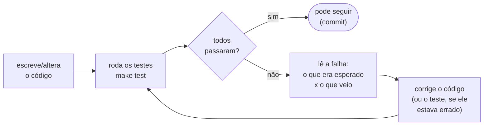
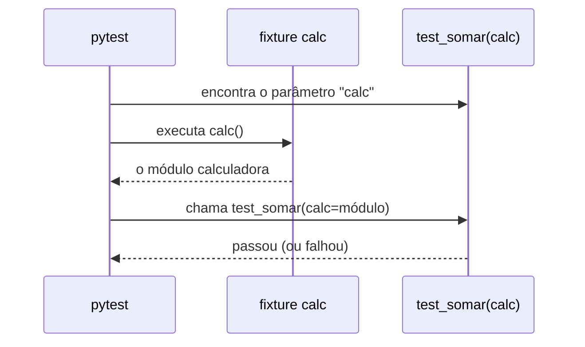

<!-- TOC -->

- [Módulo 10 - Testes automatizados](#módulo-10---testes-automatizados)
  - [Visão geral](#visão-geral)
  - [O que você vai aprender](#o-que-você-vai-aprender)
  - [Analogia: o checklist do piloto](#analogia-o-checklist-do-piloto)
  - [Conceitos](#conceitos)
    - [O ciclo do teste](#o-ciclo-do-teste)
    - [Anatomia de um teste com pytest](#anatomia-de-um-teste-com-pytest)
    - [As ferramentas do pytest usadas aqui](#as-ferramentas-do-pytest-usadas-aqui)
    - [Fixtures: o pytest entrega o que o teste pede](#fixtures-o-pytest-entrega-o-que-o-teste-pede)
    - [Testar nos limites](#testar-nos-limites)
    - [doctest e unittest](#doctest-e-unittest)
    - [Cobertura de testes](#cobertura-de-testes)
  - [Exemplos](#exemplos)
    - [O código testado: `calculadora.py`](#o-código-testado-calculadorapy)
    - [Rodando os testes deste módulo](#rodando-os-testes-deste-módulo)
    - [Uma falha de verdade](#uma-falha-de-verdade)
    - [doctest e unittest](#doctest-e-unittest-1)
  - [Testes](#testes)
  - [Erros comuns](#erros-comuns)
  - [Exercícios](#exercícios)
  - [Referências](#referências)

<!-- TOC -->

# Módulo 10 - Testes automatizados

## Visão geral

Como saber se o seu código funciona? Rodando e olhando a saída - uma vez.
Mas cada mudança pode quebrar algo que funcionava, e conferir tudo à mão de
novo não escala. Um **teste automatizado** é um pequeno programa que chama
o seu código com entradas conhecidas e **verifica** se o resultado é o
esperado. Este repositório inteiro é coberto por testes (`make test`): este
módulo mostra como eles funcionam e como escrever os seus.

**Pré-requisito:** [módulo 09](../09_classes_e_objetos/README.md).

## O que você vai aprender

- Escrever testes com **pytest**: funções `test_*` e `assert`.
- Rodar os testes e ler o resultado de uma falha.
- `@pytest.mark.parametrize`: o mesmo teste com vários casos.
- `pytest.raises` (exceções) e `pytest.approx` (floats).
- **Fixtures**: `tmp_path`, `capsys`, `monkeypatch` e as suas próprias.
- **doctest**: exemplos na docstring que também são testes.
- **unittest**: o framework de testes que já vem com o Python.
- O que é **cobertura de testes**.

## Analogia: o checklist do piloto

Antes de cada decolagem, o piloto percorre um **checklist**: "flaps?
ok. combustível? ok.". Ele não confia na memória nem no "ontem estava
funcionando". Os testes são o checklist do seu código: rápidos,
repetíveis e executados **toda vez**, antes de "decolar" (publicar uma
mudança).

Outra imagem útil: o **detector de fumaça**. Ele não apaga o incêndio, mas
avisa cedo - e um teste que **nunca dispara** (que não falharia nem com o
código quebrado) é um detector sem bateria. Por isso, ao escrever um
teste, quebre o código de propósito e veja o teste falhar.

## Conceitos

### O ciclo do teste



### Anatomia de um teste com pytest

O [pytest](https://docs.pytest.org/en/stable/getting-started.html)
encontra sozinho os arquivos `test_*.py` e, dentro deles, as funções
`test_*`. Um teste passa se terminar sem erro; o `assert` lança um erro
quando a condição é falsa.

```python
def test_somar(calc):  # "calc" é uma fixture (veja abaixo)
    assert calc.somar(2, 3) == 5  # agir e verificar em uma linha
```

Um bom teste costuma ter três partes - **preparar** os dados, **agir**
(chamar o código) e **verificar** o resultado - e testar **um**
comportamento, com um nome que diga qual.

### As ferramentas do pytest usadas aqui

| Ferramenta | Para quê | Exemplo em [`test_10_testes.py`](../../tests/unit/test_10_testes.py) | Documentação |
|---|---|---|---|
| `assert` | verificar uma condição | `test_somar` | [assert](https://docs.pytest.org/en/stable/how-to/assert.html) |
| `@pytest.mark.parametrize` | mesmo teste, vários casos | `test_situacao_nos_limites` | [parametrize](https://docs.pytest.org/en/stable/how-to/parametrize.html) |
| `pytest.approx` | comparar floats | `test_somar_floats` | [approx](https://docs.pytest.org/en/stable/reference/reference.html#pytest-approx) |
| `pytest.raises` | verificar que uma exceção acontece | `test_dividir_por_zero` | [raises](https://docs.pytest.org/en/stable/how-to/assert.html#assertions-about-expected-exceptions) |
| fixture própria | preparar algo para vários testes | `calc` | [fixtures](https://docs.pytest.org/en/stable/how-to/fixtures.html) |
| `capsys` | capturar o que foi impresso | `test_main_imprime` | [capsys](https://docs.pytest.org/en/stable/how-to/capture-stdout-stderr.html) |
| `tmp_path` | pasta temporária por teste | [`test_08_arquivos.py`](../../tests/unit/test_08_arquivos.py) | [tmp_path](https://docs.pytest.org/en/stable/how-to/tmp_path.html) |
| `monkeypatch` | trocar algo só durante o teste | [`test_03_controle_de_fluxo.py`](../../tests/unit/test_03_controle_de_fluxo.py) | [monkeypatch](https://docs.pytest.org/en/stable/how-to/monkeypatch.html) |

### Fixtures: o pytest entrega o que o teste pede

Uma **fixture** é uma função marcada com `@pytest.fixture`. Quando um teste
tem um parâmetro com o nome dela, o pytest a executa e entrega o resultado:



Fixtures usadas por muitos arquivos ficam em
[`tests/conftest.py`](../../tests/conftest.py) - é o caso de `saida_de`, que
todos os testes dos módulos usam para executar um `main()` e capturar a
saída.

### Testar nos limites

Bugs adoram as **fronteiras**. A regra de `situacao()` muda em 5 e em 7;
por isso o teste verifica 4.99, 5, 6.99 e 7 - e não só valores "do meio"
como 3 e 8. Trocar `nota < 7` por `nota <= 7` no código passa despercebido
em qualquer teste que não use exatamente o 7.

### doctest e unittest

- **[doctest](https://docs.python.org/pt-br/3/library/doctest.html)**
  procura, nas docstrings, trechos que parecem uma sessão do REPL (`>>>`),
  executa e compara a saída. É ótimo para exemplos curtos que também
  servem de documentação - veja as docstrings de
  [`calculadora.py`](exemplos/calculadora.py).
- **[unittest](https://docs.python.org/pt-br/3/library/unittest.html)**
  vem com o Python: os testes são métodos de uma classe que herda de
  `unittest.TestCase` e usam `self.assertEqual(...)`. O pytest também roda
  testes unittest - compare [`test_10_testes_unittest.py`](../../tests/unit/test_10_testes_unittest.py)
  com a versão pytest.

### Cobertura de testes

A **cobertura** mede quais linhas (e quais caminhos de cada `if`) foram
executadas pelos testes. `make coverage` usa o
[pytest-cov](https://pytest-cov.readthedocs.io/en/latest/) e falha abaixo
de 80%. Cobertura alta mostra que o código **rodou** durante os testes; não
prova que os `assert` verificam a coisa certa - por isso a dica de quebrar
o código de propósito. Detalhes em [`docs/TESTES.md`](../../docs/TESTES.md).

## Exemplos

### O código testado: `calculadora.py`

```bash
uv run python modulos/10_testes/exemplos/calculadora.py
```

```text
5 2.5 8.0
reprovado recuperação aprovado
```

### Rodando os testes deste módulo

```bash
uv run pytest tests/unit/test_10_testes.py -v
# ou: make test-module MODULO=10
```

O começo da saída (cada parâmetro de `parametrize` vira uma linha):

```text
tests/unit/test_10_testes.py::test_somar PASSED                          [  5%]
tests/unit/test_10_testes.py::test_somar_varios_casos[2-3-5] PASSED      [ 10%]
tests/unit/test_10_testes.py::test_somar_varios_casos[-1-1-0] PASSED     [ 15%]
tests/unit/test_10_testes.py::test_somar_varios_casos[0-0-0] PASSED      [ 21%]
...
```

### Uma falha de verdade

Trocando `if nota < 7:` por `if nota <= 7:` em `calculadora.py` e rodando
só os testes de limite (`-k limites`):

```bash
uv run pytest tests/unit/test_10_testes.py -k limites --tb=short -q
```

```text
....F.                                                                   [100%]
=================================== FAILURES ===================================
____________________ test_situacao_nos_limites[7-aprovado] _____________________
tests/unit/test_10_testes.py:83: in test_situacao_nos_limites
    assert calc.situacao(nota) == esperado
E   AssertionError: assert 'recuperação' == 'aprovado'
E
E     - aprovado
E     + recuperação
=========================== short test summary info ============================
FAILED tests/unit/test_10_testes.py::test_situacao_nos_limites[7-aprovado] - ...
1 failed, 5 passed, 13 deselected in 0.01s
```

Como ler: o caso `[7-aprovado]` falhou na linha 83; o teste esperava
`'aprovado'` (linha `-`) e o código devolveu `'recuperação'` (linha `+`).
Desfaça a alteração e rode de novo: tudo volta a passar.

### doctest e unittest

```bash
uv run python -m doctest -v modulos/10_testes/exemplos/calculadora.py | tail -3
```

```text
5 tests in 6 items.
5 passed.
Test passed.
```

```bash
uv run python -m unittest tests.unit.test_10_testes_unittest -v
```

```text
test_dividir_por_zero (tests.unit.test_10_testes_unittest.TestCalculadora.test_dividir_por_zero) ... ok
test_situacao (tests.unit.test_10_testes_unittest.TestCalculadora.test_situacao) ... ok
test_somar (tests.unit.test_10_testes_unittest.TestCalculadora.test_somar) ... ok
test_somar_floats (tests.unit.test_10_testes_unittest.TestCalculadora.test_somar_floats) ... ok

----------------------------------------------------------------------
Ran 4 tests in 0.000s

OK
```

O tempo (`0.01s`, `0.000s`) varia de máquina para máquina.

## Testes

Os testes **são** o conteúdo deste módulo:
[`tests/unit/test_10_testes.py`](../../tests/unit/test_10_testes.py) (pytest,
comentado passo a passo) e
[`tests/unit/test_10_testes_unittest.py`](../../tests/unit/test_10_testes_unittest.py)
(unittest). Leia-os de cima para baixo.

## Erros comuns

| Situação | O que acontece | Como corrigir |
|---|---|---|
| função de teste sem o prefixo `test_` | o pytest não a coleta: ela nunca roda, e nenhuma falha aparece | nomeie `test_algo` em um arquivo `test_*.py` |
| `assert 0.1 + 0.2 == 0.3` | falha (módulo 02) | `assert 0.1 + 0.2 == pytest.approx(0.3)` |
| `assert resultado` | passa para qualquer valor "verdadeiro" | compare com o valor esperado: `assert resultado == 5` |
| teste que depende de outro teste ou da ordem | falha ao rodar sozinho | cada teste prepara o que precisa (fixtures) |
| teste que nunca falha | não protege nada | quebre o código de propósito e confira que ele falha |

## Exercícios

1. Escreva testes para `media()`: lista com um item, com negativos e com
   floats (use `approx`).
2. Adicione à `calculadora.py` uma função `potencia(base, expoente)` com
   uma docstring com dois exemplos `>>>`, e rode `make doctest`.
3. Escolha um exemplo de outro módulo e escreva um teste para um caso que
   ainda não está coberto. Rode `make coverage` e abra `htmlcov/index.html`.

## Referências

- [pytest - Get started](https://docs.pytest.org/en/stable/getting-started.html)
- [pytest - How to use fixtures](https://docs.pytest.org/en/stable/how-to/fixtures.html)
- [pytest - Parametrizing tests](https://docs.pytest.org/en/stable/how-to/parametrize.html)
- [`unittest`](https://docs.python.org/pt-br/3/library/unittest.html)
- [`doctest`](https://docs.python.org/pt-br/3/library/doctest.html)
- [pytest-cov](https://pytest-cov.readthedocs.io/en/latest/)
- [`docs/TESTES.md`](../../docs/TESTES.md) - como os testes deste repositório são organizados
