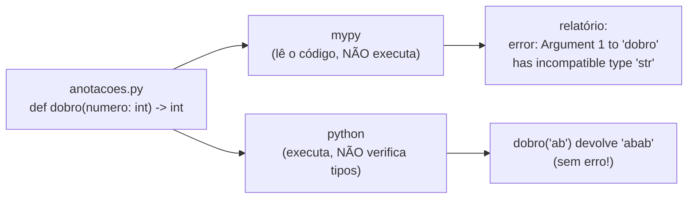

<!-- TOC -->

- [Módulo 11 - Anotações de tipo](#módulo-11---anotações-de-tipo)
  - [Visão geral](#visão-geral)
  - [O que você vai aprender](#o-que-você-vai-aprender)
  - [Analogia: a etiqueta do pote na cozinha](#analogia-a-etiqueta-do-pote-na-cozinha)
  - [Conceitos](#conceitos)
    - [Quem verifica o quê](#quem-verifica-o-quê)
    - [Sintaxe essencial](#sintaxe-essencial)
    - [`str | None` obriga você a tratar o `None`](#str--none-obriga-você-a-tratar-o-none)
    - [Lendo as anotações](#lendo-as-anotações)
  - [Exemplos](#exemplos)
    - [`anotacoes.py`](#anotacoespy)
    - [O mypy encontrando dois bugs](#o-mypy-encontrando-dois-bugs)
    - [Verificando o repositório inteiro](#verificando-o-repositório-inteiro)
  - [Testes](#testes)
  - [Erros comuns](#erros-comuns)
  - [Exercícios](#exercícios)
  - [Referências](#referências)

<!-- TOC -->

# Módulo 11 - Anotações de tipo

## Visão geral

Desde o [módulo 01](../01_primeiros_passos/README.md) os exemplos têm
coisas como `def dobro(numero: int) -> int:`. Essas são as **anotações de
tipo** (*type hints*): elas dizem que tipo de valor cada parâmetro espera e
que tipo a função devolve. Elas são **opcionais** e o Python **não as
verifica ao executar** - quem verifica é uma ferramenta separada, como o
[mypy](https://mypy.readthedocs.io/en/stable/), que este repositório roda em
`make typecheck`.

**Pré-requisito:** [módulo 10](../10_testes/README.md).

## O que você vai aprender

- Anotar parâmetros, retornos e variáveis.
- Tipos de coleções: `list[int]`, `dict[str, float]`, `tuple[int, int]`.
- "Isto ou aquilo": `str | None`.
- `Callable`, `Iterable` e `TypedDict`.
- Rodar o mypy e ler os erros que ele aponta.
- Por que o Python executa código com tipos "errados" mesmo assim.

## Analogia: a etiqueta do pote na cozinha

Uma anotação de tipo é a **etiqueta "AÇÚCAR" em um pote**. A etiqueta não
impede ninguém de colocar sal no pote - o Python não confere. Mas ela
avisa quem vai usar, e um **fiscal** (o mypy) pode passar pela cozinha
antes do jantar, ler todas as etiquetas e apontar: "o pote de açúcar está
sendo enchido com sal na linha 9". O fiscal não cozinha nada: ele só lê o
código, sem executá-lo.

## Conceitos

### Quem verifica o quê



Fonte: a documentação do [`typing`](https://docs.python.org/pt-br/3/library/typing.html)
avisa que o Python não impõe as anotações; elas são usadas por ferramentas
de terceiros, como verificadores de tipo, IDEs e linters.

### Sintaxe essencial

| Anotação | Significa |
|---|---|
| `nome: str` | um texto |
| `def f(x: int) -> float:` | recebe um int e devolve um float |
| `-> None` | não devolve nada (só "faz algo") |
| `list[int]` | uma lista de inteiros |
| `dict[str, float]` | dicionário com chaves `str` e valores `float` |
| `tuple[int, int]` | uma tupla com exatamente dois inteiros |
| `str \| None` | um texto **ou** `None` |
| `Callable[[int], int]` | uma função que recebe um int e devolve um int (módulo 04) |
| `Iterable[float]` | qualquer coisa que um `for` percorre e entrega floats |

`list[int]` (com o nome do tipo embutido) funciona desde o Python 3.9 e
`str | None` desde o 3.10; em código antigo você verá `List[int]` e
`Optional[str]`, importados de `typing`, que significam o mesmo.

### `str | None` obriga você a tratar o `None`

`buscar_usuario()` pode devolver `None`. Se você chamar `.upper()` no
resultado sem verificar, o código quebra **só quando** o usuário não
existir - talvez meses depois. O mypy aponta isso **antes** de rodar
(veja a seção Exemplos). A correção é testar: `if nome is not None: ...`.

### Lendo as anotações

As anotações ficam guardadas na função; no Python 3.14 a forma recomendada
de lê-las é [`annotationlib.get_annotations()`](https://docs.python.org/pt-br/3/library/annotationlib.html),
que substitui `inspect.get_annotations()`
([HOWTO de anotações](https://docs.python.org/pt-br/3/howto/annotations.html)).
Você raramente precisará disso; é o que bibliotecas como `dataclasses`
([módulo 09](../09_classes_e_objetos/README.md)) fazem por baixo dos panos.

## Exemplos

### `anotacoes.py`

```bash
uv run python modulos/11_anotacoes_de_tipo/exemplos/anotacoes.py
```

```text
42
ana None
15.5 6
7.0
abab
{'numero': <class 'int'>, 'return': <class 'int'>}
```

A linha `abab` mostra que `dobro("ab")` **rodou**, mesmo `numero` sendo
anotado como `int`. No arquivo, essa linha tem um comentário
`# type: ignore[arg-type]` - uma instrução para o mypy ignorar aquele erro
específico, usada aqui só porque o erro é proposital.

### O mypy encontrando dois bugs

Com este arquivo, `erro_de_tipo.py`:

```python
def dobro(numero: int) -> int:
    return numero * 2


def buscar(usuarios: dict[int, str], codigo: int) -> str | None:
    return usuarios.get(codigo)


print(dobro("ab"))
nome = buscar({1: "ana"}, 1)
print(nome.upper())
```

```bash
uv run mypy erro_de_tipo.py
```

```text
erro_de_tipo.py:9: error: Argument 1 to "dobro" has incompatible type "str"; expected "int"  [arg-type]
erro_de_tipo.py:11: error: Item "None" of "str | None" has no attribute "upper"  [union-attr]
Found 2 errors in 1 file (checked 1 source file)
```

Executado com `uv run python erro_de_tipo.py`, o mesmo arquivo imprime
`abab` e `ANA` sem nenhum erro - os dois bugs só apareceriam em outra
situação (outro argumento, outro usuário).

### Verificando o repositório inteiro

```bash
make typecheck
```

roda o mypy nos testes e em cada pasta de exemplos. A configuração está em
`[tool.mypy]` no [`pyproject.toml`](../../pyproject.toml): por exemplo,
`disallow_untyped_defs = true` exige anotações em todas as funções.

## Testes

[`tests/unit/test_11_anotacoes_de_tipo.py`](../../tests/unit/test_11_anotacoes_de_tipo.py)
confere a saída e demonstra, com um teste, que `dobro([1])` devolve
`[1, 1]` ao executar - o Python não verifica a anotação `int`.

```bash
make test-module MODULO=11
```

## Erros comuns

| Situação | O que acontece | Como corrigir |
|---|---|---|
| achar que a anotação valida os dados | dados errados passam sem erro em tempo de execução | rode o mypy; valide entradas externas com `if`/`raise` |
| `def f(x: int = None)` | `error: Incompatible default for parameter "x" (default has type "None", parameter has type "int")` | `def f(x: int \| None = None)` |
| usar o resultado de `str \| None` direto | `error: Item "None" of "str \| None" has no attribute ...` | teste `if valor is not None:` antes |
| `# type: ignore` sem código de erro | esconde qualquer erro naquela linha | use o código específico: `# type: ignore[arg-type]` |

## Exercícios

1. Anote todas as funções de um exercício que você fez nos módulos
   anteriores e rode `uv run mypy seu_arquivo.py`.
2. Escreva `def primeira_vogal(texto: str) -> str | None` e trate o caso
   `None` ao usar o resultado.
3. Crie um `TypedDict` para um produto (`nome`, `preco`, `estoque`) e uma
   função que recebe uma `list` deles e devolve o valor total.

## Referências

- [`typing` - suporte para dicas de tipo](https://docs.python.org/pt-br/3/library/typing.html)
- [PEP 484 - Type Hints](https://peps.python.org/pep-0484/)
- [PEP 604 - `X | Y`](https://peps.python.org/pep-0604/)
- [PEP 585 - `list[int]` nos tipos embutidos](https://peps.python.org/pep-0585/)
- [mypy - Getting started](https://mypy.readthedocs.io/en/stable/getting_started.html)
- [`annotationlib`](https://docs.python.org/pt-br/3/library/annotationlib.html)
- [HOWTO - Boas práticas para anotações](https://docs.python.org/pt-br/3/howto/annotations.html)
