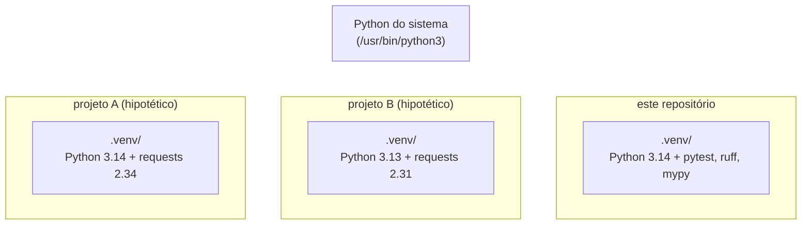
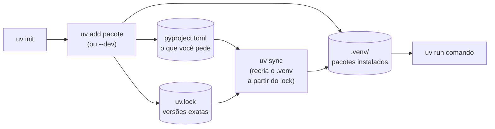

<!-- TOC -->

- [Módulo 12 - Ambientes virtuais e dependências](#módulo-12---ambientes-virtuais-e-dependências)
  - [Visão geral](#visão-geral)
  - [O que você vai aprender](#o-que-você-vai-aprender)
  - [Analogia: a cozinha de cada restaurante](#analogia-a-cozinha-de-cada-restaurante)
  - [Conceitos](#conceitos)
    - [Um ambiente por projeto](#um-ambiente-por-projeto)
    - [Sem uv: `venv` e `pip`](#sem-uv-venv-e-pip)
    - [O ciclo de um projeto com uv](#o-ciclo-de-um-projeto-com-uv)
    - [mise: a versão das ferramentas](#mise-a-versão-das-ferramentas)
  - [Exemplos](#exemplos)
    - [`ambiente.py`](#ambientepy)
    - [Criando um projeto do zero](#criando-um-projeto-do-zero)
  - [Testes](#testes)
  - [Erros comuns](#erros-comuns)
  - [Exercícios](#exercícios)
  - [Referências](#referências)

<!-- TOC -->

# Módulo 12 - Ambientes virtuais e dependências

## Visão geral

A biblioteca padrão é grande, mas cedo ou tarde você vai querer usar um
**pacote de terceiros** publicado no [PyPI](https://pypi.org) - o
repositório oficial de pacotes Python. Este módulo mostra **onde** esses
pacotes são instalados (os **ambientes virtuais**), **como** declarar e
travar as versões que o seu projeto usa (`pyproject.toml` e `uv.lock`) e as
duas ferramentas que este repositório usa para isso:

- **[uv](https://docs.astral.sh/uv/)** - gerencia o projeto: cria o
  ambiente virtual, instala os pacotes, trava as versões e roda comandos.
- **[mise](https://mise.jdx.dev)** - instala e fixa **as versões das
  ferramentas** (o próprio Python e o uv) por projeto.

**Pré-requisito:** [módulo 11](../11_anotacoes_de_tipo/README.md). Você já
usou tudo isso desde o começo (`uv run`, `make setup`); agora vai entender
o que acontece por baixo.

## O que você vai aprender

- O que é um ambiente virtual e por que cada projeto deve ter o seu.
- Como o Python sabe se está dentro de um (`sys.prefix` x `sys.base_prefix`).
- O ciclo de um projeto com uv: `uv init`, `uv add`, `uv run`, `uv sync`, `uv lock`, `uv remove`.
- A diferença entre `pyproject.toml` (o que você **pede**) e `uv.lock` (o que foi **resolvido**).
- Dependências de desenvolvimento (`--dev`).
- Fixar versões de ferramentas com `mise.toml`.

## Analogia: a cozinha de cada restaurante

Imagine vários restaurantes dividindo **uma única despensa**. O restaurante
italiano precisa do molho na receita de 2019; o novo bistrô, da receita de
2026. Se trocarem o pote da despensa, um dos dois estraga o prato. O
tutorial oficial descreve exatamente esse conflito entre aplicações que
precisam de versões diferentes do mesmo pacote
([Ambientes virtuais e pacotes](https://docs.python.org/pt-br/3/tutorial/venv.html)).

- Um **ambiente virtual** (`.venv/`) é **uma despensa só deste
  restaurante**: os pacotes instalados ali não afetam os outros projetos
  nem o Python do sistema.
- O **`pyproject.toml`** é a **lista de compras** ("requests, versão 2.34
  ou mais nova").
- O **`uv.lock`** é a **nota fiscal**: registra exatamente o que foi
  comprado (cada pacote, a versão exata e as dependências das
  dependências), para que outra pessoa monte uma despensa idêntica.
- O **uv** é o **gerente de compras**; o **mise** é quem garante que todas
  as cozinhas usem **o mesmo modelo de fogão** (a mesma versão do Python e
  do uv).

## Conceitos

### Um ambiente por projeto



Um ambiente virtual é, segundo o tutorial, "uma árvore de diretórios que
contém uma instalação Python para uma versão particular do Python, além de
uma série de pacotes adicionais". Quando o Python roda de dentro de um,
`sys.prefix` aponta para o ambiente e `sys.base_prefix` para o Python que
o criou - basta comparar os dois
([Como funcionam os venvs](https://docs.python.org/pt-br/3/library/venv.html)).
É o que [`ambiente.py`](exemplos/ambiente.py) faz.

### Sem uv: `venv` e `pip`

O Python já vem com o módulo [`venv`](https://docs.python.org/pt-br/3/library/venv.html)
e com o `pip`. O fluxo "manual", do tutorial oficial:

```bash
python3 -m venv .venv              # cria o ambiente
source .venv/bin/activate          # ativa (Linux/macOS); no Windows: .venv\Scripts\activate
python -m pip install requests     # instala dentro do ambiente ativo
deactivate                         # sai do ambiente
```

O uv faz o mesmo (e mais) sem precisar **ativar** o ambiente: `uv run`
sempre usa o `.venv` do projeto.

### O ciclo de um projeto com uv



| Comando | O que faz |
|---|---|
| `uv init` | cria um projeto novo (`pyproject.toml`, `.python-version`, ...) |
| `uv add requests` | adiciona a dependência ao `pyproject.toml`, atualiza o `uv.lock` e instala no `.venv` |
| `uv add --dev pytest` | o mesmo, mas como dependência **de desenvolvimento** (grupo `dev`) |
| `uv remove requests` | o inverso de `uv add` |
| `uv sync` | deixa o `.venv` exatamente igual ao `uv.lock` (é o que `make setup` roda) |
| `uv lock` | recalcula o `uv.lock` |
| `uv run comando` | garante que o ambiente está atualizado e roda o comando dentro dele |
| `uv tree` | mostra a árvore de dependências |

Pontos da [documentação do uv](https://docs.astral.sh/uv/concepts/projects/layout/):
o `uv.lock` **deve ir para o controle de versão** (git) e **não deve ser
editado à mão**; o grupo `dev` é sincronizado por padrão
([dependências](https://docs.astral.sh/uv/concepts/projects/dependencies/)).

### mise: a versão das ferramentas

O mise se descreve como uma forma de gerenciar "ferramentas de
desenvolvimento, variáveis de ambiente, tarefas..." em uma configuração por
projeto. Neste repositório ele só instala as ferramentas fixadas em
[`mise.toml`](../../mise.toml):

```toml
[tools]
python = "3.14"
uv = "latest"
```

```bash
mise install                 # instala o que o mise.toml pede
mise use python@3.14         # (em um projeto seu) adiciona/atualiza a linha no mise.toml
mise exec -- python --version
```

O uv **também** sabe baixar Python sozinho (pelo `.python-version`); o mise
é recomendado aqui para fixar **também a versão do uv** e manter as duas
ferramentas iguais em toda máquina. Detalhes e instalação:
[`REQUIREMENTS.md`, seção 3.3](../../REQUIREMENTS.md#33---gerenciando-versões-com-mise).

## Exemplos

### `ambiente.py`

```bash
uv run python modulos/12_ambientes_e_dependencias/exemplos/ambiente.py
```

Saída em uma das máquinas de teste (os caminhos e versões variam):

```text
Versão do Python: 3.14.7
Executável: /home/<você>/python_examples/.venv/bin/python
Em um ambiente virtual? True
pytest: 9.1.1
ruff: 0.16.10
pacote-que-nao-existe: não instalado
```

Agora rode com o Python do sistema, **fora** do ambiente:

```bash
python3 modulos/12_ambientes_e_dependencias/exemplos/ambiente.py
```

```text
Versão do Python: 3.10.12
Executável: /usr/bin/python3
Em um ambiente virtual? False
...
```

Outra versão do Python, outro executável - e os pacotes do `.venv` (como o
pytest) provavelmente aparecem como "não instalado".

### Criando um projeto do zero

Os comandos abaixo foram executados com uv 0.12 em uma pasta vazia; as
versões dos pacotes mudam com o tempo.

```bash
uv init --app --no-package meu-projeto
cd meu-projeto
uv run main.py
```

```text
Using CPython 3.14.7
Creating virtual environment at: .venv
Hello from meu-projeto!
```

O primeiro `uv run` criou o `.venv/` e o `uv.lock`. Adicionando uma
dependência:

```bash
uv add requests
```

```text
Resolved 6 packages in 266ms
...
 + certifi==2026.7.22
 + charset-normalizer==3.5.2
 + idna==3.20
 + requests==2.34.2
 + urllib3==2.8.0
```

Você pediu **um** pacote; vieram cinco, porque o `requests` depende de
outros quatro. O `pyproject.toml` registra só o que você pediu:

```toml
dependencies = [
    "requests>=2.34.2",
]
```

e `uv tree` mostra a árvore:

```text
meu-projeto v0.1.0
└── requests v2.34.2
    ├── certifi v2026.7.22
    ├── charset-normalizer v3.5.2
    ├── idna v3.20
    └── urllib3 v2.8.0
```

Uma dependência só de desenvolvimento vai para o grupo `dev`:

```bash
uv add --dev pytest
```

```toml
[dependency-groups]
dev = [
    "pytest>=9.1.1",
]
```

E para experimentar um pacote **sem** adicioná-lo ao projeto:
`uv run --with rich python -c "import rich"`.

## Testes

[`tests/unit/test_12_ambientes_e_dependencias.py`](../../tests/unit/test_12_ambientes_e_dependencias.py)
verifica que os testes rodam **dentro** do ambiente virtual, simula o
Python do sistema trocando `sys.prefix` com `monkeypatch`, e confere que
`versao_do_pacote("pytest")` bate com a versão do pytest em uso.

```bash
make test-module MODULO=12
```

## Erros comuns

| Situação | O que acontece | Como corrigir |
|---|---|---|
| `python3 -c "import pytest"` fora do ambiente | `ModuleNotFoundError: No module named 'pytest'` | rode pelo ambiente: `uv run python ...` |
| `pip install` no Python do sistema | mistura pacotes de projetos diferentes; sistemas que seguem a [PEP 668](https://peps.python.org/pep-0668/) recusam a instalação | use `uv add` dentro do projeto |
| editar o `uv.lock` à mão | o lock fica inconsistente | edite o `pyproject.toml` (ou use `uv add`/`uv remove`) e rode `uv lock` |
| não versionar o `uv.lock` | cada máquina pode instalar versões diferentes | faça commit do `uv.lock` |
| versionar o `.venv/` | centenas de arquivos, específicos da sua máquina | o `.gitignore` já o ignora; recrie com `uv sync` |
| `uv: command not found` | o uv não está no `PATH` | instale ([`REQUIREMENTS.md`, seção 3](../../REQUIREMENTS.md#3-software-necessário)) e abra um novo terminal |

## Exercícios

1. Crie um projeto com `uv init --app --no-package`, adicione o pacote
   [`requests`](https://pypi.org/project/requests/) e escreva um script que
   faz uma requisição a uma URL e mostra o código de status.
2. Rode `uv remove requests` e confira o que mudou no `pyproject.toml`, no
   `uv.lock` e no `.venv`.
3. Neste repositório, rode `uv tree` e descubra de quais pacotes o `pytest`
   depende.

## Referências

- [Tutorial Python - Ambientes virtuais e pacotes](https://docs.python.org/pt-br/3/tutorial/venv.html)
- [`venv`](https://docs.python.org/pt-br/3/library/venv.html)
- [`sys.prefix`](https://docs.python.org/pt-br/3/library/sys.html#sys.prefix) e
  [`importlib.metadata`](https://docs.python.org/pt-br/3/library/importlib.metadata.html)
- [uv - documentação](https://docs.astral.sh/uv/)
- [uv - estrutura de um projeto e o lockfile](https://docs.astral.sh/uv/concepts/projects/layout/)
- [uv - dependências](https://docs.astral.sh/uv/concepts/projects/dependencies/)
- [mise - Getting started](https://mise.jdx.dev/getting-started.html)
- [PyPI - Python Package Index](https://pypi.org)
