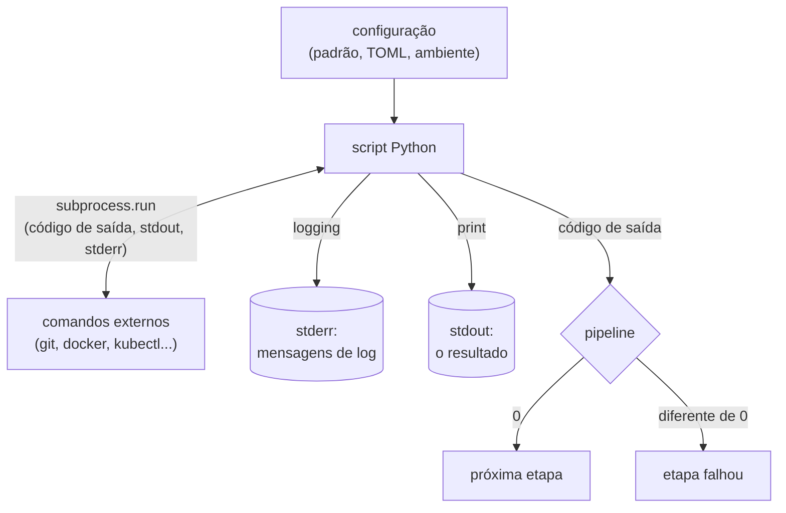
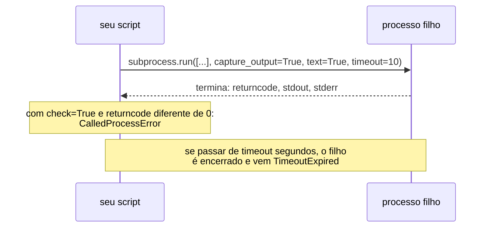
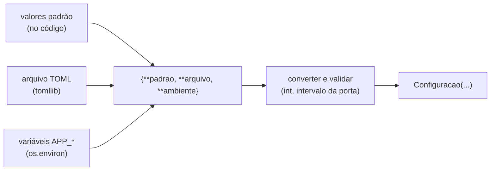
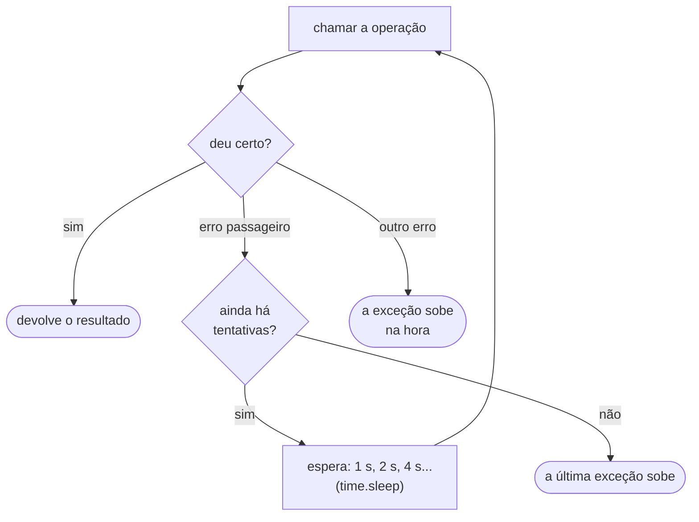

<!-- TOC -->

- [Módulo 13 - Python para infraestrutura (DevOps e cloud)](#módulo-13---python-para-infraestrutura-devops-e-cloud)
  - [Visão geral](#visão-geral)
  - [O que você vai aprender](#o-que-você-vai-aprender)
  - [Analogias](#analogias)
  - [Conceitos](#conceitos)
    - [Um script no pipeline](#um-script-no-pipeline)
    - [Comandos externos com `subprocess`](#comandos-externos-com-subprocess)
    - [Configuração: padrão, arquivo e ambiente](#configuração-padrão-arquivo-e-ambiente)
    - [Logs: `print` para o resultado, `logging` para o diagnóstico](#logs-print-para-o-resultado-logging-para-o-diagnóstico)
    - [Redes e sub-redes com `ipaddress`](#redes-e-sub-redes-com-ipaddress)
    - [Tentar de novo: backoff exponencial](#tentar-de-novo-backoff-exponencial)
    - [Integridade com SHA-256](#integridade-com-sha-256)
  - [Exemplos](#exemplos)
    - [`comandos.py`](#comandospy)
    - [`configuracao.py`](#configuracaopy)
    - [`analisar_logs.py`](#analisar_logspy)
    - [`redes.py`](#redespy)
    - [`retentativas.py`](#retentativaspy)
    - [`integridade.py`](#integridadepy)
  - [Indo além da biblioteca padrão](#indo-além-da-biblioteca-padrão)
  - [Testes](#testes)
  - [Erros comuns](#erros-comuns)
  - [Exercícios](#exercícios)
  - [Referências](#referências)

<!-- TOC -->

# Módulo 13 - Python para infraestrutura (DevOps e cloud)

## Visão geral

Quem trabalha com infraestrutura - como *DevOps engineer*, SRE ou *cloud
architect* - escreve muitos **scripts de automação**: rodar comandos,
ler configurações, analisar logs, planejar redes, tentar de novo quando um
serviço falha, conferir se um arquivo baixado é o certo. Um script em shell
resolve os casos simples; quando a lógica cresce (condições, tratamento de
erros, dados estruturados, testes), Python costuma ser uma escolha mais
legível e mais fácil de testar.

Este módulo junta o que você aprendeu na trilha e aplica a essas tarefas,
**só com a biblioteca padrão**: `subprocess`, `shlex`, `shutil`, `os`,
`tomllib`, `argparse`, `logging`, `re`, `collections`, `ipaddress`,
`time` e `hashlib`. Nenhum exemplo acessa a rede ou uma conta de nuvem de
verdade - tudo roda na sua máquina, sem custo.

**Pré-requisito:** [módulo 12](../12_ambientes_e_dependencias/README.md).
Os exemplos usam exceções ([módulo 07](../07_erros_e_excecoes/README.md)),
arquivos ([módulo 08](../08_arquivos/README.md)), `@dataclass`
([módulo 09](../09_classes_e_objetos/README.md)) e anotações de tipo
([módulo 11](../11_anotacoes_de_tipo/README.md)).

## O que você vai aprender

- Executar comandos externos com `subprocess.run()`, sem shell, com tempo
  limite e lendo o **código de saída**.
- Quebrar e montar linhas de comando com segurança (`shlex`) e descobrir
  se uma ferramenta está instalada (`shutil.which`).
- Montar a configuração em camadas: valores padrão, arquivo TOML
  (`tomllib`) e variáveis de ambiente (`os.environ`).
- Escrever uma ferramenta de linha de comando com `argparse`, `logging` e
  um código de saída que um *pipeline* de CI/CD entende.
- Analisar linhas de log com expressões regulares (`re`) e contar com
  `collections.Counter`.
- Planejar redes e sub-redes (CIDR) com `ipaddress`.
- Tentar de novo com espera crescente (*backoff* exponencial).
- Conferir a integridade de um arquivo com SHA-256 (`hashlib`).

## Analogias

- **`subprocess.run` com uma lista é um formulário com campos separados.**
  Cada campo (`["ls", "-l", "meu arquivo"]`) chega ao programa exatamente
  como foi preenchido. Passar **uma string com `shell=True`** é como ditar o
  pedido a um intermediário (o *shell*), que interpreta símbolos como `;` e
  `|` como "e depois faça também isto" - útil às vezes, perigoso quando
  parte do texto vem de fora.
- **Configuração em camadas é uma receita de família.** A receita base (o
  padrão) vale sempre; as anotações no caderno (o arquivo) mudam alguns
  ingredientes; o pedido de quem vai comer hoje (a variável de ambiente)
  vence tudo. A regra de quem vence é **deste exemplo** - cada ferramenta
  define a sua.
- **Uma rede CIDR é um loteamento.** `10.0.0.0/16` é o bairro inteiro (65536
  endereços); dividi-lo em `/24` é traçar 256 quarteirões de 256 lotes.
  Duas redes que se **sobrepõem** são dois loteamentos vendendo o mesmo
  terreno - o conflito aparece quando você tenta conectá-las.
- **Backoff exponencial é ligar para alguém que não atende.** Você não
  liga sem parar: espera 1 minuto, depois 2, depois 4... e desiste depois
  de algumas tentativas.
- **Um checksum SHA-256 é a impressão digital de um arquivo.** Mudou um
  único byte, a impressão digital é outra. Limite da analogia: o hash tem
  tamanho fixo (64 caracteres hexadecimais) e os arquivos possíveis são
  infinitos, então dois arquivos diferentes **podem**, em teoria, ter o
  mesmo hash (uma *colisão*). O checksum confirma que você recebeu o
  arquivo publicado; ele não diz se quem publicou é confiável.

## Conceitos

### Um script no pipeline

Em um *pipeline* de CI/CD (a sequência automática de etapas que testa e
implanta o código), cada etapa é um comando. O pipeline não lê o que o
comando imprimiu para decidir se continua: ele olha o **código de saída**.



A documentação de [`sys.exit()`](https://docs.python.org/pt-br/3/library/sys.html#sys.exit)
diz que zero é considerado "successful termination" (término com sucesso)
e qualquer valor diferente de zero é "abnormal termination" (término
anormal) para os shells, e que programas Unix geralmente usam 2 para erros
de sintaxe na linha de comando e 1 para todos os outros erros.

### Comandos externos com `subprocess`

A documentação oficial é direta: "A abordagem recomendada para invocar
subprocessos é usar a função `run()` para todos os casos de uso que ela
pode manipular"
([`subprocess`](https://docs.python.org/pt-br/3/library/subprocess.html#using-the-subprocess-module)).



| Parâmetro de `run()` | O que faz |
|---|---|
| `capture_output=True` | guarda stdout e stderr no resultado, em vez de mostrá-los no terminal |
| `text=True` | devolve `str` em vez de `bytes` |
| `timeout=10` | se o processo passar de 10 segundos, ele é encerrado e `run()` levanta `TimeoutExpired` |
| `check=True` | se o código de saída não for 0, levanta `CalledProcessError` |

Sobre `check`, a documentação diz: "Se *check* for verdadeiro, e o
processo sair com um código de saída diferente de zero, uma exceção
`CalledProcessError` será levantada. Os atributos dessa exceção contêm os
argumentos, o código de saída e stdout e stderr se eles foram capturados"
([`subprocess.run`](https://docs.python.org/pt-br/3/library/subprocess.html#subprocess.run)).

**Segurança: prefira sempre a lista.** A seção
[Security Considerations](https://docs.python.org/pt-br/3/library/subprocess.html#security-considerations)
(ainda sem tradução) explica que o módulo não chama um shell por conta
própria e, por isso, "all characters, including shell metacharacters, can
safely be passed to child processes" (todos os caracteres, inclusive os
metacaracteres do shell, podem ser passados com segurança aos processos
filhos). Com `shell=True`, proteger espaços e metacaracteres passa a ser
responsabilidade da sua aplicação, para evitar a injeção de comandos
(*shell injection*).

Quando você **precisa** de uma linha de comando como texto (para mostrar
no log, por exemplo), use o [`shlex`](https://docs.python.org/pt-br/3/library/shlex.html):
`shlex.split()` quebra uma linha usando uma sintaxe parecida com a do
shell (em inglês, "shell-like syntax"), e `shlex.join()`/`shlex.quote()` protegem cada parte com aspas. A
documentação avisa que o `shlex` "is **only designed for Unix shells**"
(foi feito só para shells Unix).

[`shutil.which(cmd)`](https://docs.python.org/pt-br/3/library/shutil.html#shutil.which)
"Retorna o caminho para um executável que seria executado se o *cmd*
fornecido fosse chamado. Se nenhum *cmd* for chamado, retorna `None`" -
útil para checar, no começo do script, se `docker` ou `kubectl` estão
instalados.

### Configuração: padrão, arquivo e ambiente

[`os.environ`](https://docs.python.org/pt-br/3/library/os.html#os.environ)
é "Um objeto mapeamento onde as chaves e valores são strings que
representam o ambiente do processo". Repare: **sempre strings** - `"3"`
precisa virar `int("3")`. [`os.getenv(nome, padrao)`](https://docs.python.org/pt-br/3/library/os.html#os.getenv)
devolve o padrão quando a variável não existe; `os.environ[nome]` levanta
`KeyError`.

O [`tomllib`](https://docs.python.org/pt-br/3/library/tomllib.html) (desde o
Python 3.11) lê arquivos TOML - o mesmo formato do `pyproject.toml` e do
`mise.toml` deste repositório. Ele só **lê**: a documentação diz que o
módulo não oferece suporte à escrita de TOML. E `tomllib.load()` exige um
"objeto arquivo binário e legível": abra com `"rb"`.



No `{**a, **b}`, as chaves repetidas ficam com o valor do dicionário que
vem **depois** - é isso que faz o ambiente vencer o arquivo, e o arquivo
vencer o padrão.

> YAML, muito usado em infraestrutura, **não** faz parte da biblioteca
> padrão. Para lê-lo, é preciso um pacote de terceiros, como o
> [PyYAML](https://pypi.org/project/PyYAML/) (veja
> [Indo além da biblioteca padrão](#indo-além-da-biblioteca-padrão)).

### Logs: `print` para o resultado, `logging` para o diagnóstico

O [tutorial de logging](https://docs.python.org/pt-br/3/howto/logging.html)
recomenda `print()` para a saída normal de um script de linha de comando e
um *logger* (`logger.info()`, `logger.warning()`, `logger.error()`...) para
os eventos da execução. Dois detalhes da documentação:

- "O nível padrão é `WARNING`, o que significa que somente os eventos desse
  nível de severidade e superiores serão registrados, a menos que o pacote
  logging esteja configurado para fazer o contrário."
- Um [`StreamHandler`](https://docs.python.org/pt-br/3/library/logging.handlers.html#streamhandler)
  sem argumento escreve em `sys.stderr`. Assim, o **resultado** (stdout)
  pode ir para um arquivo ou outro programa, e os **logs** (stderr)
  continuam aparecendo no terminal.

Para extrair campos de uma linha de log, uma expressão regular com grupos
nomeados (`(?P<status>\d{3})`) do módulo [`re`](https://docs.python.org/pt-br/3/library/re.html)
e um [`Counter`](https://docs.python.org/pt-br/3/library/collections.html#collections.Counter),
o dicionário que conta quantas vezes cada valor aparece.

### Redes e sub-redes com `ipaddress`

O [`ipaddress`](https://docs.python.org/pt-br/3/library/ipaddress.html)
entende endereços e redes IPv4 e IPv6. As perguntas de quem desenha uma
rede na nuvem viram uma linha cada:

| Pergunta | Código |
|---|---|
| quantos endereços cabem? | `ip_network("10.0.0.0/16").num_addresses` |
| como dividir em sub-redes `/24`? | `ip_network("10.0.0.0/16").subnets(new_prefix=24)` |
| duas redes se sobrepõem? | `rede_a.overlaps(rede_b)` |
| este IP pertence a esta rede? | `ip_address("10.0.3.7") in ip_network("10.0.0.0/22")` |

`num_addresses` é o total da rede, incluindo o endereço da rede e o de
*broadcast*. Os provedores de nuvem costumam **reservar** alguns endereços
de cada sub-rede para uso próprio; quantos e quais muda de provedor para
provedor - consulte a documentação do seu.

### Tentar de novo: backoff exponencial

Falhas passageiras (`ConnectionError`, `TimeoutError`) merecem uma nova
tentativa; erros permanentes (uma configuração errada, um `ValueError`)
não - tentar de novo não vai consertá-los.



### Integridade com SHA-256

O [`hashlib`](https://docs.python.org/pt-br/3/library/hashlib.html) calcula
*hashes* criptográficos. `hashlib.sha256(dados).hexdigest()` devolve 64
caracteres hexadecimais; para um arquivo,
[`hashlib.file_digest()`](https://docs.python.org/pt-br/3/library/hashlib.html#hashlib.file_digest)
(desde o Python 3.11) "Retorna um objeto resumo que foi atualizado com o
conteúdo do objeto arquivo" - aberto em modo binário (`"rb"`). É o mesmo
valor que o comando `sha256sum` (GNU coreutils) mostra.

## Exemplos

Todos rodam sem rede, sem teclado e sem deixar arquivos para trás. Para
rodar todos: `make run MODULO=13`.

### `comandos.py`

O "comando externo" aqui é o próprio Python (`sys.executable`), para o
exemplo funcionar igual em qualquer máquina; no dia a dia, seria
`["git", "status"]`, `["docker", "ps"]` etc.

```bash
uv run python modulos/13_python_para_infraestrutura/exemplos/comandos.py
```

```text
código 0, saída: 'servidor ok'
código 3, erro: 'disco cheio'
CalledProcessError, código de saída: 2
TimeoutExpired depois de 0.5 s
['kubectl', 'get', 'pods', '--namespace', 'meu app']
ls -l 'arquivo; rm -rf ~'
python encontrado? True
comando-que-nao-existe encontrado? False
```

Repare na sexta linha: o `shlex.join` colocou `arquivo; rm -rf ~` entre
aspas, então um shell o trataria como **um nome de arquivo**, e não como
um segundo comando. (O `kubectl` da quinta linha só foi quebrado em partes,
não executado.)

### `configuracao.py`

```bash
uv run python modulos/13_python_para_infraestrutura/exemplos/configuracao.py
```

```text
do arquivo: {'ambiente': 'homologacao', 'replicas': 2}
do ambiente: {'replicas': '3'}
Configuracao(ambiente='homologacao', porta=8080, replicas=3)
Configuracao(ambiente='dev', porta=8080, replicas=1)
ConfiguracaoInvalida: porta deve ser um número inteiro, recebi 'oitenta'
ConfiguracaoInvalida: variável de ambiente obrigatória ausente: APP_URL_BANCO
valor padrão
********************1234
```

O exemplo usa um dicionário no lugar de `os.environ` para a saída ser
sempre a mesma; as funções aceitam qualquer `Mapping[str, str]`, então
`montar_configuracao(PADRAO, arquivo, os.environ)` funciona igual. A
penúltima linha usa o `os.environ` de verdade: se você criar a variável
`APP_VARIAVEL_QUE_NAO_EXISTE` no seu terminal, ela muda. A última mostra
`mascarar()`, para registrar em log que um segredo **existe** sem mostrar o
segredo.

### `analisar_logs.py`

Uma ferramenta completa: argumentos, logs, regex, contagem e código de
saída. O formato das linhas de log é a regra deste exemplo:
`2026-10-03T10:00:01 GET /api/saude 200 12ms`.

```bash
uv run python modulos/13_python_para_infraestrutura/exemplos/analisar_logs.py
```

```text
WARNING: linha 5 ignorada (formato inesperado): 'linha cortada no meio'
200: 3
201: 1
503: 1
ERROR: taxa de erros 20% acima do limite de 5%
código de saída: 1
WARNING: linha 5 ignorada (formato inesperado): 'linha cortada no meio'
200: 3
201: 1
503: 1
INFO: taxa de erros 20% dentro do limite
código de saída: 0
ERROR: arquivo não encontrado: nao_existe.log
código de saída: 1
```

O `main()` chama `executar()` três vezes: com o limite padrão (5%), com
`--limite 0.25` e com um arquivo que não existe. Só na demonstração os logs
vão para `sys.stdout`, para aparecerem junto da saída; sem o parâmetro
`fluxo_de_log`, eles vão para `sys.stderr`. A ajuda gerada pelo `argparse`
(saída de `criar_parser().print_help()`):

```text
usage: analisar_logs [-h] [--limite LIMITE] [--verboso] arquivo

Resume um log de acesso e checa a taxa de erros.

positional arguments:
  arquivo          o arquivo de log

options:
  -h, --help       show this help message and exit
  --limite LIMITE  taxa de erros máxima aceita (padrão: 0.05)
  --verboso        mostra também mensagens DEBUG
```

### `redes.py`

```bash
uv run python modulos/13_python_para_infraestrutura/exemplos/redes.py
```

```text
10.0.0.0/16: 65536 endereços, máscara 255.255.0.0, de 10.0.0.0 a 10.0.255.255
10.0.1.0/24: 256 endereços, máscara 255.255.255.0, de 10.0.1.0 a 10.0.1.255
10.0.0.0/16 em /24: 256 sub-redes; as 3 primeiras:
  10.0.0.0/24
  10.0.1.0/24
  10.0.2.0/24
em 4 partes iguais: ['10.0.0.0/18', '10.0.64.0/18', '10.0.128.0/18', '10.0.192.0/18']
[('10.0.0.0/16', '10.0.128.0/17')]
10.0.3.7 em 10.0.0.0/22? True
10.0.4.1 em 10.0.0.0/22? False
2001:db8::/64: 18446744073709551616 endereços, máscara ffff:ffff:ffff:ffff::, de 2001:db8:: a 2001:db8::ffff:ffff:ffff:ffff
```

`10.0.128.0/17` está **dentro** de `10.0.0.0/16`, por isso as duas se
sobrepõem; `10.1.0.0/16` não conflita com nenhuma.

### `retentativas.py`

```bash
uv run python modulos/13_python_para_infraestrutura/exemplos/retentativas.py
```

```text
esperas: [1.0, 2.0, 4.0, 8.0, 10.0]
tentativa 1 falhou (serviço indisponível); nova tentativa em 0.01 s
tentativa 2 falhou (serviço indisponível); nova tentativa em 0.02 s
resposta: 200 OK depois de 3 chamadas
tentativa 1 falhou (serviço indisponível); nova tentativa em 0.01 s
tentativa 2 falhou (serviço indisponível); nova tentativa em 0.02 s
desistindo depois de 3 chamadas: serviço indisponível
```

A primeira linha mostra as esperas para 6 tentativas começando em 1 s e
dobrando, com teto de 10 s. A demonstração usa esperas de centésimos de
segundo só para terminar rápido. `tentar_com_backoff` recebe a função de
espera como parâmetro (`dormir=time.sleep`), e os testes passam outra no
lugar - assim eles não esperam de verdade.

### `integridade.py`

```bash
uv run python modulos/13_python_para_infraestrutura/exemplos/integridade.py
```

```text
SHA-256 de b'': e3b0c44298fc1c149afbf4c8996fb92427ae41e4649b934ca495991b7852b855
checksum publicado: f20db34e4a2067852e95802cd6b2c49634f8197a508af0bdd32d09eb4a650776
arquivo confere? True
depois de alterado, confere? False
```

O mesmo hash do conteúdo vazio, calculado pelo `sha256sum` do Linux:

```bash
printf '' | sha256sum
```

```text
e3b0c44298fc1c149afbf4c8996fb92427ae41e4649b934ca495991b7852b855  -
```

## Indo além da biblioteca padrão

Para falar com a API de um provedor de nuvem, use o SDK oficial dele -
pacotes de **terceiros**, instalados com `uv add` no seu projeto
([módulo 12](../12_ambientes_e_dependencias/README.md)), e por isso fora
dos exemplos desta trilha. Alguns, com a descrição que cada um publica no
PyPI (consultado em 3 de outubro de 2026; pode mudar):

| Pacote | Descrição no PyPI |
|---|---|
| [`boto3`](https://pypi.org/project/boto3/) | "The AWS SDK for Python (Boto3)" |
| [`azure-identity`](https://pypi.org/project/azure-identity/) | "Microsoft Azure Identity Library for Python" |
| [`google-cloud-storage`](https://pypi.org/project/google-cloud-storage/) | "Google Cloud Storage API client library" |
| [`PyYAML`](https://pypi.org/project/PyYAML/) | "YAML parser and emitter for Python" |

As ideias deste módulo continuam valendo com eles: configuração vinda do
ambiente, logs em stderr, código de saída, novas tentativas só para erros
passageiros e testes que não dependem da rede.

## Testes

[`tests/unit/test_13_python_para_infraestrutura.py`](../../tests/unit/test_13_python_para_infraestrutura.py)
compara a saída de cada exemplo com a deste README e testa as funções
diretamente, sem rede e sem esperas reais:

- `subprocess`: código de saída, `CalledProcessError`, `TimeoutExpired` e
  `FileNotFoundError` para um comando que não existe;
- configuração: a ordem padrão < arquivo < ambiente, os limites da porta
  (0, 1, 65535 e 65536), uma variável de ambiente real com o
  [`monkeypatch.setenv`](https://docs.pytest.org/en/stable/how-to/monkeypatch.html)
  do pytest e um TOML inválido;
- logs: os limites da faixa 5xx (499, 500, 599 e 600), o modo `--verboso`,
  os logs indo para stderr por padrão e um argumento inválido saindo com
  código 2;
- redes: o primeiro e o último endereço de uma rede, IPv4 x IPv6 e CIDRs
  inválidos;
- backoff: as esperas calculadas e o fato de **não** tentar de novo um
  `ValueError`.

```bash
make test-module MODULO=13
```

## Erros comuns

| Situação | O que acontece | Como corrigir |
|---|---|---|
| passar o comando como uma string: `subprocess.run("ls -l")` | `FileNotFoundError: [Errno 2] No such file or directory: 'ls -l'` (procura um programa chamado `ls -l`) | passe uma lista: `["ls", "-l"]` (ou `shlex.split("ls -l")`) |
| montar o comando com f-string e `shell=True` | um valor como `arquivo; rm -rf ~` vira **dois** comandos (injeção de comandos) | use a lista, sem `shell=True` |
| `check=True` com um comando que falha | `subprocess.CalledProcessError: Command '['ls', '/pasta-que-nao-existe']' returned non-zero exit status 2.` | trate a exceção, ou use `check=False` e olhe o `returncode` |
| comando que nunca termina | o script fica parado para sempre (sem `timeout`), ou `subprocess.TimeoutExpired: Command '['sleep', '5']' timed out after 0.5 seconds` | sempre informe um `timeout` e trate a exceção |
| ler uma variável que não existe com `os.environ[...]` | `KeyError: 'APP_URL_BANCO'` | `os.getenv("APP_URL_BANCO")` (devolve `None`) ou uma mensagem clara, como `obrigatoria()` |
| usar o valor de uma variável de ambiente como número | `os.environ` só tem strings: `"3" + 1` dá `TypeError` | converta e valide: `int(valor)` |
| `tomllib.load()` com o arquivo aberto em modo texto | ``TypeError: File must be opened in binary mode, e.g. use `open('foo.toml', 'rb')` `` | abra com `"rb"` |
| TOML mal escrito (`porta = ` sem valor) | `tomllib.TOMLDecodeError: Invalid value (at line 1, column 9)` | corrija a linha e a coluna indicadas |
| CIDR com bits de host (`10.0.0.1/24`) | `ValueError: 10.0.0.1/24 has host bits set` | use o endereço da rede (`10.0.0.0/24`) ou `ip_network(..., strict=False)` |
| endereço inválido (`10.0.0.256`) | `ValueError: '10.0.0.256' does not appear to be an IPv4 or IPv6 address` | cada parte de um IPv4 vai de 0 a 255 |
| argumento inválido para o `argparse` (`--limite muito`) | `analisar_logs: error: argument --limite: invalid float value: 'muito'` e o programa sai com código 2 | é o comportamento esperado; confira o uso com `--help` |
| tentar de novo qualquer exceção | um erro permanente é repetido N vezes e atrasa o diagnóstico | só repita erros passageiros (`erros=(ConnectionError, TimeoutError)`) |
| `hashlib.file_digest()` com o arquivo aberto em modo texto | `ValueError: '<_io.TextIOWrapper name=... mode='r' encoding='utf-8'>' is not a file-like object in binary reading mode.` | abra com `"rb"` |

## Exercícios

1. Transforme `analisar_logs.py` em uma ferramenta de verdade: troque o
   `main()` do fim do arquivo por `raise SystemExit(executar(sys.argv[1:]))`,
   rode com um arquivo seu e confira o código de saída com `echo $?`.
   (Desfaça a troca depois: os testes do repositório chamam o `main()`.)
2. Acrescente ao `analisar_logs.py` a opção `--top N`, que mostra as N
   rotas mais acessadas com `Counter.most_common(N)`.
3. Escreva `planejar(cidr, quantidade)`, que devolve as **menores**
   sub-redes de mesmo tamanho capazes de dividir `cidr` em pelo menos
   `quantidade` partes (dica: `subnets(prefixlen_diff=...)`).
4. Acrescente à `Configuracao` um campo `debug: bool` lido de `APP_DEBUG`,
   aceitando só `"true"` e `"false"`; qualquer outro valor deve levantar
   `ConfiguracaoInvalida`. Escreva os testes antes.
5. Faça `tentar_com_backoff` aceitar um `espera_maxima` e teste que nenhuma
   espera passa dele.

## Referências

- [`subprocess` - Gerenciamento de subprocessos](https://docs.python.org/pt-br/3/library/subprocess.html)
- [`shlex` - Análise léxica simples](https://docs.python.org/pt-br/3/library/shlex.html)
- [`shutil.which`](https://docs.python.org/pt-br/3/library/shutil.html#shutil.which)
- [`os.environ`](https://docs.python.org/pt-br/3/library/os.html#os.environ) e [`os.getenv`](https://docs.python.org/pt-br/3/library/os.html#os.getenv)
- [`tomllib`](https://docs.python.org/pt-br/3/library/tomllib.html)
- [`argparse`](https://docs.python.org/pt-br/3/library/argparse.html)
- [Tutorial de logging](https://docs.python.org/pt-br/3/howto/logging.html) e [`logging.handlers`](https://docs.python.org/pt-br/3/library/logging.handlers.html)
- [`re` - Operações com expressões regulares](https://docs.python.org/pt-br/3/library/re.html)
- [`collections.Counter`](https://docs.python.org/pt-br/3/library/collections.html#collections.Counter)
- [`ipaddress`](https://docs.python.org/pt-br/3/library/ipaddress.html) e [Uma introdução ao módulo ipaddress](https://docs.python.org/pt-br/3/howto/ipaddress.html)
- [`time.sleep`](https://docs.python.org/pt-br/3/library/time.html#time.sleep)
- [`hashlib`](https://docs.python.org/pt-br/3/library/hashlib.html)
- [`sys.exit`](https://docs.python.org/pt-br/3/library/sys.html#sys.exit)
- [pytest - `monkeypatch`](https://docs.pytest.org/en/stable/how-to/monkeypatch.html)
